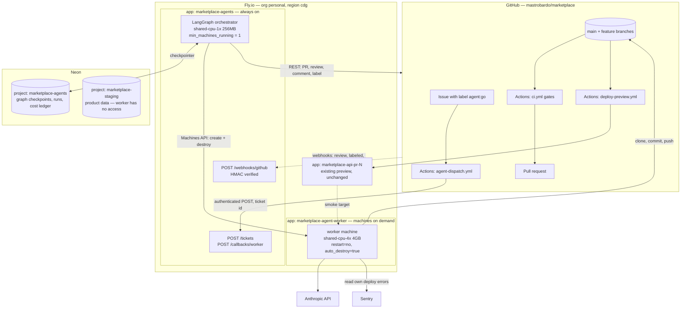
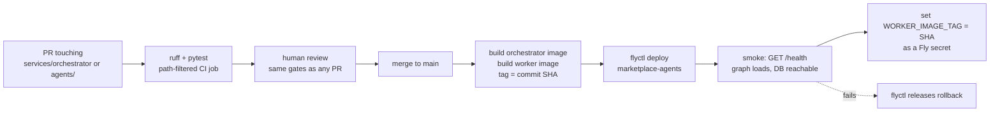
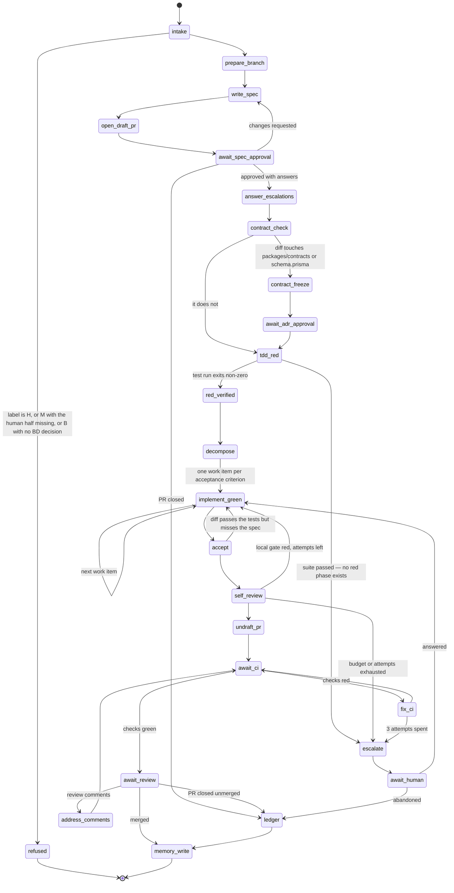
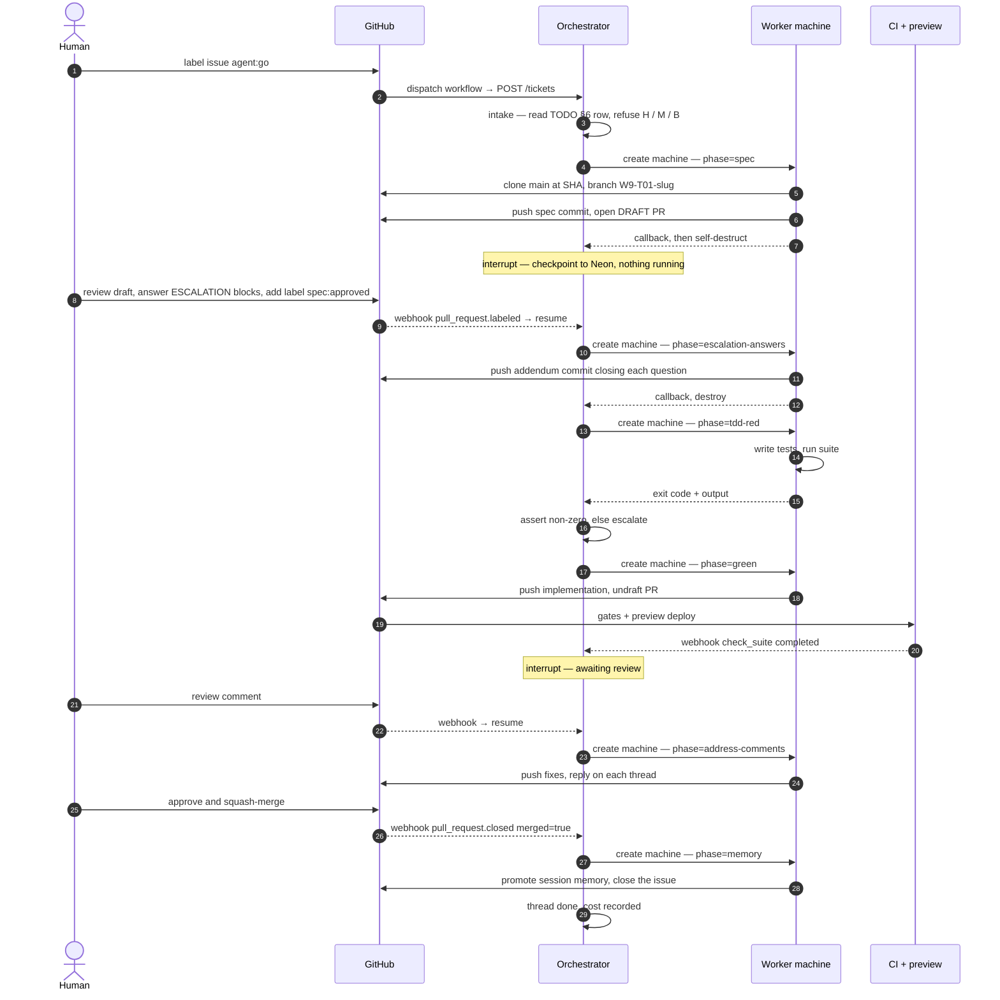
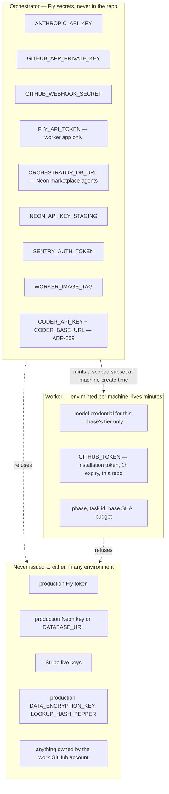

# ADR-008: Autonomous agent orchestration

## Status
Proposed — 2026-09-10 · model selection is split out into [ADR-009](ADR-009-model-tiering.md)

## Context

The pipeline in `agents/AGENTS.md` §1 — spec → contract freeze → TDD red → green → refactor →
review → merge — is executed today by a human driving a Claude Code session. Every step is already
written down as a prompt template, every artifact already has a required path, and every gate
already runs in CI. What is missing is the thing that *drives* it when nobody is at the keyboard.

The naive shape — "a CI job that runs an agent until the PR is open" — cannot work, because three of
the pipeline's steps are **waits measured in days**:

| Wait | Typical duration | Who ends it |
|---|---|---|
| Spec approval, including answers to `ESCALATION` blocks | hours → days | human |
| CI result on a pushed branch | minutes | GitHub |
| PR review comments, or the PR being closed unmerged | hours → days | human |

A process that holds those waits in memory is a process that dies — a GitHub Actions job caps at
6 hours, and a Fly machine sitting in `sleep` is billed for doing nothing. The state has to outlive
the compute.

## Decision

**LangGraph is the durable state machine for the pipeline. It is not the thing that writes code.**

The code is written by Claude Code / the Claude Agent SDK, running against a real checkout, with the
same prompts in `agents/prompts/` that a human session uses today. LangGraph contributes exactly one
thing that the current setup cannot do: a graph that suspends on `interrupt()`, persists to
Postgres, and resumes days later from a webhook.

That produces the governing split:

- **Orchestrator** — long-lived, tiny, always-on. Holds graph state. Talks to GitHub, Fly and Neon.
  Never runs a model, never clones the repo.
- **Worker** — ephemeral, one machine per *phase*, destroyed on exit. Clones at a pinned SHA, runs
  one prompt, pushes one commit, calls back, dies. Holds no state between phases. The worker is a
  **contract, not a program**: which model runs a phase is a config value, and more than one image
  implements the same interface — see [ADR-009](ADR-009-model-tiering.md).

Stateless workers are what make a three-day interrupt free: nothing is running while we wait, a
crashed worker is simply re-spawned at the same graph node, and the phase boundary is a natural
retry boundary.

---

## Deployment topology



### The relation that matters most

**The orchestrator never deploys anything.** It pushes commits and opens pull requests; from that
moment the existing `deploy-preview.yml` treats an agent's PR exactly as it treats a human's. No new
deploy path, no second copy of the Fly/Neon/Cloudflare credential surface, and the preview a
reviewer clicks is produced by the same tested workflow as always.

Likewise the worker never touches the product database. It reads the *preview* URL that
`deploy-preview.yml` commented on the PR, and nothing else.

---

## Module inventory — what, where, when

| Module | Path | Artifact | Deployed where | Deployed when | Lifetime |
|---|---|---|---|---|---|
| **Orchestrator** | `services/orchestrator/` | Docker image | Fly app `marketplace-agents`, `cdg` | On merge to `main`, path-filtered on `services/orchestrator/**` | Always on, 1 machine |
| **Worker images** | `infra/docker/worker-*.Dockerfile` | One image per harness, tagged with the `main` SHA | Fly registry; run as machines in app `marketplace-agent-worker` | Built on merge to `main` when a Dockerfile, `services/orchestrator/**`, or `agents/**` changes | Machine lives one phase — minutes |
| **Model routing** | `services/orchestrator/models.toml` | — | Read by the orchestrator | With the orchestrator; a model change is a reviewed PR | — |
| **Dispatch workflow** | `.github/workflows/agent-dispatch.yml` | — | GitHub Actions | Live on merge to `main` — label events always run the default branch's copy | Per trigger |
| **Graph state store** | — | Neon project `marketplace-agents` | Neon | Once, `OPS-20`, before the orchestrator's first deploy | Permanent |
| **Prompts and policies** | `agents/**` | Baked into the worker image | — | With the worker image | — |
| **Preview env** | `infra/fly/api.preview.toml` | *unchanged* | Fly `marketplace-api-pr-N` | Per PR, existing workflow | Until PR closes |

### Why `services/orchestrator/`, outside the pnpm workspace

`pnpm-workspace.yaml` globs `apps/*` and `packages/*`. A Python module under `services/` is invisible
to pnpm and to turbo, which is what we want — no `pnpm install` will try to resolve it, no `turbo
build` will try to build it.

It lives in **this** repo rather than its own, because the graph's node contracts and the prompt
templates in `agents/prompts/` must version together. A prompt change that alters the output shape a
node parses has to land in one PR and revert as one commit. We already learned this once: the
`agents-drift` gate exists precisely because `.claude/agents/` and `agents/roles/` drifted apart
when they were maintained separately.

Two consequences accepted deliberately:

1. **Our own gates apply to it.** `spec-present` will demand a spec and run record for orchestrator
   work. Correct, and slightly recursive.
2. **Self-modification is fenced.** A ticket whose diff touches `services/orchestrator/**` must not
   be executed by a worker built from that diff. Workers always run a **pinned image tag**, never
   `latest`, and the orchestrator refuses to spawn for such a ticket unless a human sets the tag
   explicitly.

### The deploy pipeline for the agent system itself



The orchestrator gets **one** environment, not three. It is infrastructure for building the product,
not part of the product, and a second copy would double the spend surface for the
`ANTHROPIC_API_KEY`. Changes to it are tested by running one real ticket end to end with a low
budget cap — a `W9` ticket makes a good canary because the blast radius is the agent system itself.

---

## The graph



### Two nodes carry more weight than the rest

**`tdd_red` is machine-verified, not trusted.** L1 requires the failing run pasted into the run
record. Here the graph *executes* the suite and asserts a non-zero exit before it will advance; a
suite that passes means no red phase exists, and the edge goes to `escalate` instead of to
implementation. A law currently enforced by a reviewer's attention becomes an edge condition.

**`ledger` fires on PR close.** L7 requires an intervention entry when a PR is closed unmerged — and
that is exactly the moment a human is irritated and walks away. The graph writes it via
`prompts/07-intervention-triage.md` before the thread can reach a terminal state. The rejection
dataset stops depending on discipline.

### State carried across interrupts

`thread_id` is the task ID — `W1-T05` — so any ticket is resumable by its own name, from a webhook,
a CLI, or a human curl.

```
task_id, slug, slice, role, issue, pr, branch, base_sha,
phase, attempts{phase: n}, escalations[], red_output,
spec_sha, budget_usd, spent_usd, worker_image_tag
```

---

## A ticket, end to end



### Interrupts and what resumes them

| Graph node | GitHub event | Resume payload |
|---|---|---|
| `await_spec_approval` | `pull_request.labeled` — `spec:approved` | review body, parsed for escalation answers |
| `await_spec_approval` | `pull_request_review` — `changes_requested` | the review body |
| `await_adr_approval` | `pull_request_review` — approved, second reviewer | reviewer login |
| `await_ci` | `check_suite.completed` | conclusion + failing job logs |
| `await_review` | `issue_comment`, `pull_request_review_comment` | comment bodies + thread ids |
| `await_review` / any | `pull_request.closed` | `merged: true` or `false` |

**Approval is a label, not a parsed comment.** `spec:approved` is unambiguous, is visible on the
board, survives edits, and cannot be triggered by prose in an unrelated sentence. When the spec
carries `ESCALATION` blocks, the orchestrator refuses to resume until the review body answers each
one — and the answers land as an addendum commit, which is the shape branch `W1-T05` already
produced by hand at `bd7d4e4`.

---

## Retrieval: a deterministic context pack, not a vector store

**No RAG, no embeddings, no index over the codebase.** Embedding retrieval over a repo we can `grep`
returns plausible chunks instead of exact ones, and the high-value context here is *structural* — we
know which files a `W1-T05` agent needs before it starts, from the slice map and the task ID.

`prepare_branch` assembles the pack deterministically:

| Source | Selector |
|---|---|
| `agents/AGENTS.md` + every `agents/policies/*.md` | always |
| `agents/roles/<agent>.md` | from the slice ownership map, TODO §4 |
| The task's row in TODO §6 | grep by task ID — never the whole 48KB file |
| `memory/LONG_TERM.md`, `memory/slices/<agent>.md` | always |
| `memory/sessions/*<TASK-ID>*` | when an interrupted session exists — AGENTS.md boot step 6 |
| Issue body | the user story and AC from `docs/board/stories.ts` |
| 2–3 merged sibling specs | same slice, most recent |
| `docs/interventions/` entries for this agent | the root-cause history; the highest-signal input we have |

Everything else the agent finds with grep and read, which is what a coding agent is good at.

**The pack is an egress surface.** Four of those eight sources are prose that names real partners,
real incidents and real people — the interventions ledger and `git log` especially, the latter
guaranteed to carry `mastrobardo@gmail.com` because `author-identity` requires it. Assembling the
pack is therefore also a per-source trust decision, and it is not covered by a redactor that operates
on the repo. See [ADR-009](ADR-009-model-tiering.md) → *What ghostc does not currently see*.

**Clone semantics**: shallow clone of `origin/main` at a SHA pinned at intake, always after an
explicit `git fetch` — `origin/main` on a stale clone has bitten this repo before. Rebase onto fresh
`main` at `undraft_pr`, not earlier.

Revisit only when `docs/specs/` plus `docs/interventions/` outgrows a context window: hybrid BM25
over **those two directories**, and still never over source code.

## MCP servers: three

Each server costs tool-definition tokens on every turn, so the bar is "needs structured, paginated,
authenticated access that a CLI cannot give cheaply".

| Server | Why it earns its place |
|---|---|
| **GitHub** | PR, issue, review and comment lifecycle is the graph's entire I/O surface |
| **Neon** | The worker inspects its own preview branch and migration result during `fix_ci` |
| **Sentry** | `docs/board/AGENT-CREDENTIALS.md` §C: autonomy is not only deploying, it is finding out whether the deploy worked. Without this the agent ships and asks a human |

CLI rather than MCP: `flyctl`, `git`, `gh`, `pnpm`. Playwright joins later, only if the smoke test at
`await_review` is worth its weight.

---

## Secrets and trust boundaries



Rules that follow from `docs/board/AGENT-CREDENTIALS.md` and `agents/policies/human-boundaries.md`:

- **The worker app has no `fly secrets` of its own.** Every value arrives in the machine-create call,
  scoped to one phase, and dies with the machine. A leaked worker env is worth an hour.
- **A GitHub App, not a PAT.** Installation tokens expire in an hour and are scoped to this repo. It
  also gives us the webhook delivery and a distinct actor in the audit log.
- **Commits are still authored `mastrobardo <mastrobardo@gmail.com>`.** The `author-identity` gate
  cannot be bypassed and checks both trailers. Push *authentication* is the App; commit *authorship*
  is the personal identity. Agent-written commits are distinguished by a `Co-Authored-By` trailer and
  the run record, not by the author field.
- **A budget in graph state, not a rate limit.** `AGENT-CREDENTIALS.md` §E calls
  `ANTHROPIC_API_KEY` "a spend surface with no gate on it". The gate is `budget_usd`, decremented per
  worker run, with `escalate` as the terminal edge and a single kill switch that drains the app.
- Production deploys stay manual and human, unchanged. An agent proposing a release is fine.

---

## Consequences

### What gets better
- The three long waits stop costing anything, and stop losing context when a session ends.
- `tdd_red` and the close-without-merge ledger become mechanically enforced rather than reviewed.
- Cost, attempt counts and escalation rate per task become a table — the first real measurement of
  the "agent output quality is measurable, not anecdotal" claim in TODO §1.

### What gets worse, and must be handled first
1. **The gates fail open.** The `database` job enumerates its live suites by hand: a new test file is
   skipped and the run still goes green. An autonomous loop treats "CI green" as its success signal,
   so it will exploit this without meaning to. **Fix the enumeration before the loop runs
   unattended** — otherwise the graph is verifying nothing.
2. **Parallel branches collide** on `README.md`, `memory/` and `pnpm-lock.yaml` while sharing no
   source file. N concurrent agents make this N². Mitigation: all memory writes deferred to the
   single serialized `memory_write` node after merge, and a lease on the remaining shared paths.
   Related open issue: #163.
3. **Branch protection is not on yet** (`W0-T13`, #45). Gates report but do not block, so an agent PR
   *could* be merged red. Autonomy raises the cost of that from "unlikely" to "eventually".
4. A wedged thread is invisible until someone looks. The orchestrator needs a `/threads` view and a
   stale-interrupt alert before this is trusted overnight.

---

## Alternatives rejected

| Alternative | Why not |
|---|---|
| **A single long-running CI job per ticket** | The 6-hour Actions cap, and a job cannot survive a two-day wait for a review. |
| **The graph running inside the worker, one machine per ticket** | A machine alive for three days waiting on a human, billed throughout, losing everything if it restarts. |
| **Vector RAG over the repo** | Approximate answers to questions with exact ones. The pack above is deterministic and auditable; grep handles the rest. |
| **A separate repo for the orchestrator** | Guarantees prompt/graph drift. `agents-drift` exists because we already made this mistake. |
| **Kubernetes / Cloud Run for workers** | Fly Machines already give per-run VMs with `auto_destroy`, and the account, tokens and region are the ones this repo already uses. |
| **A bot GitHub identity for commits** | `author-identity` fails it on every PR, by design. |
| **Skipping LangGraph — a hand-rolled state machine over a DB table** | Honest option, and roughly the same amount of code. LangGraph is chosen for `interrupt`/`Command(resume=…)` and the checkpointer, not for its agent abstractions, which we deliberately do not use. |

## Open questions

1. **Concurrency limit.** How many tickets in flight before the shared-file collisions in
   consequence 2 outweigh the throughput? Suggested start: **one**, until the ledger says otherwise.
2. **Who reviews an agent's PR?** L6 forbids self-merge and §5.4 wants three axes. A second graph
   thread reviewing the first satisfies the letter; whether it satisfies the intent is untested.
3. **Escalation latency.** If a human answers in three days, is a ticket still worth resuming, or
   should the branch be rebased from scratch? Needs a staleness policy on `base_sha`.
