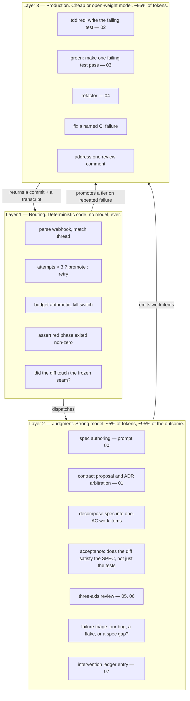
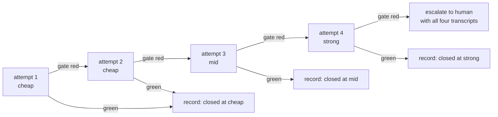
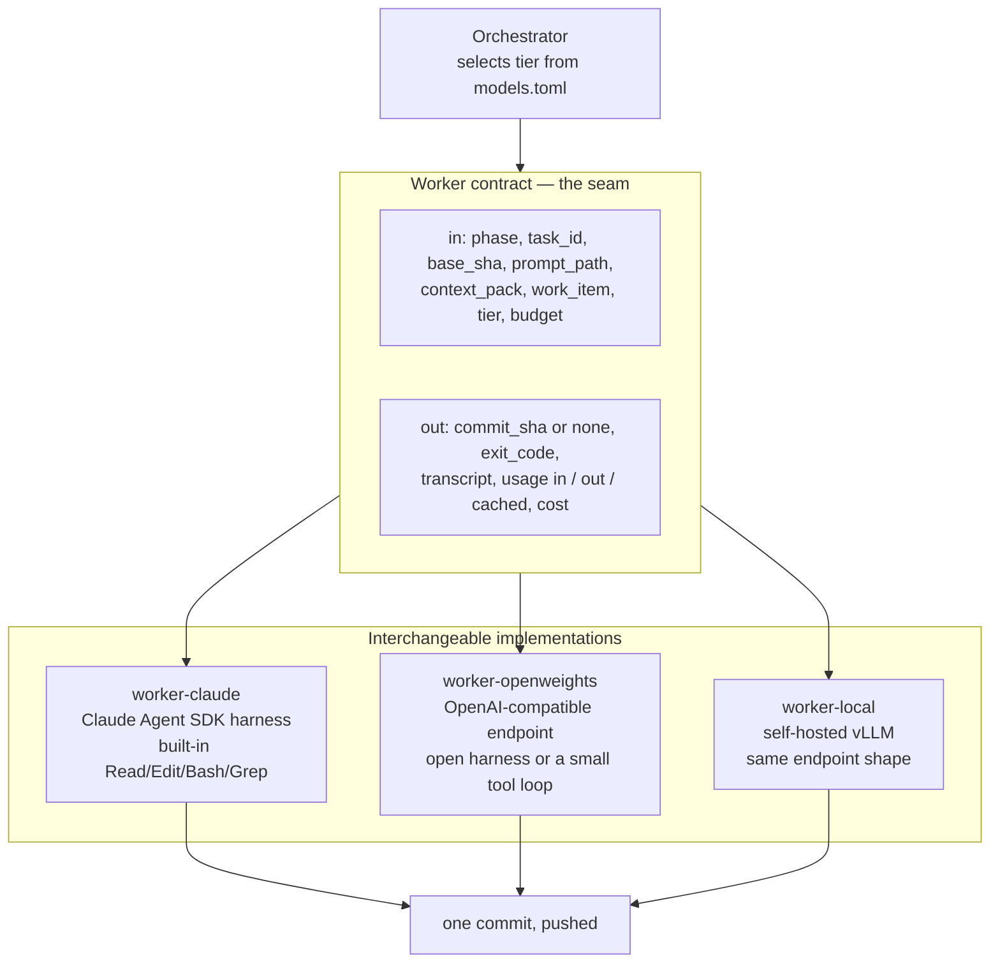
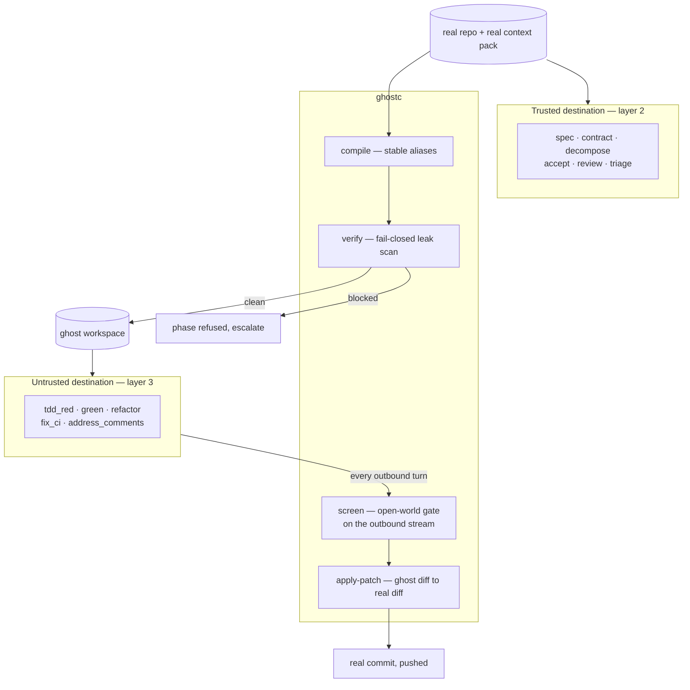

# ADR-009: Model tiering and the worker contract

## Status
Proposed — 2026-09-10 · extends [ADR-008](ADR-008-autonomous-agent-orchestration.md)

## Context

ADR-008 treats the model as an implementation detail of the worker: a phase runs "an agent" and
returns a commit. That was deliberate under-specification, and it is now the thing to decide.

The proposal is a strong model for orchestration and a cheap open-weight model for the coding —
Opus or Fable supervising, something like DeepSeek doing the typing. The instinct is right, but the
axis is wrong. **Tier by judgment density, not by process.** Some of the most consequential thinking
in this pipeline happens at what ADR-008 calls a worker phase — spec authoring is the single
highest-leverage artifact in the whole system — and some of what happens in the orchestrator is
arithmetic that no model should touch.

## Decision

### Three layers, and only the middle one is a model choice



Layer 1 stays code. A model that decides whether three is greater than two is a liability, not a
feature — and every graph transition in ADR-008 is that kind of decision.

The split between 2 and 3 is where the money is. Judgment prompts are short — a spec, a diff, a
failing log; call it 5–40K in and 2–8K out. Production prompts are a long agentic loop over a real
checkout: hundreds of thousands of tokens across many turns, resent on every turn. **Volume lives
almost entirely in layer 3, and consequence lives almost entirely in layer 2.** That asymmetry is
what makes tiering worth doing at all.

### The routing table

Versioned at `services/orchestrator/models.toml`, so a model change is a pull request with a diff
and a reviewer, not an environment variable somebody edited at 1am.

| Phase | Layer | Tier | Sees | Why |
|---|---|---|---|---|
| `intake`, every graph transition | 1 | **none** | — | Deterministic |
| `write_spec` | 2 | **strong** | real | A weak spec wastes every token spent downstream. Not negotiable |
| `answer_escalations` | 2 | **strong** | real | Reconciling a human's answers against a frozen sketch |
| `contract_freeze` | 2 | **strong** | real | The seam changes only via ADR; getting this wrong is expensive for every other slice |
| `decompose` *(new)* | 2 | **strong** | real | Turns AC into one-test-at-a-time work items — see below |
| `tdd_red` | 3 | **cheap** | **ghost** | The output is machine-checked: the suite must fail |
| `implement_green` | 3 | **cheap** | **ghost** | One failing test at a time, bounded by the test |
| `refactor` | 3 | **cheap** | **ghost** | Tests stay green and unchanged — a hard oracle |
| `fix_ci` | 3 | **cheap**, promoting | **ghost** | Named failure, named file |
| `address_comments` | 3 | **cheap**, promoting | **ghost** | One comment, one thread |
| `accept` *(new)* | 2 | **strong** | real | Does the diff satisfy the spec, or merely the tests? |
| `review` | 2 | **strong** | real | §5.4's three axes, on the agent's own PR |
| `triage`, `ledger` | 2 | **strong** | real | Root-cause labels feed the prompt-improvement loop; a wrong label poisons the dataset |

The **Sees** column is the subject of the next section, and it is not a coincidence that it splits
along the same line as the tier.

### Why a cheap coder is safe *here* specifically

Not a general claim. It holds because of machinery this repo already has:

1. **The spec is frozen before any code is written.** The cheap model is never asked what to build.
2. **`tdd_red` is machine-verified** (ADR-008): a test that must fail before implementation is an
   oracle the model cannot talk its way past.
3. **The gates are machine-run.** Typecheck, lint, unit, build, database.
4. **A strong model reviews the diff against the spec.**

Cheap model + red test + green gate + strong reviewer is bounded. Remove any one and it is not.

The residual failure mode is not broken code — the gates catch that. It is **plausible code that
passes the test while missing the spec**, which is precisely what the `accept` node exists to catch,
and why that node is strong-tier even though it runs once per ticket.

### The consequence nobody expects: phases get smaller

Open-weight models degrade over long agentic horizons much faster than their single-shot benchmarks
suggest. Thirty turns into a loop, instruction-following and tool discipline fall off well before
raw coding ability does.

So heterogeneity forces a decomposition that was optional before. A new strong-tier `decompose` node
turns the spec's acceptance criteria into an ordered list of one-test work items, and
`implement_green` becomes a **loop over items**, each a short worker invocation with a single
failing test as its goal:

```
before:  implement_green("build W1-T05")                 → 40 turns, one cheap model, drifting
after:   decompose → [AC1 … AC18]                        → strong, once
         implement_green(AC-n) × 18                      → ~4 turns each, cheap, bounded by one test
```

Each invocation is short enough that the cheap model is working where it is strongest, and a failure
localises to one criterion rather than to "the ticket". This is worth doing even if the coder stays
Anthropic — the model change is what makes it mandatory.

### Automatic tier promotion



The ladder is the cost control **and** the measurement. Sticker price per token is not the number
that matters — cost per *completed task* is, and a cheap model that needs four attempts is not
cheap. After twenty tickets the ledger says what fraction each tier closed unaided, and the routing
table gets edited with evidence rather than vibes.

Two constraints on the ladder: **the tier is fixed for the duration of a phase** (prompt caches are
model-scoped; ping-ponging forfeits every cache hit and re-pays the context pack), and **a promotion
is recorded as a first-class event**, because a rising promotion rate is a signal about the prompt
template, exactly like a run record full of corrective iterations.

---

## The worker contract

The graph must not know which model ran. Making the model a per-node config value only works if the
worker is an interface with more than one implementation.



**This is the load-bearing decision of this ADR.** Everything else — which model, which host, whether
open weights are worth it — becomes a config value and an experiment, instead of a rewrite.

It also names the real cost of heterogeneity honestly: **Claude Code is an Anthropic harness.** An
open-weight worker needs a different one — an open agent loop against an OpenAI-compatible endpoint —
and that second harness is the actual work, not the model swap. What makes it survivable is that
`agents/prompts/*.md` are already plain markdown with no Anthropic-specific syntax. What does *not*
port: the skills system, `.claude/agents/`, hooks, and `CLAUDE.md` conventions. Any prompt that
depends on those is a prompt the open-weight worker cannot run, and `agents/prompts/` should be kept
harness-neutral from here on for that reason.

---

## Cost

Anthropic rates, first-party API, per million tokens:

| Model | ID | Context | Input | Output |
|---|---|---|---|---|
| Claude Fable 5.1 | `claude-fable-5-1` | 1M | $10 | $50 |
| Claude Opus 5 | `claude-opus-5` | 1M | $5 | $25 |
| Claude Sonnet 5 | `claude-sonnet-5` | 1M | $2 | $10 |
| Claude Haiku 4.5 | `claude-haiku-4-5` | 200K | $1 | $5 |

Open-weight coder models hosted at an inference provider land roughly an order of magnitude below
Haiku on input and output. **Do not take a specific figure from this document** — verify the current
rate for whichever model and host is chosen at the time, since both move monthly.

**The honest arithmetic for this project.** A ticket the size of `W1-T05` is order 10⁵–10⁶ worker
tokens including retries, against order 10⁴ judgment tokens. Moving the worker traffic from Opus to
an open-weight model takes a ticket from a few dollars to well under one. **Real, but small in
absolute terms at a solo developer's throughput.** If the goal is purely to spend less, `worker-claude`
pointed at Haiku 4.5 or Sonnet 5 captures most of that saving today with **no second harness, no new
vendor, and no new data egress** — and it is the correct first move.

The reasons that actually justify the open-weight worker are the other ones:

- **Not being single-vendor** for the component that does 95% of the token volume.
- **A path to self-hosting** — the same OpenAI-compatible endpoint shape, later pointed at vLLM on
  hardware you control, which is the only configuration where the source never leaves.
- **It forces the verification machinery to be real.** A pipeline that only works with a frontier
  model at the keyboard has been leaning on the model to cover for gaps in its gates.

**Recommendation: build the seam now, populate it with Anthropic tiers first, then add
`worker-openweights` as a second implementation and A/B it on real tickets** using the promotion-rate
and cost-per-completed-task data the ledger already collects. Evidence, not a bet.

## Data egress — a new `[H]` decision

`agents/policies/human-boundaries.md` forbids an agent from contacting anyone outside the repo or
publishing anything externally. Sending a full private repository to a third-party inference provider
is a new external data flow, and it is not the agent's call to make.

Three placements, in descending order of exposure:

| Where the weights run | Exposure | Cost shape |
|---|---|---|
| The model vendor's own API | Full source to that vendor, under their retention terms | Cheapest per token |
| A neutral inference host serving the open weights, no-retention contract | Full source to that host | Slightly more per token |
| Self-hosted vLLM on a GPU machine | None — source never leaves | Per-hour, not per-token; needs high utilisation to beat per-token pricing, and a solo developer's ticket rate does not come close |

Redaction is the other half of this answer, and it is the subject of the next section: a ghost repo
lowers the exposure of rows 1 and 2 from "the source" to "aliased source", which is what makes a
hosted destination tolerable at all.

**Open weights are exactly what makes the host a separate, revisable choice** from the model. Prefer a
host with a stated no-retention policy over the model vendor's first-party API, and record the
decision as an `OPS` ticket with the retention terms attached, alongside the existing entries in
`docs/board/AGENT-CREDENTIALS.md`. Also confirm the host offers **prompt caching**: the context pack
is resent on every turn of an agentic loop, and a host without caching quietly erases much of the
per-token advantage that motivated the switch.

---

## Redaction at the boundary — ghostc

[`micro1hackaton`](https://github.com/mastrobardo/micro1hackaton) is a privacy compiler for exactly
this problem: `ghostc compile` rewrites a real repo into a semantically faithful **ghost repo** with
stable aliases (`Stripe` → `PaymentProviderA`, not `REDACTED`, so imports and semantics survive),
`ghostc verify` runs a fail-closed leak scan, `ghostc screen` is an open-world LLM gate over
outbound text, and `ghostc apply-patch` reverse-compiles a ghost diff back into a real one.

### The layer split is already a trust split

The tiering above divides the pipeline into a small, high-judgment layer that needs full fidelity
and a bulk, mechanical layer that does not. That is the same line a redactor wants to draw. A spec
has to name Stripe and Neon to be worth reading; *make this failing test pass* does not care that
the payment provider is called `PaymentProviderA`.

So the boundary falls out of a decision already taken, rather than being bolted across it:



### `worker-ghost` is a third implementation of the same contract

The worker contract is already a clone-to-commit boundary, so ghostc slots in as a sandwich around
it and the graph in ADR-008 does not change:

```
compile (real → ghost)  →  worker runs entirely in ghost space  →  apply-patch (ghost → real)  →  push
```

`worker-claude`, `worker-openweights` and `worker-ghost` are three images behind one interface. This
is the whole reason the contract was worth defining before choosing a model.

### What ghostc does not currently see

`compile` operates on a **repo**. An agentic loop's egress is not a repo snapshot — it is a stream of
tool results generated at run time, and in ADR-008 the **context pack** is assembled from six sources
that are not source code at all:

| Egress surface | Covered by `compile`? | Note |
|---|---|---|
| Source under the worktree | ✅ | The designed case |
| GitHub issue body, TODO §6 row | ❌ | Prose naming real partners, providers and people |
| `memory/` and `docs/interventions/` | ❌ | The ledger names humans by role and records real incidents |
| `git log`, `git blame` | ❌ | Every commit carries `mastrobardo@gmail.com` — required by `author-identity`, so it is guaranteed present |
| Stack traces, test failures, CI logs | ❌ | Runtime output; ghost-space if the workspace is clean, real if anything real leaked into env |
| Preview URL, Fly app name, Neon branch name | ❌ | Injected by the orchestrator, never in the repo |

**The pack and the runtime stream need `screen`, not `compile`.** Two consequences: the context pack
becomes an explicit egress surface with a per-source trust decision (ADR-008 assembles it and never
asked where any of it was allowed to go), and the leak-count eval needs a second corpus — agentic
traffic is a different distribution from a repo snapshot, and the values that leak from it are ones
that never appear in source.

### Three properties this design depends on

1. **`screen` cannot adjudicate the destination it is screening.** Here that is fine and
   non-circular — Anthropic is the trusted side, the open-weight host is the new boundary, so the
   screen runs on the trusted tier. It stops being true the day someone routes the screen to the
   cheap model to save money. Write that down as a constraint, not an assumption.
2. **Stable aliases are load-bearing for cost, not only for reversibility.** Prompt caching is a
   prefix match, and an agentic loop resends its history every turn. An alias that is not
   deterministic per identifier changes the ghost prefix on every request and destroys the cache —
   which is most of the per-token advantage that motivated the cheap tier in the first place.
3. **Fail closed at the phase boundary.** `verify` blocking is a refused phase and an escalation, not
   a warning. This composes with the attempt ladder: a phase that cannot be safely ghosted promotes
   to the trusted tier on the real repo rather than degrading quietly.

### Where to test it first

The `PostToolUse` hook in Claude Code is a real chokepoint available today, in the harness phase 1
already commits to. Running `ghostc screen` over tool output there exercises the gate against genuine
agentic traffic — the runtime surface `compile` structurally cannot see — with no new infrastructure
and no third-party destination in play. It does not cover the assembled system block or the context
pack; those need the barebone loop, which is only required once an untrusted destination actually
exists. That ordering keeps the privacy experiment independent of the second-harness work instead of
gating one on the other.

---

## Run record and ledger changes

`agents/prompts/08-run-record.md` carries a single `Model:` line. With tiering that field is a lie by
omission, and it becomes a table:

```markdown
| Phase | Model | Tier | Attempts | In | Out | Cached | $ |
|---|---|---|---|---|---|---|---|
| spec | claude-opus-5 | strong | 1 | 18k | 6k | 12k | 0.24 |
| decompose | claude-opus-5 | strong | 1 | 9k | 3k | 8k | 0.10 |
| green AC1-18 | <coder> | cheap | 23 | 1.4M | 180k | — | 0.61 |
| fix_ci | <coder> → claude-sonnet-5 | promoted | 3 | 210k | 40k | — | 0.82 |
| accept | claude-opus-5 | strong | 1 | 24k | 4k | 20k | 0.22 |
```

This is what lets `docs/interventions/ROLLUP.md` answer the question the whole scheme turns on: when
a PR is rejected, **which tier wrote the part that was wrong** — and therefore whether the fix is a
better prompt, a smaller work item, or a better model.

## Consequences

- **A second harness to maintain**, and `agents/prompts/` must stay harness-neutral to feed both.
- **Prompt caching is model-scoped.** The ladder pays a cold cache on every promotion; that cost is
  part of what the ladder measures, and it is why a tier is pinned for a whole phase.
- **Two vendors' outages**, two rate-limit regimes, two failure vocabularies to triage.
- **`decompose` is new work** that the graph in ADR-008 does not have, and `implement_green` becomes a
  loop rather than a call. This is the largest structural change this ADR imposes.
- **Determinism differs.** Sampling parameters are removed on the current Anthropic models and
  controlled through effort instead; on open weights temperature is yours to set, and it should be
  low for a coder.
- **A ghost workspace is a third thing to keep in sync.** `apply-patch` must reverse cleanly onto a
  base that may have moved, and a mapping file is now a build artefact the orchestrator holds and
  must never push. Fail-closed `verify` makes a stale mapping a refused phase rather than a leak.
- **The cheap tier is only as safe as the gates.** ADR-008 already flags that the `database` job
  enumerates its live suites by hand and therefore fails open. Under a frontier coder that is a
  latent bug; under a cheap one it is the load-bearing failure. **Fix it before the coder changes.**

## Alternatives rejected

| Alternative | Why not |
|---|---|
| **Strong model everywhere** | The status quo. Correct, and the right default — but it never finds out whether the gates are real, and it forfeits the one place tiering genuinely pays |
| **Cheap model everywhere, including the spec** | The spec is the artifact every downstream token is spent against. Saving $0.20 there to waste $2 downstream is not a saving |
| **A model deciding graph transitions** | Layer 1 is arithmetic. A model there adds latency, cost and non-determinism to `attempts > 3` |
| **Tier by process — orchestrator strong, all workers cheap** | The original proposal. Puts spec authoring, contract proposals and acceptance review on the cheap tier because they happen to run in a worker. The layer split fixes exactly this |
| **Self-hosted GPU from day one** | Per-hour billing against a handful of tickets a day. Revisit when utilisation, or a hard no-egress requirement, justifies it |
| **Fable 5.1 as the strong tier** | Twice Opus 5's rate. Worth testing on `write_spec` and `accept` specifically — the two nodes where a better answer is worth most — but not as the blanket judgment tier |

## Open questions

1. **Which coder model, and hosted where?** Deliberately unresolved: it is a config value in
   `models.toml`, and the seam above is what makes it one. Needs the egress decision first.
2. **Does the promotion ladder ever pay off, or does a cheap failure predict a strong failure?**
   If a task the cheap tier cannot close is usually one the strong tier cannot close either, the
   ladder is pure waste and the right move is to escalate to a human on attempt two. Twenty tickets
   of ledger data answers this.
3. **Does the ghost repo cost accuracy?** Aliasing is semantically faithful by design, but a model
   reasoning about `PaymentProviderA` has lost every prior it had about Stripe's actual API. That may
   cost more attempts than the redaction is worth on integration-heavy tickets, and the promotion
   ladder will show it as a ghost-specific failure rate. Measure before assuming either way.
4. **Can `accept` be trusted to a model at all?** A strong model judging a cheap model's work against
   a spec both of them read is a real evaluation problem, not a solved one. Until there is evidence,
   it advises the human reviewer — it does not replace them, and L6 still forbids self-approval.
