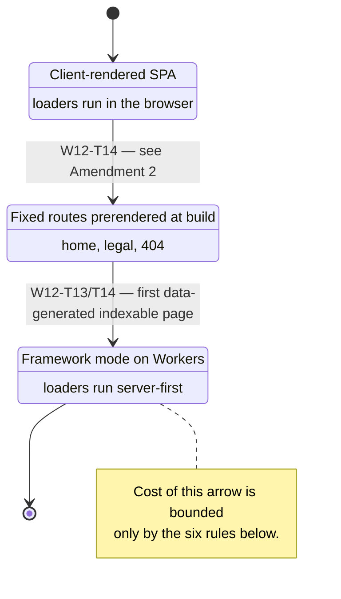
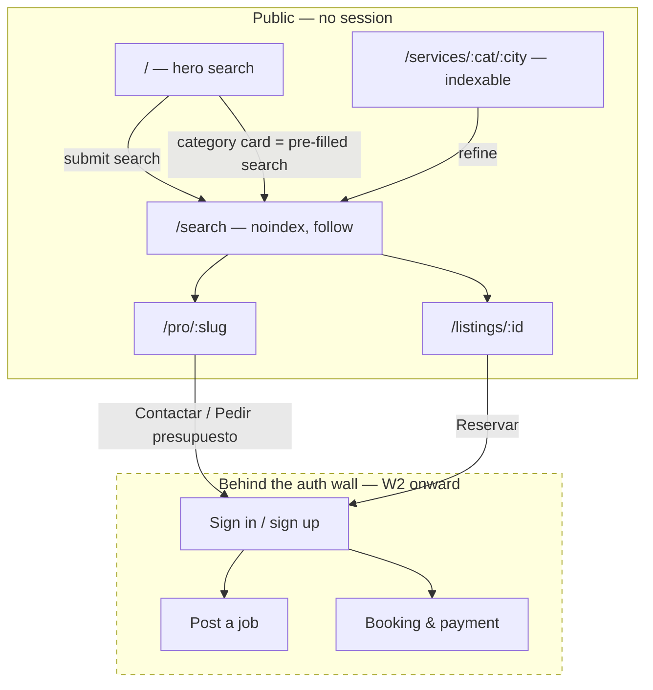

# ADR-011: The web front end — how a page is rendered, and what the storefront is made of

## Status
Proposed — 2026-09-11 · **amended 2026-09-11 (see "Amendment 1", "Amendment 2" and "Amendment 3"
below): URL segments are not translated, SEO is deferred, and a provider profile is addressed by
id.** Implemented by `W12` (milestone `M11 Public storefront`). Companion:
[ADR-012](ADR-012-design-system-and-component-workbench.md), which covers the components this
architecture assembles. Depends on [ADR-006](ADR-006-hosting-and-environments.md) (Cloudflare
Pages) and [ADR-007](ADR-007-feature-flags.md) (server-side flag evaluation).

**Explorable diagram**: `docs/diagrams/storefront-architecture.html` — the layering, the public
page map and the search path in one pannable view (source: the `.json` beside it).

---

## Summary — five decisions

1. **One React application**, rendered on the client today, **written so that server rendering is a
   switch and not a rewrite**. The switch is React Router's framework mode on Cloudflare Workers,
   and it gets flipped by `W12-T14`, when the first page whose commercial value depends on being
   indexed ships.
2. **A route is a loader plus a component.** No fetching in `useEffect`, no browser global at module
   scope, no module-scope cache holding per-user data. This is the whole cost of decision 1, paid in
   advance, and it is enforced by lint rather than by good intentions.
3. **Search is a schema, not a form.** One typed list of field descriptors renders the home hero, the
   compact header bar and the results filter rail, and serialises to the query string. A second
   vertical is then a different schema, not a different front end.
4. **The storefront talks only to the generated client** in `packages/contracts`. Until those
   endpoints exist it talks to MSW handlers built from the `packages/testing` factories — the same
   factories `W1-T09` made the single source of test data.
5. **A public page is indexable or it does not exist commercially.** Category × city landing pages
   are half the answer to the cold-start risk (`R3`), and they are worthless behind a client-rendered
   shell.

---

## Context

### What exists
`apps/web` is a Vite + React 19 single-page app with a router, a layout shell, ES/EN i18n and
`src/styles/tokens.css`. `HomePage` renders a heading and a paragraph and says so in its own comment:
*"a placeholder with a real structure … `W3` onward replaces it with search and discovery."* Nothing
has replaced it, because **`W3` owns search as an API concern and no workstream owns the pages**.

### What is missing
`TODO.md` §4 gives slice **S10 Design system** to `agent-ui` and puts `packages/ui` in the target
tree in §2. §6 has no `W12`. §8 has no milestone that a page appears in. S10 is the only slice in the
ownership map with an owner, a folder and **no backlog** — so the front end is the one part of this
system that no ticket has ever been responsible for. Every other slice's UI work is currently an
unstated tail on an API ticket, which is exactly how thirteen agents each invent their own button.

### The reference
[venuu.com](https://venuu.com/es/es) — a venue marketplace whose homepage is one large three-field
search (*event type · number of guests · location*) over a photograph, then category cards, a trust
strip, a supply-side call to action and a fat footer. The transferable idea is not the photograph.
It is that **the search is the product's entire navigation**: category cards are pre-filled searches,
landing pages are saved searches with prose around them, and the header keeps a compressed copy of
the same control on every page. Our fields are different — *what · where · when*, plus the mode
(`DIRECT | QUOTE | AUCTION | EMERGENCY`) — but the shape holds.

### Why the SPA becomes a problem the moment the storefront is real
Cloudflare Pages serves one `index.html` and the browser assembles everything else. That is fine for
an authenticated application and actively harmful for the public surface:

- **Indexing.** Googlebot renders JavaScript, but on a deferred queue and with no guarantee; the
  pages we most need indexed — `fontanero en Madrid`, and a few hundred siblings — are generated from
  data, are thin on their own, and compete with incumbents who ship HTML.
- **Cold start** (`R3`). The marketplace has no supply and no demand on day one. Organic long-tail
  search is the cheapest acquisition channel available before there is anything to advertise, and it
  is the half of the cold-start answer that is a code task.
- **Link previews.** Every share of a provider profile into WhatsApp — the way this business will
  actually travel in Spain — needs real `og:` tags in the served HTML.
- **Perf on a mid-range Android phone on 4G**, which is the device this product is used on.

So the SPA is a stage, not a destination — and the mistake to avoid is arriving at that conclusion
in six months with three hundred components that read `window` at import time.

---

## Decision

### 1. Rendering: a client-rendered SPA now, framework mode later, with the seam paid for today

| | Today (`W12-T01`…`T13`) | After the switch (`W12-T14`) |
|---|---|---|
| Build | Vite, `apps/web` | Vite, same app, framework plugin |
| Router | `react-router` 8, `createBrowserRouter` | same route modules, server-rendered |
| Host | Cloudflare Pages (static) | Cloudflare Workers via Pages |
| Data | loaders run in the browser | the same loaders run on the server first |
| New services | none | none |

We keep `react-router` because we are **already on version 8**, and framework mode is the same
router with a server entry in front of it. The migration is a build configuration and two entry
files — *provided* the route modules are shaped for it. That proviso is the decision.

**Trigger.** The switch is not scheduled by date. It is flipped by the ticket that ships the first
indexable, data-generated page (`W12-T13` landing pages, executed in `W12-T14`). Before that, the
public pages are few and fixed, and prerendering them at build time is enough.



#### The six rules that keep the arrow cheap

| # | Rule | What breaks without it |
|---|---|---|
| **R1** | A route module exports `loader`, `Component`, and where relevant `ErrorBoundary` and `meta`. Nothing else. | Route logic that cannot move to the server. |
| **R2** | No `window`, `document`, `localStorage`, `matchMedia` or `navigator` **at module scope**. Inside an effect or an event handler only. | The server crashes on import. This is the single most common SSR migration failure. |
| **R3** | Data comes from the loader. A component never fetches on mount. | Server-rendered HTML arrives empty and the SEO work was pointless. |
| **R4** | State that must survive a reload or a share lives **in the URL**. | Shared searches lose their filters; the results page cannot be rendered from a request alone. |
| **R5** | No module-scope mutable cache. A `const cache = new Map()` at module top level is per-user in the browser and **shared between all users** on a server. | One user's results served to another. This is a data-leak class, not a bug class. |
| **R6** | Anything request-scoped — the i18n instance, the API client, resolved feature flags — is created per request and passed down, never a module singleton. | ES text served to EN users under load; flags bleeding between requests. |

**Enforcement, because a convention that is not a gate does not survive a deadline** (`TODO.md` R11,
and the exact decay [ADR-010](ADR-010-agent-telemetry.md) documented for run records):

- R2 and R5 are an ESLint rule over `apps/web/src/routes/**` and `apps/web/src/features/**`
  (`no-restricted-globals` plus a small custom rule for mutable module-scope bindings).
- R3 is a lint rule banning `fetch` and the generated client inside component bodies.
- R1 and R6 are a unit test that imports every route module **in a Node environment with no DOM** and
  asserts the export shape. If a route cannot be imported without a browser, it fails today — years
  before anyone tries to server-render it.

**Known migration debt, recorded now rather than discovered later.** `apps/web/src/i18n/index.ts`
initialises a module-level `i18next` singleton, and `main.tsx` awaits it before the first render.
That is correct for an SPA and violates R6. It stays as-is; `W12-T14` converts it to a per-request
instance, and the route-shape test is what will prove the conversion is complete.

### 2. Page inventory — the public surface

`:lang` is `es` (default) or `en`. Paths are localised per language; the route ids are not.

| Route (`es`) | Page | Indexable | Data | Ticket |
|---|---|---|---|---|
| `/` → `/es` | Home: hero search, categories, how it works, trust strip, supply CTA | ✅ | categories, counts | `W12-T10` |
| `/es/search?...` | Results: list + map, filters | **`noindex, follow`** | search | `W12-T11` |
| `/es/services/:category` | Category landing | ✅ | category, top providers | `W12-T13` |
| `/es/services/:category/:city` | Category × city landing — *the SEO surface* | ✅ | category, city, providers | `W12-T13` |
| `/es/pro/:id` | Provider profile, public view | ✅ | provider (portfolio and reviews: no columns — see Amendment 3) | `W12-T12` |
| `/es/listings/:id` | Listing detail | ✅ | listing, provider | `W12-T12` |
| `/es/become-a-pro` | Supply-side landing | ✅ | static | `W12-T10` |
| `/es/legal/*` | Terms, privacy, cookies | ✅ | static (`W10-T07`) | `W12-T09` |
| `*` | 404 / 500 | — | — | `W12-T09` |

**Search results are `noindex, follow`** on purpose. An unbounded filter space generates unbounded
near-duplicate pages, which is the classic way a marketplace earns a thin-content penalty and buries
the landing pages that *are* worth indexing. Crawlers follow the links out of a results page; they do
not index the page itself. The indexable inventory is a **curated** category × city matrix, not a
combinatorial one — which city and which category pairs exist is a content decision (`BD-15`), not a
`for` loop.



**M11 ends at that dashed line.** The CTA routes to the auth wall and stops there, deliberately and
visibly — a real boundary the milestone can be demoed against, not an unfinished edge.

### 3. Search is a schema

The home hero, the compact control in the header, and the results filter rail are three renderings of
**one** declaration. The alternative — three hand-built forms — guarantees they drift, and the drift
is invisible until a filter exists in one place and not the others.

```ts
// packages/ui — the shape; the instance lives in the discovery feature.
export type SearchField =
  | { kind: 'category'; name: 'what';  required: true }
  | { kind: 'place';    name: 'where'; required: true; geolocate: boolean }
  | { kind: 'choice';   name: 'when';  options: Urgency[] }
  | { kind: 'choice';   name: 'mode';  options: JobMode[] };

export type SearchSchema = {
  fields: SearchField[];
  renderings: {
    hero:    { layout: 'row'; prominence: 'primary' };
    header:  { layout: 'compact'; collapseTo: 'what' };
    filters: { layout: 'stack'; extra: FilterField[] };
  };
};
```

Three consequences worth stating:

1. **The schema produces the query.** `SearchSchema → SearchQuery` is a pure function, and
   `SearchQuery` is a zod schema in `packages/contracts`. The search bar therefore *defines the
   search API's input* — which makes `W12-T08` a contract request to `agent-contracts`, filed before
   `W3` implements the endpoint, rather than a UI that guesses at a response shape.
2. **The query string is the state.** `?what=fontaneria&where=28013&when=semana&mode=quote` — so a
   search is shareable, back/forward work, and a server can render the page from the request alone
   (rule R4, paid forward).
3. **A second vertical is a different schema.** Venuu's *event type · guests · location* and our
   *what · where · when* are the same component with a different declaration. That is the part of the
   reference worth copying.

```mermaid
sequenceDiagram
    autonumber
    actor U as Visitor
    participant H as Home (hero)
    participant R as Router
    participant L as Results loader
    participant C as Generated client
    participant A as API — GET /search

    U->>H: picks what · where · when
    H->>H: schema → SearchQuery (zod, packages/contracts)
    H->>R: navigate /es/search?what=…&where=…&when=…
    R->>L: loader(request)
    L->>C: search(query parsed from the URL)
    C->>A: GET /search?…
    A-->>C: { items, facets, page } — W1-T02 list conventions
    C-->>L: typed result
    L-->>R: data
    R-->>U: list + facets; map hydrates on view
    Note over L,A: Same call, same parse, whether the loader<br/>runs in the browser or on a Worker.
```

### 4. The data seam — and what the storefront needs the API to provide

The storefront imports **one** module for data: the generated client from `packages/contracts`. No
`fetch` in a component, no hand-written URL, no Prisma anywhere near React (`TODO.md` §2, rule 3).

`agent-ui` **may not edit `packages/contracts`** — the contract-freeze law in `agents/AGENTS.md`
makes that a change request that `agent-contracts` applies. `W12-T08` is that request:

| Endpoint | Feeds | Owner | Status |
|---|---|---|---|
| `GET /categories` | hero field, category cards, landing pages | `agent-providers` (`W3-T01`) | exists in backlog |
| `GET /search` | results, map, facets | `agent-discovery` (`W3-T04`) | **input shape defined by `W12-T07`** |
| `GET /providers/:slug` | public profile | `agent-providers` (`W3-T02`) | exists in backlog |
| `GET /listings/:id` | listing detail | `agent-discovery` (`W3-T03`) | exists in backlog |
| `GET /places/suggest` | the `where` field's autocomplete | `agent-discovery` (`W3-T06`) | Maps cost applies — see below |

**The storefront does not wait for them.** Every one of those is backed by an MSW handler built from
the factories in `packages/testing`. `W1-T09` made those factories the single source of test data and
added a gate that keeps it that way; the storefront fixtures are built **from the factories**, never
alongside them. A second fixture set that drifts from the first is the failure mode that gate exists
to prevent, and a front end built in isolation is the most likely place to introduce one.

### 5. SEO, i18n and performance — the three things that are cheap now and expensive later

**Indexing.** Per indexable route: a `meta` export producing `title`, `description`, `canonical`,
`og:*`; `hreflang` alternates for `es`/`en` plus `x-default`; JSON-LD (`Service` and `LocalBusiness`
on provider pages, `BreadcrumbList` on landings); a `sitemap.xml` generated from the curated landing
matrix, not from every URL the router can express; `robots.txt` disallowing `/search`.

**i18n.** ES is the default and the fallback (already true in `i18n/index.ts`). The language is the
first path segment — `/es/...`, `/en/...` — and **everything after it is English in both languages**:
`/es/search`, never `/es/buscar`. See Amendment 1. Route ids stay language-neutral so links are
written once.

**Performance budget**, enforced on the preview URL by Lighthouse CI in `W12-T15` and failing the PR:

| Metric | Budget (mobile, p75) |
|---|---|
| LCP | ≤ 2.5 s |
| INP | ≤ 200 ms |
| CLS | ≤ 0.1 |
| Initial route JS | ≤ 170 KB gzipped |
| Images | AVIF/WebP from R2, `srcset`, explicit dimensions |

**Maps are the budget's main threat** and a metered cost (`R9`). Therefore: the results page renders
the **list without the map**; the map is a separate chunk loaded on viewport or on interaction;
radius queries are PostGIS, never Maps; geocoding is cached server-side. If the map fails to load, the
page still works — which is also the accessible behaviour.

---

## Alternatives considered

**Astro for the marketing surface + the SPA for the app.** Best raw SEO and the fastest public pages.
Rejected for now: two build systems, two routers, and `packages/ui` would have to work under both,
which doubles the constraint on the design system before it has a single component. Revisit only if
the framework-mode switch underdelivers on landing-page performance.

**Next.js on Cloudflare (OpenNext).** The most familiar SSR story. Rejected: a rewrite of the shell,
an adapter between us and the platform, and a runtime heavier than the rest of a deliberately small
stack. We would be adopting a framework to get server rendering we can have from the router we
already depend on.

**Prerender a fixed route list, permanently.** Cheapest, and adequate until landing pages are
generated from data — which is precisely the point of landing pages. It is the *interim* state above,
not an end state.

**Chromatic, a CMS, a BFF.** Out of scope here; the content question is `BD-15` (ADR-012 covers the
workbench).

---

## Consequences

- **The lint rules are load-bearing.** If R1–R6 are not gates, the SSR "switch" quietly becomes a
  rewrite and this ADR is a story we told ourselves. They land in `W12-T01`, before there are
  components to retrofit.
- **`noindex` on search results is a deliberate trade.** We give up long-tail filter URLs to protect
  the landing pages. If that proves wrong, it is one header and a sitemap change — reversible.
- **The curated landing matrix needs a human decision** (`BD-15`): which categories, which cities, and
  where the surrounding prose comes from. Agents must not invent a city list.
- **The i18n singleton is known debt** with a named owner ticket. It is the only R6 violation in the
  tree today, and it is in the file the migration will touch first.
- **The search schema is a new shared shape** between `agent-ui` and `agent-discovery`. It is the most
  likely collision point in `W12` (`R8`), which is why `W12-T07` produces a schema and `W12-T08`
  produces a contract request, in that order, rather than one ticket doing both.
- **No new services.** Everything above runs on Cloudflare, which M0 already pays for. The four-service
  rule holds.

---

## Amendment 1 — 2026-09-11: URL segments are not translated, and SEO is deferred

Two operator decisions taken while planning `W12-T09`, both reversing what is written above. They
are recorded here rather than applied silently, because an agent reading only the original text
would faithfully rebuild what was just rejected.

### 1.1 — URL segments are not translated

**Decided:** the language prefix stays (`/es`, `/en`); every segment after it is English in both
languages. `/es/search`, `/es/services/fontaneria`, `/es/legal/terms`.

**What it replaces:** §5's *"Localised path segments per language … because a Spanish URL with
English segments is worth less in Spanish search results"*, and §2's page inventory, which spelled
all eight public routes in Spanish. The table above has been respelled; treat any Spanish segment
found elsewhere in this repo as stale.

**The cost, stated plainly:** the original argument was real. A Spanish keyword in the URL is worth
something in Spanish results, and `W12-T13`'s category × city landing pages were where it would have
paid off. That value is given up. What is bought is one spelling per route instead of two, no
per-language segment table, and no redirect layer between them — and with 1.2 below, the thing being
given up has no near-term buyer anyway.

### 1.2 — SEO is deferred, not traded off

**Decided:** there is nothing in production, so none of the indexing work pays off yet. It becomes
its own ticket when there is something to index.

**What it replaces:** summary decision 5 (*"a public page is indexable or it does not exist
commercially"*) as a driver of W12's ordering. Concretely: `W12-T09` ships no `hreflang`; the
`meta`/canonical/JSON-LD/sitemap/`robots.txt` work in `W12-T14` and the Lighthouse gate in `W12-T15`
become candidates rather than commitments; and `W12-T13`, whose whole rationale was the SEO surface
and half the answer to the cold-start risk (`R3`), should have its priority re-derived rather than
inherited.

**What this does *not* change:** the six route rules (R1–R6) and the SSR-as-a-switch design. Those
were justified by SEO but are not only worth it for SEO — they are what keeps the rendering decision
reversible, and they are already gates. `noindex` on search results also stands: it costs nothing to
keep and is a decision about what *not* to do.

**When SEO returns**, it is a new ticket with a fresh justification against whatever the product
looks like then — not a resumption of this ADR's plan.

---

## Amendment 2 — 2026-09-11: prerendering moves from `W12-T10` to `W12-T14`

**Decided:** shipping the home page does *not* flip the rendering mode. Fixed routes stay
client-rendered until `W12-T14`, which flips the whole switch at once.

**What it replaces:** §1's state diagram, whose first arrow reads `SPA --> Prerendered: W12-T10 —
home page ships`.

**Why:** prerendering's stated rationale in §1 is indexing and link previews. Amendment 1.2 deferred
both. What is left is first paint on four routes nobody is being sent to yet — and the number that
would say whether the current paint is too slow is `W12-T15`'s Lighthouse gate, which has not run.
Standing up a prerender pipeline now means standing up a rendering path that `W12-T14` then deletes,
which is the same trade Amendment 1.1 declined.

**What this does not change:** the six route rules. `W12-T10` is written to them — its loaders are
loaders, its `QueryClient` comes through `getContext`, and its query-string functions are pure and
DOM-free. The arrow is later, not cancelled, and it is cheap precisely because those held.

**Escalated by** `W12-T10` §10 Q1 and answered by the operator on 2026-09-11.

## Amendment 3 — 2026-09-11: a provider profile is addressed by id, not by slug

**Decided:** the public profile route is `/:lang/pro/:id`, where `:id` is the provider's uuid.

**What it replaces:** §2's page inventory row, which read `/es/pro/:slug`, and by extension
`TODO.md`'s `W3-T07` line naming the endpoint `GET /providers/:slug`.

**Why:** there is no slug column. `Category` has one (`W1-T05`) and `ProviderProfile` does not —
`apps/api/prisma/schema.prisma:123` — and nothing in the backlog adds one. `W12-T11` already ships
every result row as `` `/${locale}/pro/${item.id}` `` against a `z.uuid()`, so the inventory row was
describing a route that could not be built. Writing a slug into a page ticket would mean inventing a
column, a uniqueness rule, a collision policy for two providers called *Fontanería Gómez*, and a
redirect from the id form — four provider-slice decisions, taken sideways, to improve a share link
for a product with no supply yet.

**What this does not change:** a slug stays desirable and stays possible. It is additive — a column,
a unique index, and a second lookup — and the day it lands, `/pro/:id` becomes a redirect rather than
a mistake. Filed against the provider slice (`W12-T12` §10 Q1).

**Escalated by** `W12-T12` §10 Q1 and answered by the operator on 2026-09-11.
