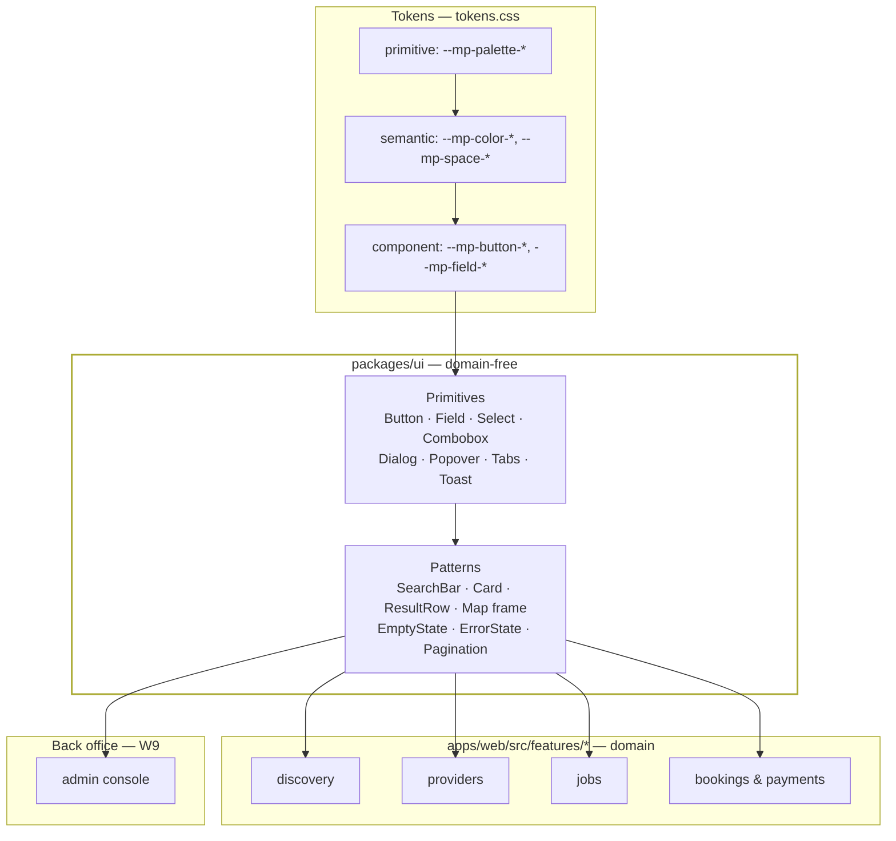
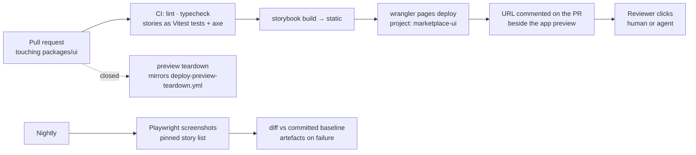

# ADR-012: The design system — primitives, themes, and the workbench that proves them

## Status
Proposed — 2026-09-11 · implemented by `W12` (milestone `M11 Public storefront`). Companion:
[ADR-011](ADR-011-web-application-architecture.md), which covers the pages these components build.
Pays down [`W10-T05`](../../TODO.md) (WCAG 2.1 AA) continuously instead of at the end.

**Explorable diagram**: `docs/diagrams/storefront-architecture.html` — the layering, the public
page map and the search path in one pannable view (source: the `.json` beside it).

---

## Summary — six decisions

1. **`packages/ui` is the only place a component is defined.** Two layers, primitives and patterns,
   and nothing domain-shaped in either. Feature slices compose; they do not restyle.
2. **React Aria Components** supplies behaviour. Not a look — keyboard, focus, screen-reader
   semantics, touch targets, locale-aware formatting and RTL. The expensive half of accessibility,
   bought instead of retrofitted.
3. **CSS Modules over three token layers** — primitive → semantic → component. A component's CSS may
   read semantic and component tokens and nothing else. The existing `tokens.test.ts` gate is
   extended to enforce the layering it already half-enforces.
4. **A theme is one file.** The default theme ships with the system; a deliberately different second
   theme ships alongside it as *proof the swap works*, and dark parity stays a test.
5. **Storybook 10 is the workbench, and the stories are the test suite.** `@storybook/addon-vitest`
   runs every story as a Vitest browser test with `parameters.a11y.test = 'error'`, so an axe
   violation fails a pull request exactly like a failing assertion.
6. **The workbench is deployed**, to its own Cloudflare Pages project, per pull request and on merge.
   Reviewers — human or agent — click a link. No fifth vendor: **Chromatic is rejected**, and visual
   regression is Playwright screenshots of a pinned story list, nightly.

---

## Context

`apps/web/src/styles/tokens.css` exists and is good: semantic names (`--mp-color-danger`, never
`--mp-color-red-500`), a 4px spacing scale, a complete dark palette, and a real gate behind it —
`tokens.test.ts` fails the build on a hardcoded colour in any stylesheet and fails it again on a
colour defined for light but not for dark. Its header comment already says `agent-ui` owns it.

**Nothing consumes it.** There is no `packages/ui`, no component, no story, and no ticket. So the
first slice agent that needs a button will write one; the second will write a slightly different one;
and by the time `W10-T05` runs its accessibility pass there will be thirty of them, each with its own
focus ring, none of them keyboard-complete. That ordering — a11y as a pass at the end — is the single
most expensive way to buy WCAG compliance, and `TODO.md` currently schedules it that way by default
rather than by choice.

The same reasoning applies to review. Thirteen agents will produce components nobody can look at
without checking out a branch and running a dev server. A deployed workbench is to UI review what a
preview URL is to feature review (`TODO.md` §9, rule 2 — *"every PR gets a URL; reviewers click, they don't
imagine"*), and that principle currently has no UI half.

---

## Decision

### 1. `packages/ui` — two layers, and a hard boundary



**The boundary, stated as rules:**

- `packages/ui` **never imports `packages/contracts`.** The day a `Job` type reaches the design
  system, every contract change rebuilds the buttons and `agent-ui` becomes a downstream of nine
  slices. A component takes strings, numbers and callbacks.
- A feature slice **never ships a raw `<button>`, `<input>` or `<dialog>`**, and never ships a colour
  literal. Both are gates, not requests.
- **The back office consumes the same package.** There is no second design system for admin. If the
  admin console needs a data grid, the data grid is a pattern in `packages/ui` — which is also how
  `W9` stops being a visual orphan.
- A pattern that needs a value it cannot find in the tokens needs **a new token**, not a literal.
  That rule is already written at the top of `tokens.css`; this ADR gives it somewhere to apply.

### 2. React Aria Components for behaviour

`react-aria-components` (1.x, Adobe) is unstyled and ships the parts of a component that are tedious
and easy to get subtly wrong:

- focus management and focus-visible, including within dialogs and popovers;
- full keyboard interaction models for select, combobox, tabs, menu, date picker;
- correct ARIA roles and relationships, live-region announcements;
- **locale-aware** number, date and collation handling — Spanish decimal commas, `dd/mm/yyyy`,
  `ñ`-correct sorting — which we would otherwise hand-roll badly in an ES-first product;
- touch target sizing and pointer/touch parity, which matters because this product is used on a phone.

It gives us no appearance whatsoever, which is the point: tokens remain the only source of looks.

**Alternatives.** *Base UI* (the MUI team's headless library) is lighter and cleanly designed, but its
component set is younger — the combobox and date story in particular — so we would hand-build the two
controls the search bar depends on most. *Radix Primitives* is the most widely known and has the
weakest locale-aware input story, which is the wrong trade for Spain. Both are viable; neither is
better here.

### 3. Styling: CSS Modules over three token layers

```
--mp-palette-clay-60: #b4531f;     ← primitive: a value. Only a theme file may read it.
--mp-color-accent: var(--mp-palette-clay-60);   ← semantic: a role.
--mp-button-bg: var(--mp-color-accent);         ← component: a use.
.button { background: var(--mp-button-bg); }    ← the only thing a component may read.
```

Zero runtime, identical in the browser and on a Worker (ADR-011's rendering switch), and a theme is
a stylesheet rather than a rebuild. The existing test already enforces namespacing, the four token
families and dark parity; `W12-T05` extends it with two assertions:

- **layering**: a file in `packages/ui` may reference `--mp-color-*`, `--mp-space-*`, `--mp-radius-*`,
  `--mp-font-*`, `--mp-layout-*` and its own `--mp-<component>-*`, and **may not** reference
  `--mp-palette-*`;
- **completeness**: every semantic token resolves in every shipped theme, not only the default.

*Rejected:* Tailwind (utility values must be generated from the tokens or the colour gate fights every
class, and theming migrates from CSS into config) and vanilla-extract (better typing, but a second
build plugin and the token test would need to learn a second file format for no gain we can name).

### 4. A theme is a file — and the swap is proven, not asserted

A theme is: a `--mp-palette-*` ramp, the semantic mapping over it, a font pairing, and optional radius
and density overrides. Nothing else. `W12-T05` ships **two** — the default, and a second that looks
genuinely different — because a theming system with one theme is an untested theming system, and the
usual failure is discovering that half the "tokens" were literals all along.

Dark mode needs one structural change. Today `tokens.css` switches on `@media (prefers-color-scheme:
dark)` alone, so a theme cannot be chosen — only detected. It becomes `[data-theme]` on the root with
the media query as the default, which is also what lets the workbench toolbar show a story in
`default/dark` and `alt/light` side by side. `tokens.test.ts`'s AC15 assertion moves with it.

### 5. The workbench: Storybook 10, and stories that are tests

`storybook` 10.x with `@storybook/react-vite`, living in `packages/ui`. Every exported component has
stories for its **states**, not its props: default, focus, disabled, loading, error, empty, and
long-text (Spanish runs ~20% longer than English and is where fixed-width buttons break).

The toolbar switches **theme** and **locale**, so one story is reviewable as ES-dark and EN-light
without writing either variant by hand.

**Testing.** `@storybook/addon-vitest` turns the stories into Vitest browser tests. The repo is
already on Vitest 5 with `@vitest/browser` 5, so this is the existing test runner, the existing CI
job, and one command — not a second harness. Each story sets `parameters.a11y.test = 'error'`, which
runs axe against the rendered story and **fails the build on a violation**. Interaction tests use the
same `play` functions.

This is the load-bearing choice in this ADR: **writing a story is not decoration, it is writing the
component's test**. It makes the per-component cost visibly higher and the `W10-T05` bill visibly
lower, and it puts the accessibility signal where an agent can act on it — in a failing test on its
own pull request — instead of in a report six months later.

*Rejected:* `@storybook/test-runner` (still maintained, but a second process and a second CI step for
what the Vitest addon does inside the runner we already have) and Ladle (faster, fewer addons, no a11y
story worth the switch).

### 6. Deployment and visual review



The deploy uses the same `npx wrangler pages deploy` invocation as `deploy-preview.yml` — including
its hard-won rule of reading the URL back from wrangler rather than constructing it — against a second
Pages project. That is a new *project*, not a new *service*: the M0 four-services rule (Fly, Neon,
Cloudflare, Sentry) holds.

**Chromatic is rejected.** It is the obvious tool for this job, and it is a fifth vendor with a
snapshot quota, added to a stack that was deliberately kept to four. Visual regression instead runs as
Playwright screenshots over a pinned story list, nightly, with baselines committed. The accepted cost
is real: screenshot baselines are renderer- and OS-dependent, so they are generated **only** inside
the CI container image, and a local run does not update them.

---

## Consequences

- **`packages/ui` becomes a build dependency of `apps/web`**, so turbo gains an edge and the web
  typecheck waits on a UI build. Watch it: if the UI build gets slow, everything downstream gets slow.
- **React Aria Components is a real bundle cost.** Per-component imports only, and ADR-011's
  ≤170 KB initial-route budget is what keeps the honesty — it will be the first thing to complain.
- **Stories are mandatory**, which makes each component slower to land. That is the intended trade:
  it converts an end-of-project accessibility pass into a per-PR gate.
- **A second Pages project needs a teardown path**, or preview deployments accumulate. `W12-T06`
  mirrors `deploy-preview-teardown.yml` rather than inventing a second mechanism.
- **`tokens.css` moves** from `apps/web/src/styles` into `packages/ui` when `W12-T01` lands, and
  `apps/web`'s `tokens.test.ts` moves with it. Until then the token gate protects a file with no
  consumers — which is the current state and is the thing this ADR ends.
- **Two ADRs, one milestone.** ADR-011 decides how a page reaches a browser; this one decides what the
  page is made of. They are separable decisions with separable reversals, which is why they are not
  one document.
