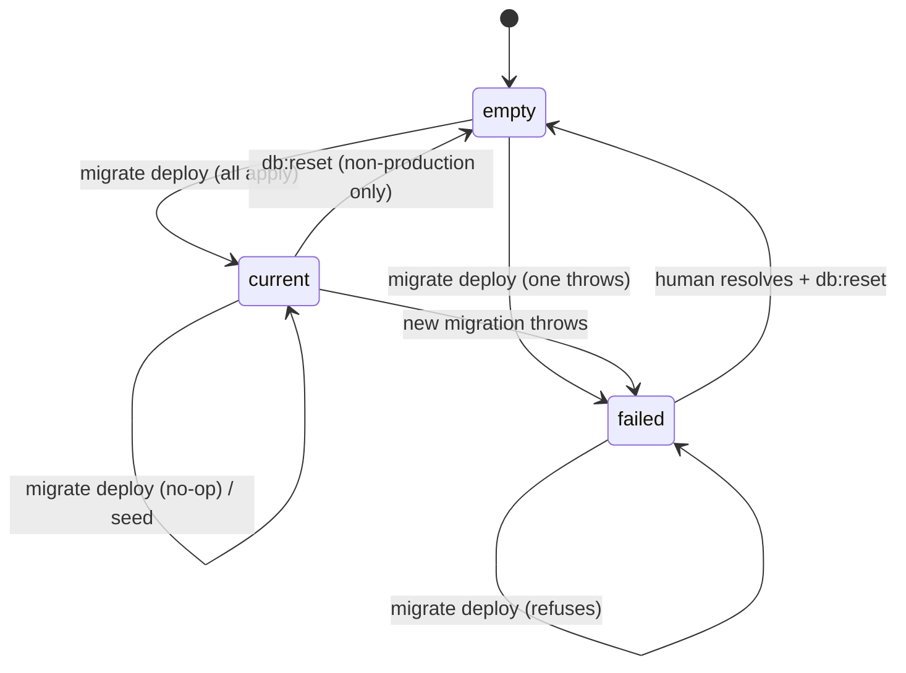

# Spec — W0-T05 database toolchain

|               |                                                      |
| ------------- | ---------------------------------------------------- |
| **Task**      | `W0-T05` `[A]`                                       |
| **Slice**     | S0 Platform                                          |
| **Owner**     | `agent-devops`                                       |
| **Reviewers** | `agent-contracts`, `agent-qa`                        |
| **Issue**     | https://github.com/mastrobardo/marketplace/issues/37 |
| **Status**    | draft                                                |

---

## 1. Purpose

`DATABASE_URL` is required at boot and nothing opens it. `apps/api` has no ORM, no migration
history and no way to fill a database. The next four tasks all assume otherwise: `W1-T05` writes
the core Prisma schema, `W0-T06` wants a migration step in CI, `W0-T07` wants migrations to run as
a separate approved step on deploy (ADR-006), and `W0-T20` wants a sanitisation stage inside a seed
pipeline that does not exist yet.

The point of this task is **not** "we use Prisma". It is that the day `agent-contracts` adds the
first model, the mechanics around it are already decided and already tested: where migrations live,
how one is rolled back, how a seed is written so that running it twice is safe, and how any of it
is proven without a human watching. Get that wrong and the failure is not a broken build — it is a
migration that half-applied to staging on a Friday with no way back.

Without it `W1-T05` invents the migration workflow while also designing the domain model, and the
two decisions contaminate each other.

## 2. User stories

- **As `agent-contracts`**, I want the datasource, client generation and migration folder already
  working, so that `W1-T05` is a schema decision and not a tooling decision.
- **As any slice agent**, I want `prisma migrate dev` to be the only way the schema changes, so that
  two agents' migrations merge as ordered files rather than as conflicting DDL.
- **As a reviewer**, I want every migration to carry an explicit rollback, so that "reversible" is a
  file I can read rather than a claim in a PR description.
- **As `agent-devops` (me, in `W0-T07`)**, I want migrations to be a standalone command that never
  runs implicitly on boot, so that a deploy cannot silently mutate production's schema.
- **As `agent-qa`**, I want a seed that is idempotent, so that a test run does not depend on whether
  the database was fresh.
- **As `agent-devops` (in `W0-T20`)**, I want one named place where sanitisation hooks into the seed
  pipeline, so that PII stripping is a step in a pipeline and not a script somebody remembers to run.
- **As a developer on a laptop**, I want `pnpm db:reset` to give me a known-good database in one
  command, so that a broken local schema costs seconds.

## 3. State machine

The stateful thing is the **database's migration state**, as Prisma's `_prisma_migrations` table
records it.

| from | event | to | guard | side effect |
| --- | --- | --- | --- | --- |
| `empty` | `db:migrate:deploy` | `current` | every migration applies | rows appended to `_prisma_migrations` |
| `empty` | `db:migrate:deploy` | `failed` | a migration throws | the failing migration is recorded as failed; **no further migration runs** |
| `current` | `db:migrate:deploy` | `current` | nothing pending | no-op |
| `current` | schema edited + `db:migrate:dev` | `current` | dev only | a new migration folder is written and applied |
| `current` | `db:seed` | `current` (+ seeded) | seeder not in `SeedRun` | seeder runs, then records itself |
| `current` (+ seeded) | `db:seed` | unchanged | seeder already in `SeedRun` | **skipped** — this is what "repeatable" means |
| `failed` | `db:migrate:deploy` | `failed` | — | refuses to continue until a human resolves it |
| *any* | `db:reset` | `empty` → `current` (+ seeded) | **non-production only** | drops, re-applies every migration, seeds |



`failed` has no automatic exit on purpose. Prisma's own guidance is that a partially applied
migration is a human decision; automating it is how a recovery script deletes production data.

## 4. API surface

No HTTP surface. The public surface is the command set and what a slice agent imports.

| Command | Contract |
| --- | --- |
| `pnpm db:generate` | regenerates the Prisma client; safe offline, no database needed |
| `pnpm db:migrate` | dev loop: diff the schema, write a migration folder, apply it |
| `pnpm db:migrate:deploy` | apply pending migrations only; **the one CI and deploy use** |
| `pnpm db:migrate:status` | exit non-zero when the database is behind or failed |
| `pnpm db:seed` | run every registered seeder that has not run |
| `pnpm db:reset` | drop, re-migrate, re-seed; refuses when `NODE_ENV=production` |

| Import | Kind | Contract |
| --- | --- | --- |
| `apps/api/prisma/schema.prisma` | schema | **the seam** — `agent-contracts` owns the models (L3) |
| `src/db/client.ts` → `getPrismaClient(config)` | factory | one client per process, built from a validated `Config`, never from `process.env` |
| `src/db/client.ts` → `disconnect()` | function | closes the pool; tests and shutdown hooks call it |
| `prisma/seed/registry.ts` → `seeders` | array | where a slice appends its seeder |
| `prisma/seed/types.ts` → `Seeder` | type | `{ id, description, run(tx) }` — `id` is the ledger key |
| `prisma/seed/sanitise.ts` → `assertSanitised(env)` | guard | the hook `W0-T20` fills in; today it refuses to seed a non-local database with a non-local seeder |

## 5. Permissions matrix

No runtime roles yet. The enforceable constraint is charter ownership of the seam.

| Actor | `prisma/schema.prisma` **models** | `prisma/migrations/**` | `prisma/seed/**`, `src/db/**` | `db:*` scripts |
| --- | --- | --- | --- | --- |
| `agent-devops` | **forbidden** (this task adds infrastructure models only, listed in §8) | write | write | write |
| `agent-contracts` | write (`W1-T05`) | write | read | read |
| any slice agent | forbidden — propose via `prompts/01-contract-proposal.md` | write, own migration only | append a seeder | read |

Two denies become tests: a migration folder with no `down.sql` fails, and a seeder whose `id`
collides with an existing one fails.

## 6. Error cases

Non-HTTP; these are process exits, because everything here is a command.

| Code | Exit | When | What the operator sees |
| --- | --- | --- | --- |
| `POSTGIS_MISSING` | migration fails | migration `0000` runs against a database with no PostGIS | the migration raises with the `CREATE EXTENSION` command to run and why it is not in the migration |
| `MIGRATION_FAILED` | 1 | any migration throws | Prisma's own output plus the failed migration name; `db:migrate:status` keeps reporting it |
| `SEED_DUPLICATE_ID` | 1 | two seeders share an `id` | the duplicated id and both descriptions — fails before opening a connection |
| `SEED_UNSAFE_TARGET` | 1 | a seeder marked `localOnly` runs against a non-local `DATABASE_URL` | the host it refused and the `W0-T20` note |
| `RESET_IN_PRODUCTION` | 1 | `db:reset` with `NODE_ENV=production` | refusal naming the variable |

## 7. Acceptance criteria

**Schema and client**

1. **Given** a clean checkout, **when** `pnpm db:generate` runs with no database reachable, **then**
   it succeeds — client generation must not need a server.
2. **Given** `schema.prisma`, **when** it is read, **then** its datasource is `postgresql`, its url
   comes from `env("DATABASE_URL")`, and no connection string literal appears anywhere in it.
3. **Given** `src/db/client.ts`, **when** a client is built, **then** it is built from a `Config`
   value and the module contains no `process.env` reference.
4. **Given** `getPrismaClient` is called twice in one process, **when** the results are compared,
   **then** they are the same instance.
5. **Given** the API boots, **when** no route needs the database, **then** no connection is opened —
   `/health` still answers from process state alone.

**Migrations**

6. **Given** an empty PostGIS database, **when** `pnpm db:migrate:deploy` runs, **then** every
   migration applies and the exit code is 0.
7. **Given** that same database, **when** `db:migrate:deploy` runs a second time, **then** it is a
   no-op and still exits 0.
8. **Given** a database **without** PostGIS, **when** migration `0000` runs, **then** it fails with a
   message naming `CREATE EXTENSION postgis` and the migration does not silently continue.
9. **Given** the migrations directory, **when** each folder is inspected, **then** every one contains
   both `migration.sql` and `down.sql`.
10. **Given** a migrated database, **when** each `down.sql` is applied in reverse order, **then** the
    database returns to the state before that migration and the sequence exits 0.
11. **Given** the migrations directory, **when** folder names are read, **then** each matches
    `NNNN_snake_case` and the numbers are unique and contiguous from `0000`.
12. **Given** a migrated database, **when** `prisma migrate diff` compares it to `schema.prisma`,
    **then** there is no drift.

**Seeding**

13. **Given** an empty registry entry list, **when** `pnpm db:seed` runs, **then** it exits 0 and
    reports that nothing was pending — an empty scaffold is a working scaffold.
14. **Given** a seeder that has never run, **when** `db:seed` runs, **then** it executes once and a
    row appears in `SeedRun` keyed by its `id`.
15. **Given** the same seeder, **when** `db:seed` runs again, **then** it is skipped and the
    `SeedRun` row is unchanged — including its `ranAt`.
16. **Given** a seeder that throws, **when** `db:seed` runs, **then** its `SeedRun` row is **not**
    written and the process exits non-zero.
17. **Given** two seeders sharing an `id`, **when** `db:seed` starts, **then** it fails before
    connecting, naming the duplicate.
18. **Given** a seeder marked `localOnly` and a `DATABASE_URL` whose host is not loopback, **when**
    `db:seed` runs, **then** it refuses with `SEED_UNSAFE_TARGET`.
19. **Given** `NODE_ENV=production`, **when** `pnpm db:reset` runs, **then** it refuses and touches
    nothing.

**Wiring**

20. **Given** `package.json`, **when** its scripts are read, **then** every command in §4 exists, and
    `pnpm verify` does **not** invoke any of them — the local gate must stay daemon-free.
21. **Given** the API's build output, **when** it is inspected, **then** the generated Prisma client
    is not committed to git.

Criteria 6, 7, 8, 10, 12, 14–18 need a live database and run behind `STACK_LIVE=1`, exactly as
`W0-T02`'s stack tests do. 1–5, 9, 11, 13, 19, 20, 21 are static and run in the default gate.

## 8. Data

**No domain models.** `schema.prisma` gains exactly one model, and it is infrastructure:

```prisma
model SeedRun {
  id          String   @id            // the seeder's own id, e.g. "categories.base"
  description String
  ranAt       DateTime @default(now())

  @@map("_seed_run")
}
```

It is owned by `agent-devops`, not by the seam. It is in `schema.prisma` rather than in raw SQL
because Prisma's drift detection compares the database to the schema: a table created by a
migration but absent from the schema is reported as drift on every subsequent `migrate dev`, which
would train agents to ignore drift warnings. Named `_seed_run` so it sorts away from domain tables.

**Migrations**

| Folder | What | `down.sql` |
| --- | --- | --- |
| `0000_require_postgis` | a `DO` block that raises unless `postgis` is installed | no-op, documented |
| `0001_seed_run_ledger` | creates `_seed_run` | `DROP TABLE "_seed_run"` |

`CREATE EXTENSION` stays in `docker/postgres/init/` and is Neon's job in every other environment —
the application role does not have the rights, in any environment (see that file's own comment).
Migration `0000` therefore **asserts** the precondition rather than establishing it, which is what
turns "somebody enabled PostGIS once" into something every environment re-proves on every deploy.

**Reversibility.** Prisma does not generate down migrations. The convention is a hand-written
`down.sql` per folder, enforced by criterion 9 and exercised by criterion 10. A `down.sql` that
genuinely cannot restore state (a dropped column's data) must say so in a comment; the test asserts
the file exists and is non-empty, not that it is clever.

## 9. Out of scope

- **Any domain model.** `User`, `Category`, geo columns and their indexes are `W1-T05`,
  `agent-contracts`. This task deliberately ships a schema with no business meaning.
- **Real seed data.** The registry ships empty. Demo fixtures are `agent-qa` (`W7-T01`); sanitised
  staging data is `W0-T20`.
- **Actual sanitisation.** `assertSanitised` is the named hook and the local-target guard;
  the PII stripping itself is `W0-T20`.
- **Running migrations in CI or on deploy.** The commands exist and are documented as the ones to
  call; wiring them is `W0-T06` and `W0-T07`.
- **Neon branching per PR.** `W0-T16`, and it needs an account (`OPS-07`).
- **`sslmode=verify-full` and connection pooling.** ADR-006 requires both in deployed environments;
  they are properties of the deployed `DATABASE_URL` and of `W0-T07`, not of this scaffold.
- **`.env.example`.** `W0-T09`.

## 10. Open questions

None blocking. One note for the reviewer:

`agent-contracts` — `SeedRun` puts a devops-owned model in the file L3 freezes. The alternative
(raw SQL outside the schema) makes every future `migrate dev` report drift. If you would rather own
it, take it in `W1-T05`; the seed runner only needs the table to exist with those three columns.
