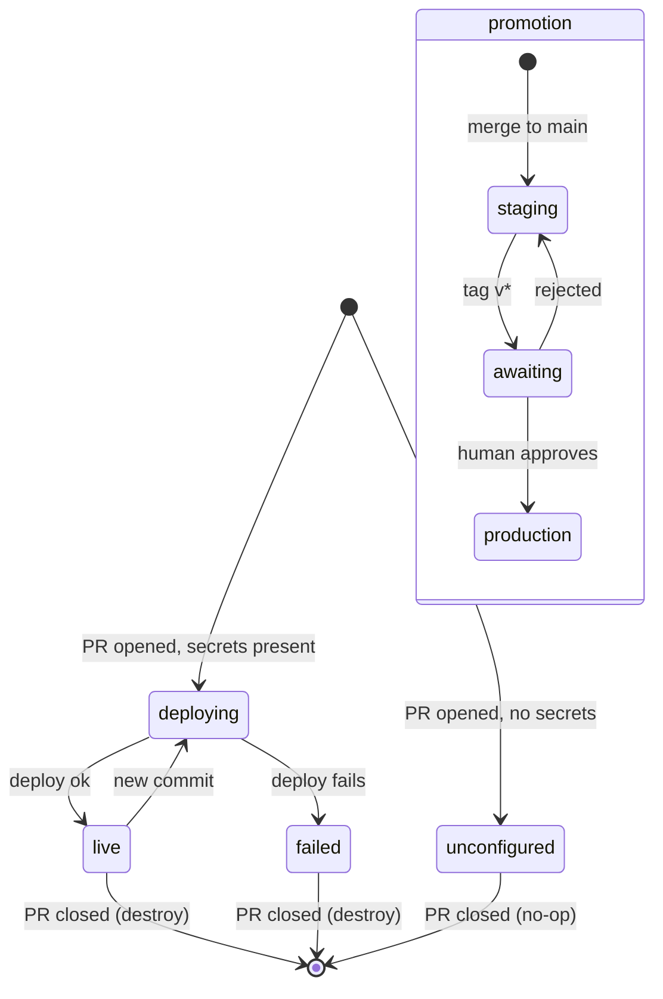

# Spec — W0-T07 deploy environments

|               |                                                      |
| ------------- | ---------------------------------------------------- |
| **Task**      | `W0-T07` `[M]`                                       |
| **Slice**     | S0 Platform                                          |
| **Owner**     | `agent-devops`                                       |
| **Reviewers** | `agent-qa`, `agent-contracts`                        |
| **Issue**     | https://github.com/mastrobardo/marketplace/issues/39 |
| **Status**    | draft — **lands inert**, see §11                     |

---

## 1. Purpose

`W0-T06` makes a change *provably correct*. It does not make it *reviewable*. A reviewer reading a
diff of a booking flow is imagining the product; the only way to judge whether a screen works is to
use it. `TODO.md` §1 puts Spain-first UX at the centre of this product, and no amount of green
checks tells you whether a Spanish label overflows its button.

There is a second reason, specific to this repo. Thirteen agents work in parallel in separate
sessions. When something is wrong on `main`, the question "what does it actually do now?" currently
has no answer that does not involve a human checking out a branch and running it. A URL per PR
turns that into a click.

And a third, which is the expensive one to get wrong later: **production must not be a bigger
version of the dev loop.** ADR-006 already decided that production is a separate Neon project, that
releases promote an artifact already tested rather than rebuilding, and that migrations run as an
approved observable step. Those are cheap to build now and very hard to retrofit onto a pipeline
that grew organically from "just deploy on merge".

## 2. User stories

- **As a reviewer**, I want a clickable URL on every PR, so that I judge the change by using it.
- **As a reviewer**, I want that environment to hold no real customer data, so that reviewing a
  change cannot expose a licence document or a phone number.
- **As the repo owner**, I want a preview destroyed when its PR closes, so that the bill is a
  function of open PRs rather than of PRs ever opened.
- **As an agent**, I want `main` on staging automatically, so that "is it fixed on main?" is a URL.
- **As the repo owner**, I want production to deploy only when I tag a release, so that a merge is
  never a customer-visible event.
- **As the repo owner**, I want production to run **the artifact staging tested**, so that "it
  worked on staging" is a statement about the same bytes.
- **As an operator**, I want migrations to be a separate step I can see fail, so that a bad
  migration is a failed step rather than a service that will not boot.
- **As `agent-devops`**, I want the pipeline to say precisely which credential is missing and where
  to set it, so that a blocked deploy is a to-do item rather than a debugging session.

## 3. State machine

Two machines. First, a **preview environment**, keyed by PR number:

| from | event | to | guard | side effect |
| --- | --- | --- | --- | --- |
| *none* | PR opened / synchronised | `deploying` | deploy config present | Fly app `marketplace-api-pr-<n>` created if absent; Neon branch created off sanitised staging |
| *none* | PR opened / synchronised | `unconfigured` | deploy config **absent** | job reports which secrets are missing and where; **succeeds** |
| `deploying` | deploy succeeds | `live` | — | URL commented on the PR |
| `deploying` | deploy fails | `failed` | — | the job is red; the previous preview, if any, keeps running |
| `live` | PR synchronised | `deploying` | — | same app updated in place, never a second app |
| `live` / `failed` | PR closed or merged | *none* | — | Fly app destroyed, Neon branch deleted |
| `unconfigured` | PR closed | *none* | — | nothing to destroy; teardown is a no-op, not an error |

Second, the **promotion of a build**:

| from | event | to | guard | side effect |
| --- | --- | --- | --- | --- |
| *none* | merge to `main` | `staging` | deploy config present | image built once, tagged by commit SHA, pushed; migrations run; staging deployed |
| `staging` | tag `v*` pushed | `awaiting-approval` | tag is on a commit that reached staging | the `production` GitHub Environment holds the job |
| `awaiting-approval` | human approves | `production` | — | migrations run, then **the same image digest** is deployed |
| `awaiting-approval` | human rejects / times out | `staging` | — | nothing changes in production |
| *any* | tag on a commit staging never saw | *rejected* | — | the run fails before touching anything |

The `unconfigured` state is the whole reason this task can land at all. See §11.

## 4. API surface

No code surface. The public surface is the workflow files, the environments and the secret **names**
— names only; a value is `[H]` and never touched by an agent.

| Workflow | Trigger | Deploys |
| --- | --- | --- |
| `deploy-preview.yml` | `pull_request` opened/synchronised/reopened | Fly app + Cloudflare Pages preview for this PR |
| `deploy-preview-teardown.yml` | `pull_request` closed | destroys both, and the Neon branch |
| `deploy-staging.yml` | `push` to `main` | builds once, migrates, deploys staging |
| `release-production.yml` | tag `v*` | promotes the staging image digest, behind approval |

| GitHub Environment | Protection | Secrets it holds |
| --- | --- | --- |
| `preview` | none | `FLY_API_TOKEN`, `CLOUDFLARE_API_TOKEN`, `CLOUDFLARE_ACCOUNT_ID`, `NEON_API_KEY`, `NEON_PROJECT_ID` |
| `staging` | none | the same five, plus `STAGING_DATABASE_URL` |
| `production` | **required reviewer**, tag `v*` only | `FLY_API_TOKEN`, `PRODUCTION_DATABASE_URL` |

| Script | Contract |
| --- | --- |
| `scripts/deploy/config.ts` → `checkDeployConfig(env, target)` | pure; returns `{ configured, missing }` for a target |
| `scripts/deploy/names.ts` → `previewAppName(pr)` | pure; the Fly app name for a PR — deterministic, DNS-safe, ≤ 30 chars |
| `scripts/deploy/names.ts` → `previewBranchName(pr)` | pure; the Neon branch name for a PR |
| `scripts/deploy/check.ts` | CLI: writes `configured` and `missing` to `$GITHUB_OUTPUT` |

The guard is **code, not YAML**, precisely because it is the part that must work on the day the
secrets finally arrive, and YAML cannot be unit tested.

## 5. Permissions matrix

| Actor | `contents` | `pull-requests` | `deployments` | secrets |
| --- | --- | --- | --- | --- |
| `deploy-preview` | `read` | `write` (to comment the URL) | `write` | `preview` environment only |
| `deploy-preview-teardown` | `read` | none | `write` | `preview` environment only |
| `deploy-staging` | `read` | none | `write` | `staging` environment only |
| `release-production` | `read` | none | `write` | `production` environment only |
| a **fork's** PR | `read` | none | none | **none** | 

The last row is a hard constraint, not a preference: a `pull_request` workflow triggered by a fork
gets a read-only token and no secrets, by GitHub's design. A preview deploy for a fork PR is
therefore impossible without `pull_request_target`, which runs *the base branch's* workflow with
*full* secrets against *untrusted code* — the single most exploited misconfiguration in GitHub
Actions. This task does not use it. Fork PRs get the `unconfigured` path, and that is correct.

## 6. Error cases

| Code | When | What happens |
| --- | --- | --- |
| `DEPLOY_UNCONFIGURED` | a required secret is absent | the job reports every missing name and the exact GitHub path to set it, and **succeeds** — an unconfigured deploy must not present as a broken build |
| `PREVIEW_FORK_PR` | the PR comes from a fork | same path as above; no secret is exposed |
| `MIGRATION_FAILED` | migrations fail before a deploy | the deploy step never runs; the previous version keeps serving |
| `RELEASE_NOT_ON_MAIN` | a `v*` tag on a commit not on `main` | the run fails before deploying — production only ever runs code staging saw |
| `IMAGE_NOT_FOUND` | no image for the tagged commit | the release fails; production never rebuilds from source (ADR-006) |
| `TEARDOWN_ABSENT` | destroying an app that is not there | treated as success; teardown must be idempotent or a re-run leaves resources alive |

## 7. Acceptance criteria

**The guard (unit-testable, and the reason this task is more than YAML)**

1. **Given** an environment with every required variable, **when** `checkDeployConfig` runs for
   `preview`, **then** it returns `configured: true` and `missing: []`.
2. **Given** an environment missing two of them, **when** it runs, **then** `configured` is false
   and `missing` names **both**, not just the first.
3. **Given** a variable present but empty, **when** it runs, **then** it counts as missing — an
   unset GitHub secret interpolates to an empty string, not to nothing.
4. **Given** each target (`preview`, `staging`, `production`), **when** its required set is read,
   **then** it is non-empty and every name is `SCREAMING_SNAKE_CASE`.
5. **Given** the result, **when** it is rendered for the operator, **then** it names the exact
   GitHub settings path for each missing secret.
6. **Given** any result, **when** it is rendered, **then** it contains no secret **value** — only
   names.
7. **Given** a PR number, **when** `previewAppName` runs, **then** the name is deterministic,
   lowercase, DNS-safe, at most 30 characters, and contains the PR number.
8. **Given** two different PR numbers, **when** both are named, **then** the names differ.

**Preview lifecycle**

9. **Given** `deploy-preview.yml`, **when** its triggers are read, **then** it runs on
   `pull_request` `opened`, `synchronize` and `reopened`.
10. **Given** `deploy-preview-teardown.yml`, **when** its triggers are read, **then** it runs on
    `pull_request` `closed` — covering both merged and abandoned PRs.
11. **Given** the teardown workflow, **when** its steps are read, **then** every destroy tolerates
    an already-absent resource.
12. **Given** either preview workflow, **when** the app name is computed, **then** it comes from
    `scripts/deploy/names.ts` and is not duplicated as a literal in YAML.

**Promotion**

13. **Given** `deploy-staging.yml`, **when** its trigger is read, **then** it is `push` to `main`
    only.
14. **Given** `release-production.yml`, **when** its trigger is read, **then** it is a `v*` tag,
    and it declares `environment: production`.
15. **Given** the release workflow, **when** its steps are read, **then** it deploys an existing
    image reference and contains **no build step** — production runs the bytes staging tested.
16. **Given** the release workflow, **when** its steps are read, **then** migrations run as their
    own step, before the deploy step, and never as part of application start-up.
17. **Given** the staging workflow, **when** its steps are read, **then** the image is tagged with
    the commit SHA, so a release can name exactly one build.

**Safety**

18. **Given** every deploy workflow, **when** it is read, **then** it never uses
    `pull_request_target`.
19. **Given** every deploy job, **when** it is read, **then** it declares an `environment:`, so
    secrets are scoped and production can require a reviewer.
20. **Given** every workflow, **when** its top-level `permissions` is read, **then** it is declared
    explicitly and grants no more than the §5 row for that workflow.
21. **Given** every deploy job, **when** it is read, **then** it is gated on the guard's output, so
    a missing secret produces a reported skip and not a crash mid-deploy.
22. **Given** the repository, **when** it is searched, **then** no secret value appears in any
    tracked file.
23. **Given** every `uses:` in every deploy workflow, **when** its ref is read, **then** it is
    pinned to a fixed version.
24. **Given** every deploy job, **when** it is read, **then** it has a `timeout-minutes`.

**The image**

27. **Given** `infra/docker/api.Dockerfile`, **when** its steps are read, **then** the Prisma client
    is generated **after** the dev-dependency prune, it does not run as root, and its `CMD` does not
    migrate. The first of those is not theoretical: `pnpm deploy` rebuilds `node_modules` from the
    store, and the store holds the *published* `@prisma/client` — a shell whose real code
    `prisma generate` writes into the installed package. Generating only before the prune ships a
    client that throws `MODULE_NOT_FOUND` on first import, and nothing notices until a route runs a
    query in production.

**Documentation**

25. **Given** `README.md`, **when** the deployment section is read, **then** it lists every
    environment, every secret name, and the exact path a human sets it.
26. **Given** the CI workflow from `W0-T06`, **when** its jobs are read, **then** they are
    unchanged — a deploy is never a required check, or an unconfigured deploy would block merges.

## 7b. What was actually verified

The workflows cannot run, but the artifact they deploy can be built and started, and was:

- `docker build --file infra/docker/api.Dockerfile .` — succeeds.
- `docker run … marketplace-api` then `GET /health` — `200 {"status":"ok",…}`.
- `id` inside the container — `uid=100(marketplace)`, not root.
- `require('@prisma/client')` inside the container — loads, with the `seedRun` delegate present.

That last check is the reason AC27 exists. See §11.

## 8. Data

No schema change. `deploy-staging.yml` and `release-production.yml` call
`pnpm db:migrate:deploy` from `W0-T05` — the command that applies pending migrations and nothing
else. Preview databases are Neon branches off a sanitised staging branch (ADR-006), which is
`W0-T16`; until that exists a preview points at no database and the API reports itself unhealthy
rather than pretending.

## 9. Out of scope

- **Creating the accounts.** Fly, Cloudflare and Neon are `OPS-08`, `OPS-09` and `OPS-07`, all `[H]`.
- **Setting any secret.** `W0-T09`, `[H]`. This task writes names.
- **The Neon branch-per-PR automation.** `W0-T16`. The teardown workflow deletes the branch it
  would create, so the two land compatibly.
- **`sslmode=verify-full` and the pinned CA.** Properties of the connection strings a human sets.
- **Sentry, uptime checks, log sink.** `W0-T08`.
- **Sanitisation of staging data.** `W0-T20`. Until it lands, previews must not be pointed at a
  branch of real data — the workflow comments this loudly.
- **Branch protection and required checks.** `W0-T13`.
- **A custom domain.** `OPS-16`.

## 10. Open questions

None blocking. One judgement call, flagged for the operator rather than decided silently:

An unconfigured deploy job **succeeds** rather than failing. The alternative — fail loudly — makes
every PR red until the accounts exist, which trains everyone to ignore red. The cost is that a
genuinely broken deploy could hide behind the same green if the guard were ever wrong, which is why
the guard is unit-tested code rather than a YAML condition, and why it prints what it skipped.

## 11. This task lands inert — and needs a follow-up ticket

Every credential this pipeline needs is `[H]` and none exists yet: `OPS-07` (Neon), `OPS-08` (Fly),
`OPS-09` (Cloudflare), `OPS-04` (GitHub Environments), `W0-T09` (the secret values).

Two consequences, and the second is not obvious:

1. **Nothing here can be executed on its own PR.** Deploy jobs are gated on the guard, which will
   report "unconfigured", so they will skip. The YAML is checked by `actionlint` and the guard is
   covered by unit tests — but *no deploy has ever run*, and no amount of review changes that.
2. **`release-production.yml` will not even be *triggered* by this PR, or by merging it.** A
   workflow on `push: tags: v*` first exists on a tag only after it is merged and a tag is created.
   Its trigger, its `environment: production` protection rule and its approval gate are therefore
   completely unexercised until someone tags a release.

So the definition of done for issue #39 cannot be met by this PR, and pretending otherwise would
mean shipping four workflows nobody has ever seen work. **`W0-T24` `[H]`** carries the remainder:
set the secrets, then prove one preview deploy, one teardown, one staging deploy and one tagged
production release actually happen. Until it is closed, the deploy pipeline is code, not capability.
