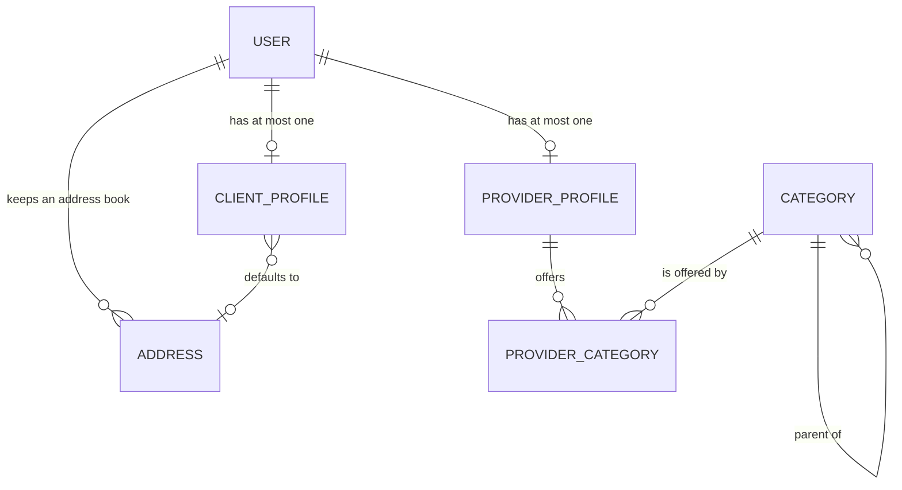
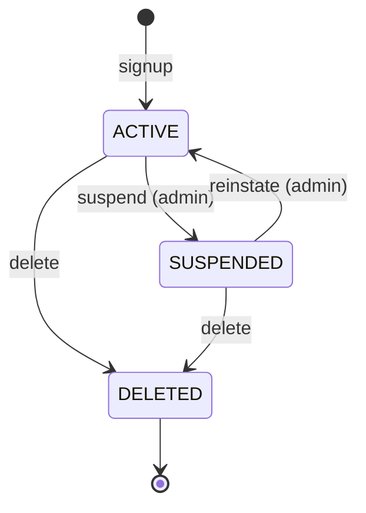

# Spec — W1-T05 core database schema

| | |
| --- | --- |
| Task | `W1-T05` — Create the core database schema |
| Issue | [#59](https://github.com/mastrobardo/marketplace/issues/59) |
| Slice | S1 Contracts |
| Owner | `agent-contracts` |
| Branch | `W1-T05-core-schema` |
| Status | **awaiting approval of §13** — no Prisma written until the entity tables in §5 are signed off |

---

## 1. Purpose

`apps/api/prisma/schema.prisma` currently contains one model, `SeedRun`, and it is infrastructure.
Every slice from `W2` onward — identity, provider profiles, discovery, jobs, money — reads or
writes a user, a profile or a category, and none of them can start until those tables exist and
are named the same way in all thirteen agents' heads.

Who suffers without it: the next four agents in the queue, simultaneously. `W2-T01` needs `User`
to sign anybody up. `W3-T02` needs `ProviderProfile` to describe a provider. `W3-T05` needs an
indexed geography column or its radius search is a sequential scan over every provider in Spain.
`W3-T01` needs `Category` before it can seed a category. If each of them invents its own, we get
four spellings of the same table and a migration war — which is precisely the failure `TODO.md` §3
was written to prevent and which this task exists to execute.

This task ships **tables and indexes only**. No endpoint, no service, no zod schema.

## 2. Decisions taken before this spec

These are inputs, not choices being made here. Each is already binding.

| # | Decision | Source | What it forces on this schema |
| --- | --- | --- | --- |
| P1 | PostgreSQL + PostGIS, Spain only, EUR only | `TODO.md` §1 | one currency, no `currency` column anywhere; geography is available and asserted |
| P2 | Migration `0000_require_postgis` **asserts** the extension, never creates it | `W0-T05` §8 | this task may `USE` PostGIS types freely; it must not `CREATE EXTENSION` |
| P3 | Every migration folder carries a hand-written `down.sql` | `W0-T05` §8 | four new folders, four `down.sql` |
| P4 | A table absent from `schema.prisma` but present in the database is reported as drift forever | `W0-T05` §8 | every object this task creates in raw SQL must also appear in `schema.prisma`, including ones Prisma cannot type |
| P5 | Money is integer cents, bounded at `Int32` because that is what Prisma `Int` is | `W1-T06` | `hourlyRateCents Int`, no `Decimal`, no `Float` |
| P6 | Lists are cursor-paged on a per-endpoint sortable allow-list, with `id` appended as tiebreaker | `W1-T02` | any column a later list endpoint sorts by needs to exist **and be indexed** with `id` as its last component |
| P7 | Code identifiers are English; `provider` covers both `manitas` and `pro` | `memory/repo/glossary.md` | no `manitas` or `presupuesto` as an identifier; `kind` distinguishes |
| P8 | A slice owns its models; shared files are append-only by request | `TODO.md` §4 | this task writes the tables later slices will *extend*, and must not pre-empt their columns |

## 3. Scope

The issue names four things: *"users, profiles, categories and location columns"*. The `TODO.md`
§3 sketch names twenty-two models. The gap between those two is where this spec could quietly
become the whole domain, so it needs a rule rather than taste.

**The inclusion rule.** A column belongs in `W1-T05` if and only if it satisfies one of:

- **(a)** it is named in the issue's scope — user, profile, category, location; or
- **(b)** it is the *identity* of a row (`id`, timestamps, the natural key); or
- **(c)** a list endpoint whose conventions `W1-T02` already froze will need to **sort or filter**
  by it, and P6 means a sortable field must exist before the endpoint that names it.

Everything else waits for the slice that owns it. Rule (c) is the one that earns its keep: it is
why `ratingAvg` is here (`W3-T05` sorts by it) and why `stripeAccountId` is not (nothing sorts by
a Stripe id, and S9 owns it).

**In scope — six tables, four enums, and the geography columns.**

| Table | Why it is in | Rule |
| --- | --- | --- |
| `User` | the issue says users | (a) |
| `ClientProfile` | the issue says profiles | (a) |
| `ProviderProfile` | the issue says profiles | (a) |
| `Address` | `ClientProfile.addresses[]` in §3 sketch; carries a location | (a) |
| `Category` | the issue says categories | (a) |
| `ProviderCategory` | without it a provider has no categories and `W3-T05` cannot filter | (c) |

**Out of scope** is §12, and it is long on purpose.

## 4. Design

### 4.1 Prisma cannot describe a geography column, and that is the whole problem

Prisma has no geography type. There is no `@db.Geography`. This is the sharpest constraint in the
task and every option is a trade, so the reasoning is here rather than in a commit message.

The naive answers and why they lose:

- **`Float latitude` + `Float longitude`, distance in application code.** Haversine in TypeScript
  over every provider row. No index can help. `W3-T05` becomes a full scan the first time it has
  ten thousand providers, and the fix is this task done again, later, under time pressure.
- **`Unsupported("geography(Point,4326)")` as the only location column.** Prisma models
  `Unsupported` fields but **cannot read or write them through the client** — they exist purely so
  drift detection stays quiet (P4). Every write of an address would have to be `$executeRaw`,
  including `W2-T04`'s ordinary profile form. That pushes raw SQL into four slices to serve one.

**The proposal: writable `latitude`/`longitude`, plus a *generated* geography column.**

```sql
ALTER TABLE "address"
  ADD COLUMN "location" geography(Point, 4326)
  GENERATED ALWAYS AS (ST_SetSRID(ST_MakePoint("longitude", "latitude"), 4326)::geography) STORED;

CREATE INDEX "address_location_gist" ON "address" USING GIST ("location");
```

- Writers use `latitude` / `longitude` through the ordinary Prisma client. No slice needs raw SQL
  to save an address.
- Readers doing proximity use `ST_DWithin("location", $1, $2)` in `$queryRaw` — one slice,
  `W3-T05`, and it was always going to be raw because Prisma cannot express `ST_DWithin` either.
- Postgres maintains the column. There is no trigger to forget and no denormalised value that can
  drift from its source, because it *is* its source, computed.
- It appears in `schema.prisma` as `location Unsupported("geography(Point, 4326)")?` purely to
  satisfy P4.

**The risk, stated plainly: this may produce permanent Prisma drift, and I have not yet proved it
does not.** Prisma's introspection has historically not understood `GENERATED ALWAYS AS … STORED`,
and if `prisma migrate dev` reports drift on every run afterward, we have trained every agent to
ignore drift warnings — the exact outcome `W0-T05` §8 wrote its `SeedRun` rationale to avoid.
Acceptance criterion **AC-12** exists to prove this before the schema is merged, and §13 Q4 carries
the fallback if it fails.

**Longitude before latitude.** `ST_MakePoint` takes `(x, y)` — longitude first. Swapping them puts
every Spanish address in Somalia. It is written once, in one migration, and AC-11 checks a known
point.

**Metres, not kilometres.** `ProviderProfile.serviceRadiusMetres` is an integer of metres because
`ST_DWithin` on `geography` takes metres. A `radiusKm` column would put a `* 1000` at every call
site and a unit bug in whichever one forgets.

### 4.2 A `User` is an account. What kind of person they are lives on the profile

`TODO.md` §3 sketches `User — … role(s) CLIENT | MANITAS | PRO | ADMIN` and, two lines later,
`ProviderProfile — kind MANITAS | PRO`. That is the same fact in two columns, and this spec
proposes to change it (§13 **Q1**).

Two things are wrong with the sketch as written:

1. **`MANITAS`/`PRO` on `User` duplicates `ProviderProfile.kind`.** Two sources of truth for one
   fact, and they can disagree. The reader that suffers is `W3-T08` — *"`requiresLicence`
   categories only surface verified pros"* — where a row saying `PRO` on the user and `MANITAS` on
   the profile surfaces an unlicensed handyman in a gas-fitting search. That is a legal problem,
   not a data-quality problem.
2. **"role(s)" is ambiguous, and the singular reading is wrong.** A plumber who hires a painter is
   a provider *and* a client. If `role` is singular, that person needs two accounts and two logins
   and their reviews split across both.

**Proposal:** `User.roles UserRole[]` where `UserRole = CLIENT | PROVIDER | ADMIN`, and
`MANITAS | PRO` exists **only** as `ProviderProfile.kind`. The rule that follows is checkable:
*a user has the `PROVIDER` role if and only if a `ProviderProfile` row exists for them* — AC-04
asserts it in both directions.

`ADMIN` stays in the same array rather than becoming a separate table. It is one boolean's worth
of information in the MVP, `W9-T01` will want real back-office permissions, and inventing an
`AdminUser` table now guesses at a shape S12 has not designed.

### 4.3 Identifiers

Primary keys are `uuid` with `gen_random_uuid()` (in core Postgres since 13 — no extension, so no
new precondition to assert alongside P2).

The alternative worth naming is a time-ordered id (UUIDv7, or `cuid2`), which gives sequential
index inserts instead of random ones. Two reasons not to reach for it now: UUIDv7 is not in
Postgres 17 core (it lands in 18) so it would mean an extension or generating ids in the
application, and P6 does not need it — the `W1-T02` cursor uses `id` as a **tiebreaker**, which
requires stability and uniqueness, not sortability. Insert locality is a real cost at a scale this
product does not have, and changing the key type later is a migration this schema does not
otherwise need. Recorded so it is a deferral rather than an oversight (§13 **Q3**).

`Category.slug` is the exception: it has a genuine natural key, humans type it into URLs, and
`W3-T01` seeds it from a fixed list. It gets a `uuid` primary key anyway and a `UNIQUE` on `slug`,
so that renaming a slug does not rewrite every foreign key pointing at it.

### 4.4 Naming

Tables and columns are `snake_case` via `@@map` / `@map`; Prisma models and fields are
`PascalCase`/`camelCase`. This follows `_seed_run` and means no quoting in hand-written migration
SQL, of which this task has a lot.

Timestamps are `createdAt` / `updatedAt` on every table, `timestamptz`, no exceptions. Storing
local time in a country with two time zones (peninsula and Canarias) is a bug waiting for an
emergency call-out at 02:00 in October.

### 4.5 Deletion

`User` carries `status` and `deletedAt`. `W2-T08` (GDPR: export and delete) requires soft-delete
plus anonymisation, and retrofitting soft-delete onto a table with live foreign keys is worse than
carrying two columns early.

**The footgun, named here because nothing in the database prevents it:** a soft-deleted user is
still a row, and every query that forgets `WHERE deleted_at IS NULL` will return them. Postgres
cannot enforce this and neither can Prisma. It belongs to `W2-T08` to decide the mechanism (a
Prisma extension, a view, a repository layer). This spec's obligation is to leave the note where
the next reader will find it rather than to guess at S2's answer.

## 5. The entities

One table per entity, as requested. Legend: **N** = nullable. Types are Postgres types; the Prisma
mapping is in §6.

### 5.1 `User` → `user`

The account. One row per person who can log in, whatever they use the platform for.

| Column | Type | N | Default | Notes |
| --- | --- | --- | --- | --- |
| `id` | `uuid` | | `gen_random_uuid()` | PK |
| `email` | `citext` | | | **UNIQUE.** `citext` so `Ana@…` and `ana@…` cannot both sign up (§13 Q5) |
| `email_verified_at` | `timestamptz` | ✓ | `null` | set by `W2-T01`; null means unverified |
| `phone` | `text` | ✓ | `null` | **UNIQUE** when present. E.164. Required for providers by `W2-T06`, not by this table |
| `phone_verified_at` | `timestamptz` | ✓ | `null` | set by `W2-T06` |
| `password_hash` | `text` | ✓ | `null` | nullable so a future social login is not a migration. `W2-T01` owns the algorithm |
| `roles` | `user_role[]` | | `'{CLIENT}'` | see §4.2. Array, not scalar |
| `status` | `user_status` | | `ACTIVE` | `ACTIVE \| SUSPENDED \| DELETED` |
| `locale` | `locale` | | `ES` | `ES \| EN`. Drives every notification and the ES-first copy rule |
| `deleted_at` | `timestamptz` | ✓ | `null` | soft delete, §4.5 |
| `created_at` | `timestamptz` | | `now()` | |
| `updated_at` | `timestamptz` | | `now()` | `@updatedAt` |

| Index | Columns | Why |
| --- | --- | --- |
| `user_email_key` | `email` UNIQUE | login lookup, and the identity constraint |
| `user_phone_key` | `phone` UNIQUE | partial: `WHERE phone IS NOT NULL`, so many users may have none |
| `user_created_at_id_idx` | `created_at DESC, id DESC` | P6 — `W9-T02` lists users newest-first; `id` is the appended tiebreaker |
| `user_status_idx` | `status` | `WHERE status = 'ACTIVE'` on effectively every query |

### 5.2 `ClientProfile` → `client_profile`

Who a person is when they are hiring. Separate from `User` because a provider account has no
client fields to fill in and a null-filled `User` teaches nobody what is required.

| Column | Type | N | Default | Notes |
| --- | --- | --- | --- | --- |
| `id` | `uuid` | | `gen_random_uuid()` | PK |
| `user_id` | `uuid` | | | **UNIQUE**, FK → `user.id`, `ON DELETE CASCADE`. One per user |
| `display_name` | `text` | | | what a provider sees. Not the legal name |
| `default_address_id` | `uuid` | ✓ | `null` | FK → `address.id`, `ON DELETE SET NULL` |
| `created_at` | `timestamptz` | | `now()` | |
| `updated_at` | `timestamptz` | | `now()` | |

| Index | Columns | Why |
| --- | --- | --- |
| `client_profile_user_id_key` | `user_id` UNIQUE | enforces one-to-one |

**Note.** The §3 sketch has `ClientProfile.defaultLocation(geo)` *and* `addresses[]`. Two
locations for one client is the same duplication as §4.2. Here the default is a **pointer to one
of the addresses**, so the geography lives in exactly one table (§13 **Q2**).

### 5.3 `ProviderProfile` → `provider_profile`

Who a person is when they are working. The row `W3` builds on and `W3-T05` searches.

| Column | Type | N | Default | Notes |
| --- | --- | --- | --- | --- |
| `id` | `uuid` | | `gen_random_uuid()` | PK |
| `user_id` | `uuid` | | | **UNIQUE**, FK → `user.id`, `ON DELETE CASCADE` |
| `kind` | `provider_kind` | | | `MANITAS \| PRO`. The only place this distinction is stored (§4.2) |
| `display_name` | `text` | | | trading name; shown in search results |
| `bio` | `text` | ✓ | `null` | `W3-T02` owns length limits |
| `latitude` | `numeric(9,6)` | ✓ | `null` | base of operations. `numeric`, not `float` — exact, and ~11 cm at 6 dp |
| `longitude` | `numeric(9,6)` | ✓ | `null` | |
| `location` | `geography(Point,4326)` | ✓ | *generated* | `GENERATED ALWAYS AS … STORED` from the two above (§4.1) |
| `service_radius_metres` | `integer` | ✓ | `null` | metres (§4.1). `CHECK (> 0 AND <= 200000)` |
| `hourly_rate_cents` | `integer` | ✓ | `null` | P5. `CHECK (>= 0)`. Null = quote-only |
| `rating_avg` | `numeric(3,2)` | ✓ | `null` | denormalised; **S4 owns writing it**. Null = no reviews yet, which is not the same as 0.00 |
| `rating_count` | `integer` | | `0` | |
| `created_at` | `timestamptz` | | `now()` | |
| `updated_at` | `timestamptz` | | `now()` | |

| Index | Columns | Why |
| --- | --- | --- |
| `provider_profile_user_id_key` | `user_id` UNIQUE | one-to-one |
| `provider_profile_location_gist` | `location` GIST | **the reason this task exists.** `ST_DWithin` in `W3-T05` |
| `provider_profile_rating_id_idx` | `rating_avg DESC NULLS LAST, id DESC` | P6 — "best rated" list, with the tiebreaker |
| `provider_profile_kind_idx` | `kind` | licence gating (`W3-T08`) filters on it |

`ratingAvg` and `ratingCount` are here on rule (c) and nothing else: `W3-T05` sorts search results
by rating, and P6 means the sort field and its index must pre-exist the endpoint. Nothing in `W1`
writes them.

### 5.4 `Address` → `address`

A place. Belongs to a user, not to a profile, so an account that is both client and provider keeps
one address book.

| Column | Type | N | Default | Notes |
| --- | --- | --- | --- | --- |
| `id` | `uuid` | | `gen_random_uuid()` | PK |
| `user_id` | `uuid` | | | FK → `user.id`, `ON DELETE CASCADE` |
| `label` | `text` | ✓ | `null` | "Casa", "Oficina". User copy, so no enum |
| `line1` | `text` | | | |
| `line2` | `text` | ✓ | `null` | |
| `city` | `text` | | | |
| `province` | `text` | | | ES province. Free text, not an enum — `W3-T01` may add a table |
| `postal_code` | `text` | | | `CHECK (postal_code ~ '^[0-9]{5}$')` — ES only, per P1 |
| `country_code` | `char(2)` | | `'ES'` | ISO-3166-1. Fixed at `ES` by P1; present so the first other country is a data change |
| `latitude` | `numeric(9,6)` | | | geocoded client-side (Google Places, `TODO.md` §1) |
| `longitude` | `numeric(9,6)` | | | |
| `location` | `geography(Point,4326)` | | *generated* | `GENERATED ALWAYS AS … STORED` (§4.1) |
| `created_at` | `timestamptz` | | `now()` | |
| `updated_at` | `timestamptz` | | `now()` | |

| Index | Columns | Why |
| --- | --- | --- |
| `address_user_id_idx` | `user_id` | list a user's addresses |
| `address_location_gist` | `location` GIST | job-side proximity (`W4-T07` matches jobs by radius) |

Latitude and longitude are **NOT NULL** here and nullable on `ProviderProfile`: an address the user
picked off a map always has coordinates, whereas a provider may complete a profile before setting
a service area.

### 5.5 `Category` → `category`

The service tree. `W3-T01` seeds it; a human decides which categories legally require a licence.

| Column | Type | N | Default | Notes |
| --- | --- | --- | --- | --- |
| `id` | `uuid` | | `gen_random_uuid()` | PK |
| `slug` | `text` | | | **UNIQUE**. `fontaneria`, `electricidad`. URL-safe, stable, ES |
| `name_es` | `text` | | | ES-first per the glossary |
| `name_en` | `text` | | | |
| `parent_id` | `uuid` | ✓ | `null` | FK → `category.id`, `ON DELETE RESTRICT`. Null = top level |
| `requires_licence` | `boolean` | | `false` | **the legal flag.** Not inherited — see below |
| `position` | `integer` | | `0` | display order within a parent |
| `is_active` | `boolean` | | `true` | retire a category without deleting rows that reference it |
| `created_at` | `timestamptz` | | `now()` | |
| `updated_at` | `timestamptz` | | `now()` | |

| Index | Columns | Why |
| --- | --- | --- |
| `category_slug_key` | `slug` UNIQUE | the natural key; URL lookup |
| `category_parent_id_position_idx` | `parent_id, position` | render the tree in one query |

**`requiresLicence` is stored per node and is not inherited from the parent.** Inheritance is the
tidier model and the wrong one here: it means the answer to *"does this job legally need a licensed
professional?"* depends on a recursive walk that a query can get wrong, and the cost of getting it
wrong is an unlicensed handyman on a gas job. An explicit `true` on every node that needs one is
duplicated data that is trivially auditable — `SELECT slug FROM category WHERE requires_licence`
answers the compliance question completely. `W3-T01`'s seed sets it per node.

**Depth is limited to two levels** (top-level and one child), enforced in the application by
`W3-T01`, not by a database constraint — Postgres cannot express it without a trigger, and a
trigger for a rule the seed controls is machinery nobody will remember.

### 5.6 `ProviderCategory` → `provider_category`

What a provider will do. A join table, explicit rather than an implicit Prisma many-to-many.

| Column | Type | N | Default | Notes |
| --- | --- | --- | --- | --- |
| `provider_profile_id` | `uuid` | | | FK → `provider_profile.id`, `ON DELETE CASCADE` |
| `category_id` | `uuid` | | | FK → `category.id`, `ON DELETE RESTRICT` |
| `created_at` | `timestamptz` | | `now()` | |

| Index | Columns | Why |
| --- | --- | --- |
| *(primary key)* | `(provider_profile_id, category_id)` | composite PK; makes the pair unique for free |
| `provider_category_category_idx` | `category_id` | **the search direction**: `W3-T05` starts from a category and finds providers |

Explicit rather than implicit because Prisma's implicit m-n creates a table named `_CategoryToProviderProfile`
that it owns and that raw SQL — which `W3-T05` must use anyway for `ST_DWithin` — then has to
join against by a generated name. It is also the row a later task will want to hang a per-category
rate on, and adding a column to a table is cheaper than converting an implicit relation.

`ON DELETE RESTRICT` on the category: deleting a category that providers offer should fail loudly.
`is_active = false` is how a category is retired.

### 5.7 Enums

| Enum | Values | Notes |
| --- | --- | --- |
| `user_role` | `CLIENT`, `PROVIDER`, `ADMIN` | §4.2. Held as an array on `user.roles` |
| `user_status` | `ACTIVE`, `SUSPENDED`, `DELETED` | §7 |
| `provider_kind` | `MANITAS`, `PRO` | glossary. The single home of this distinction |
| `locale` | `ES`, `EN` | P1 |

Postgres enums rather than check-constrained text: adding a value is `ALTER TYPE … ADD VALUE`
(cheap), removing one is a rewrite (expensive) — the right asymmetry for a closed set. Prisma
generates TypeScript unions from them, so the API layer gets the constraint for free.

### 5.8 How they fit together



## 6. Migrations

Four folders, each with a hand-written `down.sql` (P3). Split rather than one big migration so a
failure names its own cause.

| Folder | Creates | `down.sql` |
| --- | --- | --- |
| `0002_core_enums` | the four enums in §5.7 | `DROP TYPE` each, reverse order |
| `0003_core_identity` | `user`, `client_profile`, `provider_profile`, `address` + their FKs and B-tree indexes | `DROP TABLE` in FK-safe order |
| `0004_geography_columns` | the generated `location` columns and both GIST indexes | `DROP INDEX`, `DROP COLUMN` |
| `0005_category_tree` | `category`, `provider_category` | `DROP TABLE` in FK-safe order |

`0004` is separate because it is the one that can fail in a way we have not yet proved (§4.1,
AC-12). If it does, it is the only folder that changes.

**`citext`** (§5.1) needs `CREATE EXTENSION citext`, which by P2 the application role cannot do.
That makes it a devops precondition on the same footing as PostGIS, and it is §13 **Q5** rather
than an assumption — the alternative is `text` with a `lower(email)` unique index and application
discipline, which needs no extension.

The Prisma mapping is mechanical and not reproduced here; §5's tables are the source of truth and
`schema.prisma` follows them. The one non-mechanical part is the generated column, which appears as:

```prisma
/// Maintained by Postgres from latitude/longitude. Present only so Prisma does not report
/// drift (W0-T05 §8); it cannot be read or written through the client.
location  Unsupported("geography(Point, 4326)")?
```

## 7. State machine

Only `User.status` has one. Profiles and categories are edited, not transitioned.

| From | Event | To | Guard | Side effect |
| --- | --- | --- | --- | --- |
| — | `signup` | `ACTIVE` | email not already taken | row created |
| `ACTIVE` | `suspend` | `SUSPENDED` | actor is `ADMIN` | sessions revoked (`W2-T02`) |
| `SUSPENDED` | `reinstate` | `ACTIVE` | actor is `ADMIN` | — |
| `ACTIVE` | `delete` | `DELETED` | actor is the user or `ADMIN` | `deleted_at` set, PII anonymised (`W2-T08`) |
| `SUSPENDED` | `delete` | `DELETED` | as above | as above |
| `DELETED` | *any* | — | — | rejected; terminal |



This table is **declared, not implemented, by this task** — `W1-T07` builds the mechanism and
`W2-T01`/`W2-T08` wire it. It is here because §5.1 introduces the column and a status column
without its legal transitions is an invitation for four slices to each invent them.

## 8. API surface and permissions

**None.** This task ships no endpoint, no route, no zod schema and no service. The permissions
matrix that would normally live here belongs to the tasks that expose these tables: `W2-T03`
(roles and route guards), `W2-T04` (client details), `W3-T02` (provider profile).

Recorded explicitly because the spec template asks for both sections and an empty heading reads
like an omission rather than a decision.

## 9. Error cases

No HTTP surface, so no error codes from `W1-T01`. The failures this task can produce are database
constraint violations, and they matter because the slice that hits one has to map it to an error
code later.

| Constraint | Fires when | Postgres | Which task maps it |
| --- | --- | --- | --- |
| `user_email_key` | signup with a taken email | `23505` | `W2-T01` → `CONFLICT` |
| `user_phone_key` | phone already verified elsewhere | `23505` | `W2-T06` → `CONFLICT` |
| `client_profile_user_id_key` | second client profile for one user | `23505` | `W2-T04` → `CONFLICT` |
| `provider_profile_user_id_key` | second provider profile | `23505` | `W2-T05` → `CONFLICT` |
| `category_slug_key` | duplicate slug in the seed | `23505` | `W3-T01` → seed fails loudly |
| `provider_category_pkey` | provider adds a category twice | `23505` | `W3-T02` → idempotent, not an error |
| `address_postal_code_check` | non-ES postal code | `23514` | `W2-T04` → `VALIDATION_FAILED` |
| `provider_profile_radius_check` | radius ≤ 0 or > 200 km | `23514` | `W3-T02` → `VALIDATION_FAILED` |
| FK `provider_category_category_id_fkey` | delete a category in use | `23503` | `W3-T01` → refuse, deactivate instead |

## 10. Acceptance criteria

Numbered, each testable as written against a migrated database. This list is the test plan for the
red phase.

1. **Given** a database with migrations `0000`–`0001` applied, **when** `pnpm db:migrate:deploy`
   runs, **then** it exits 0 and all six tables and four enums from §5 exist.
2. **Given** the migrated database, **when** every `down.sql` from `0005` to `0002` is applied in
   reverse order, **then** each exits 0 and the schema returns to its `0001` state.
3. **Given** an existing user with email `ana@example.com`, **when** a second user is inserted with
   the same email, **then** the insert fails with `23505` on `user_email_key`.
4. **Given** a user with a `ProviderProfile`, **then** `PROVIDER` ∈ `user.roles`; and **given** a
   user with `PROVIDER` ∈ `roles`, **then** a `ProviderProfile` row exists. Both directions.
5. **Given** a user row, **when** a second `ClientProfile` is inserted for it, **then** the insert
   fails with `23505`.
6. **Given** a user with a client profile, two addresses and a provider profile, **when** the user
   row is deleted, **then** all four dependent rows are gone (`ON DELETE CASCADE`) and no orphan
   remains in any table.
7. **Given** a category referenced by a `provider_category` row, **when** the category is deleted,
   **then** the delete fails with `23503` (`ON DELETE RESTRICT`).
8. **Given** an address with a `default_address_id` pointing at it from a client profile, **when**
   the address is deleted, **then** the client profile survives with `default_address_id IS NULL`.
9. **Given** an address insert with `postal_code = '2807'` (four digits), **then** it fails with
   `23514`; **given** `'28001'`, **then** it succeeds.
10. **Given** a provider profile insert with `service_radius_metres = 0`, **then** it fails with
    `23514`; with `250000`, **then** it fails; with `15000`, **then** it succeeds.
11. **Given** an address inserted with the coordinates of Puerta del Sol
    (`latitude = 40.416775`, `longitude = -3.703790`), **then**
    `ST_X(location::geometry)` returns ≈ `-3.703790` and `ST_Y(location::geometry)` ≈ `40.416775`
    — the axis-order check from §4.1.
12. **Given** the full migration set applied, **when** `prisma migrate dev --create-only` runs
    against that database, **then** it reports **no drift and generates no new migration**. This is
    the criterion that proves §4.1's generated-column approach is viable; if it fails, §13 Q4.
13. **Given** two addresses 1 km apart, **when** `ST_DWithin(location, $point, 500)` is queried,
    **then** exactly one row is returned — proving the geography column is queryable, not merely
    present.
14. **Given** the migrated database, **when** the index list is read from `pg_indexes`, **then**
    both GIST indexes from §5.3 and §5.4 exist and their `indexdef` names `gist`.
15. **Given** `EXPLAIN` on a `ST_DWithin` query over a table with enough rows to defeat a
    sequential scan, **then** the plan uses `provider_profile_location_gist`. (The row count is a
    test-fixture detail; the criterion is that the index is *used*, not merely present, since a
    GIST index Postgres declines to use is the failure mode AC-14 cannot see.)
16. **Given** the seeded category tree, **when** a child category is inserted whose parent already
    has a parent, **then** `W3-T01`'s application check rejects it. *(Declared here, tested there —
    §5.5 puts the rule in the application deliberately.)*

## 11. Out of scope

Named because a reader could reasonably expect them, and because rule (c) in §3 is what excludes
most of them.

- **`Certification`** — S4 (`W8-T01`). It is in the `TODO.md` §3 sketch and it is *not* here: it
  needs a document store, a review queue and a status machine, none of which exist.
- **`Listing`, `Job`, `Quote`, `Auction`, `Bid`, `Booking`, `Payment`, `Payout`, `Subscription`,
  `Badge`, `Review`, `MessageThread`, `Message`** — S5–S9, one owning agent each (P8).
- **`AuditLog`** — `W1-T07` emits the record; the table lands with the first slice that persists
  one. This spec deliberately does not guess its shape.
- **Stripe columns** (`stripeAccountId`, `subscriptionTier`) — S9. Excluded by rule (c): nothing
  sorts or filters by them.
- **`verificationStatus` on `ProviderProfile`** — S4 owns verification and will derive it from
  `Certification`. A boolean here would be a second source of truth for a legal fact, which is the
  §4.2 mistake repeated.
- **Availability / working hours** — `W3-T09`.
- **Seed data.** `W3-T01` seeds categories and a human decides the licence flags. This task ships
  the empty tables.
- **Row-level security.** Access control is application-layer (`W2-T03`). Postgres RLS is not used
  and is not being ruled out for later.
- **The soft-delete filter mechanism** — §4.5. This task ships the columns, `W2-T08` ships the
  discipline.
- **zod schemas for any of these models.** `W1-T03` generates from the seam; these are database
  tables, and the seam mirrors only what an endpoint returns.

## 12. Risks

| Risk | Impact | Mitigation |
| --- | --- | --- |
| Prisma reports permanent drift on the generated columns | every agent learns to ignore drift | AC-12, before merge. Fallback in §13 Q4 |
| `citext` unavailable in Neon or preview | migration `0003` fails everywhere | §13 Q5 — decide before writing `0003` |
| Longitude/latitude transposed | every location in Spain is wrong by ~5000 km | AC-11 with a known point |
| Rating columns rot, unwritten for weeks | a sort field that is always null | accepted; rule (c) requires the column to pre-exist its endpoint. `W8-T05` fills them |
| Six tables land at once and a later slice wants one column different | an extra migration | accepted — the alternative is six PRs and six merge conflicts on one file |

## 13. Open questions

Five, and the first two change the tables in §5 rather than a detail inside them. `TODO.md` §3 is
described as frozen — *"Changes require an ADR"* — so Q1 and Q2 are contradictions of a frozen
document and need an answer before implementation, not after.

```
ESCALATION
Task:      W1-T05
Question:  Q1 — Does `MANITAS | PRO` move off `User.roles` and live only on
           `ProviderProfile.kind`, with `UserRole = CLIENT | PROVIDER | ADMIN` as an array?
Options:   A) as proposed in §4.2 — one source of truth, a user can be client and provider at once
           B) keep `TODO.md` §3 as written — `role(s) CLIENT | MANITAS | PRO | ADMIN` duplicated
              across two tables
Recommend: A. B lets the two columns disagree, and the reader that suffers is `W3-T08` licence
           gating, where the failure is an unlicensed handyman surfaced for a gas job. A also
           costs an ADR against §3, which B does not.
Blocked:   §5.1 and §5.3 as written.  Not blocked: everything else in §5.

Question:  Q2 — Does `ClientProfile.defaultLocation` become a pointer to an `Address`
           (`default_address_id`) rather than its own geo column?
Options:   A) pointer, as §5.2 — geography lives only in `address`
           B) its own lat/lng/location on `client_profile`, per the §3 sketch
Recommend: A. B is a second copy of a location the address table already holds, needing a third
           GIST index and a rule about which one wins when they disagree.
Blocked:   §5.2.  Not blocked: the rest.

Question:  Q3 — UUIDv4 (`gen_random_uuid()`) as the primary key for every table, accepting random
           index insert locality?
Options:   A) v4 now, in core Postgres 17, no extension (§4.3)
           B) time-ordered ids — UUIDv7 needs PG18 or an extension; `cuid2` means generating ids
              in the application
Recommend: A. P6 needs `id` stable and unique, not sortable. Insert locality is a real cost at a
           scale this product does not have, and it is measurable later.
Blocked:   nothing — A is the default if unanswered.

Question:  Q4 — If AC-12 shows `GENERATED ALWAYS AS … STORED` produces permanent Prisma drift,
           which fallback?
Options:   A) a `BEFORE INSERT OR UPDATE` trigger maintaining a plain geography column
           B) drop the geography column; store lat/lng and use a functional GIST index over
              `ST_MakePoint(...)` — no column for Prisma to see at all
Recommend: B if it happens. It is the only option with nothing for Prisma to misunderstand; the
           cost is that `ST_DWithin` must repeat the expression, which `W3-T05` writes once.
Blocked:   nothing yet — this is contingent, and AC-12 decides it during the red phase.

Question:  Q5 — `citext` for `user.email`, which needs `CREATE EXTENSION citext` as a devops
           precondition alongside PostGIS (P2)?
Options:   A) `citext` — the database enforces case-insensitive uniqueness
           B) `text` + `CREATE UNIQUE INDEX ON user (lower(email))` — no extension, same
              guarantee, but every lookup must remember `lower()`
Recommend: B, narrowly. A is cleaner, but P2 means the extension is a human step in four
           environments, and `W0-T24` shows how long a human step takes to land. B needs nothing
           from anyone.
Blocked:   §5.1's `email` column type and migration `0003`.
```
