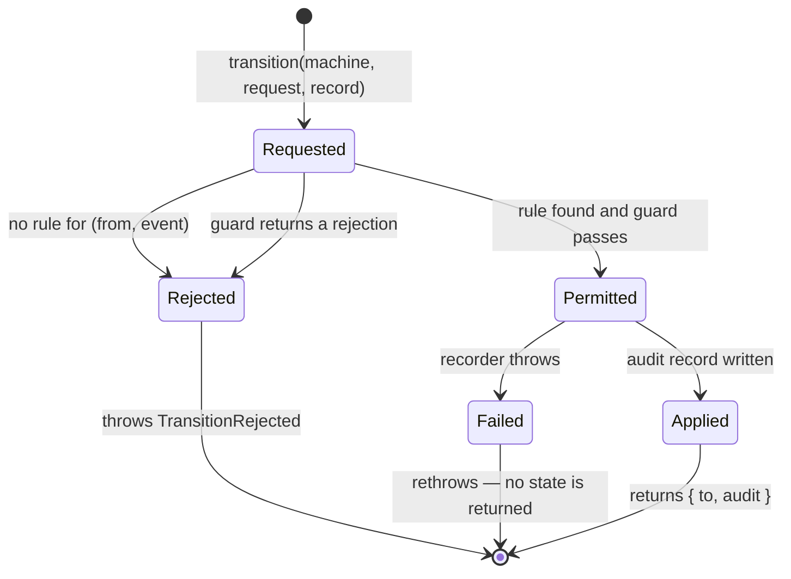
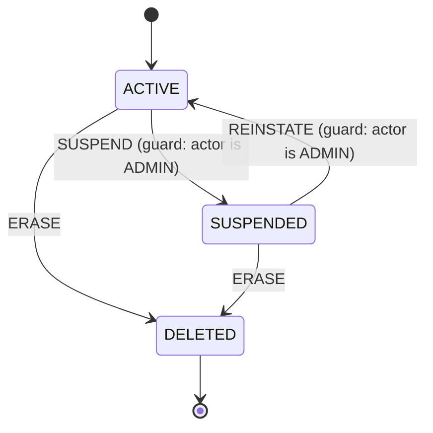

# W1-T07 — Make state changes consistent and traceable

Task: `W1-T07` · Slice: S1 · Owner: `agent-contracts` · Issue: #61
Branch: `W1-T07-state-machine` · Run record: `W1-T07-state-machine.run.md`

---

## 1. Purpose

Six things in this product move between states: **Job, Booking, Payment, Auction,
EmergencyRequest, Certification** (`TODO.md` §3). Six different slices own them, and each will be
built by a different agent in a different session. Left alone, each one writes `status = 'X'` at
whatever call site needed it, guards the change with whatever `if` was in front of the author at
the time, and records the change nowhere.

The person who suffers is the one asking *"why is this booking cancelled?"* — a support operator
in the back office (W9), a provider disputing a payout, or the agent debugging a flow it did not
write. Today there is no answer, because the only evidence a transition happened is the current
value of the column, which by definition no longer shows what it replaced.

This task supplies one mechanism, used by all six: transitions **declared as a table**, guarded by
functions that must name their refusal, and impossible to perform without writing an audit record.
It is deliberately small and deliberately generic — it owns no states of its own. `Booking`'s
states belong to `agent-money`; what belongs here is the guarantee that whatever those states are,
moving between them is checked and recorded the same way.

---

## 2. User stories

- **As a support operator**, I want every state change to carry who changed it, from what, to what
  and when, so that I can answer a dispute from the record instead of from a guess.
- **As an agent building a slice**, I want to declare my machine as a table, so that reviewing my
  flow means reading one table rather than tracing `if` statements across six handlers.
- **As a reviewer**, I want an undeclared transition to be impossible rather than merely unusual,
  so that "can a cancelled booking be completed?" is answered by the definition and not by testing.
- **As a client or provider**, I want an action the system will refuse to be refused with a reason,
  so that the UI can tell me why rather than showing a generic error.
- **As the platform**, I want the state change and its audit record to succeed or fail together, so
  that the ledger cannot disagree with the row it describes.

---

## 3. State machine

This feature *is* the state-machine mechanism, so it has no domain machine of its own. What it does
have is a lifecycle per call, and the branches matter because each one is a criterion:



The single load-bearing property: **there is no path from `Requested` to `Applied` that does not
pass through the recorder.** `Rejected` never reaches it; `Failed` never leaves it. That is what
makes "every transition writes an audit record" a structural fact rather than a convention.

The reference machine used throughout the tests is the one that already exists in the schema —
`app_user.status`, from `W1-T05`:



It is used because it is real, it is already migrated, and proving the mechanism against a live
table beats proving it against a fixture. It is **not** exported as a shipped machine — the user
lifecycle belongs to `agent-identity` (W2), who will declare it where their slice can guard it
properly.

---

## 4. API surface

No HTTP endpoints. The surface is the module `packages/contracts/src/state-machine.ts`, re-exported
from `@marketplace/contracts`.

### 4.1 `defineMachine(definition)` → `StateMachine`

```ts
defineMachine({
  name: 'booking',                  // the `entity` written into every audit record
  initial: 'PENDING_PAYMENT',
  states: ['PENDING_PAYMENT', 'CONFIRMED', 'CANCELLED'],
  terminal: ['CANCELLED'],
  transitions: [
    { from: 'PENDING_PAYMENT', on: 'PAYMENT_CAPTURED', to: 'CONFIRMED' },
    { from: ['PENDING_PAYMENT', 'CONFIRMED'], on: 'CANCEL', to: 'CANCELLED',
      guard: (ctx) => ctx.actorOwnsBooking || { reason: 'Only the client may cancel.',
                                                code: 'FORBIDDEN' } },
  ],
})
```

Everything is validated **at definition time**, which is module load — a malformed machine fails
the process at boot, not the first request that happens to touch it. §7 AC2…AC6 enumerate what is
rejected.

`from` accepts a single state or an array, because `CANCEL` from any of four states is one rule in
the reader's head and should be one row in the table.

### 4.2 `check(machine, from, event, context)` → `true | TransitionRejection`

The whole decision, with no side effects. `transition` is `check` plus the write, so the two can
never disagree about whether something is allowed.

### 4.3 `can(machine, from, event, context)` → `boolean`

`check(...) === true`. For the caller that only needs to render a button.

### 4.4 `transition(machine, request, record)` → `Promise<{ to, audit }>`

```ts
const { to } = await prisma.$transaction(async (tx) => {
  const result = await transition(
    userStatus,
    { entityId: user.id, from: user.status, event: 'SUSPEND',
      actor: { type: 'USER', id: admin.id }, context: { actorRoles: admin.roles } },
    (audit) => tx.auditRecord.create({ data: audit }).then(() => undefined),
  );
  await tx.user.update({ where: { id: user.id }, data: { status: result.to } });
  return result;
});
```

**Decision A — the recorder is a required parameter, not an option.** There is no overload of
`transition` that omits it. A caller cannot get the new state without having supplied something
that persists the record, so acceptance criterion 3 of the issue is enforced by the type checker
rather than by review.

**Decision B — the seam does not import Prisma.** `apps/web` imports `@marketplace/contracts`; a
Prisma import here would put the query engine into the browser bundle, and the charter forbids this
agent from writing under `apps/api/src/**` in any case. So the recorder is a plain
`(record: AuditRecord) => Promise<void>` and the caller binds it to its own transaction client, as
above. The cost is one line per call site; the benefit is that the mechanism is testable with no
database at all and the seam keeps exactly one runtime dependency (`zod`).

**Decision C — the caller opens the transaction.** `transition` cannot, having no client. The
contract is stated once, here: *call it inside a transaction and let the recorder write through the
same client*. AC25 proves the failure mode this protects against.

**Decision D — guards are synchronous and pure.** A guard that could query is a guard that decides
differently depending on when it runs, and it drags a database into every test of the decision.
Whatever the guard needs, the caller loads first and passes as `context`.

**Decision E — a guard rejects with a reason or returns `true`; bare `false` is not accepted.** An
unexplained 409 becomes a support ticket. Typed as `true | TransitionRejection`, which reads
naturally with `||`:

```ts
guard: (ctx) => ctx.isPaid || { reason: 'The booking is not paid.' }
```

---

## 5. Permissions matrix

The mechanism has no roles of its own; it carries the caller's decision. What it does fix is the
*shape* of the two refusals, because getting these the wrong way round is a security bug in one
direction and a confusing UI in the other:

| Situation | `TransitionRejection.code` | HTTP | Meaning |
|---|---|---|---|
| No rule for `(from, event)` | `CONFLICT` | 409 | The entity is not in a state where this is possible — for anyone. |
| Event from a terminal state | `CONFLICT` | 409 | Same, and the commonest case of it. |
| Guard refuses on the entity's condition | `CONFLICT` | 409 | Possible in principle, not right now. |
| Guard refuses on **who is asking** | `FORBIDDEN` | 403 | Possible, but not for you. |

`CONFLICT` is the default because it is the safe error to be wrong with: it tells the caller
nothing about whether someone else could have done it. A guard that means 403 says so explicitly.

Both codes are already in `ERROR_CODES` (`W1-T01`), so a rejection maps onto the existing envelope
without adding a code.

---

## 6. Error cases

| Class | Code | Status | Fires when | What the UI shows |
|---|---|---|---|---|
| `StateMachineDefinitionError` | — | — (never reaches the wire) | `defineMachine` is given a malformed table. Thrown at module load. | Nothing — the process does not start. |
| `TransitionRejected` | `CONFLICT` | 409 | No rule, terminal state, or a guard refusing on condition. | The guard's `reason`, translated from the code the route attaches. |
| `TransitionRejected` | `FORBIDDEN` | 403 | A guard refusing on the caller's identity or role. | The standard 403 copy. |
| recorder rejection | `INTERNAL_ERROR` | 500 | The audit write failed. Propagated unchanged so the caller's transaction aborts. | Generic failure. |

`StateMachineDefinitionError` is a **defect**, in the same class as `MoneyError` (`W1-T06` §4.5):
it means an agent wrote a table that does not describe a machine. It must never be caught and
converted into a client error, because there is no input a client can send that causes it.

`TransitionRejected` carries `entity`, `from`, `event`, `reason` and `code` as fields, not only in
its message, so a route can build the envelope without parsing a string.

---

## 7. Acceptance criteria

### Definition time — the table is checked before it is used

1. **AC1** — Given a definition with states, terminal states and transitions, When
   `defineMachine` is called, Then it returns a machine exposing `name`, `initial`, `states`,
   `terminal` and `transitions`, frozen against mutation.
2. **AC2** — Given a transition whose `from` or `to` names a state absent from `states`, When
   `defineMachine` is called, Then it throws `StateMachineDefinitionError` naming the unknown
   state and the rule it appeared in.
3. **AC3** — Given two transitions sharing the same `(from, event)` pair, When `defineMachine` is
   called, Then it throws `StateMachineDefinitionError`, because the outcome would otherwise
   depend on the order of the array.
4. **AC4** — Given a state not reachable from `initial` by any sequence of declared transitions,
   When `defineMachine` is called, Then it throws `StateMachineDefinitionError` naming that state.
5. **AC5** — Given a state with no outgoing transitions that is absent from `terminal`, When
   `defineMachine` is called, Then it throws `StateMachineDefinitionError` — a state that became
   terminal because a rule was forgotten is indistinguishable from one that is terminal by design
   unless the author says which.
6. **AC6** — Given a state listed in `terminal` that has an outgoing transition, When
   `defineMachine` is called, Then it throws `StateMachineDefinitionError`.

### The decision

7. **AC7** — Given a declared transition whose guard passes, When `transition` is called, Then it
   resolves with `to` equal to the declared target state.
8. **AC8** — Given no rule for `(from, event)`, When `transition` is called, Then it throws
   `TransitionRejected` with `code` `CONFLICT`, and `entity`, `from` and `event` set.
9. **AC9** — Given a terminal state, When any event is applied to it, Then `transition` throws
   `TransitionRejected` with `code` `CONFLICT`.
10. **AC10** — Given a guard returning `{ reason }`, When `transition` is called, Then it throws
    `TransitionRejected` carrying that exact `reason` and defaulting `code` to `CONFLICT`.
11. **AC11** — Given a guard returning `{ reason, code: 'FORBIDDEN' }`, When `transition` is
    called, Then the thrown rejection carries `code` `FORBIDDEN`.
12. **AC12** — Given a guard, When it is evaluated, Then it receives the `context` the caller
    passed and nothing else.
13. **AC13** — Given any of AC8…AC11, When `check` is called with the same arguments, Then it
    *returns* the rejection that `transition` would have thrown, and the recorder is not called.
14. **AC14** — Given any arguments, When `can` is called, Then it is `true` exactly when `check`
    returns `true`.

### The audit record

15. **AC15** — Given a permitted transition, When it is applied, Then the recorder is called
    exactly once, and it is called before `transition` resolves.
16. **AC16** — Given a permitted transition, When the recorder is called, Then its argument parses
    against `AuditRecordSchema` and carries `entity` = the machine's name, `entityId`, `action` =
    the event, `fromState`, `toState`, the actor, and `at`.
17. **AC17** — Given a rejected transition, When it is attempted, Then the recorder is called zero
    times. *(A refusal is not an event that happened to the entity. What refusals need is a
    metric, and that belongs to the route — see §9.)*
18. **AC18** — Given a recorder that rejects, When `transition` is called, Then it rejects with
    that error and resolves to no state.
19. **AC19** — Given an audit record carrying a key `AuditRecordSchema` does not declare, When it
    is parsed, Then parsing fails — the schema is strict, like every other schema in the seam.
20. **AC20** — Given `actorType` `SYSTEM` with a non-null `actorId`, or `USER` with a null
    `actorId`, When parsed, Then parsing fails. The two fields are one fact and cannot disagree.
21. **AC21** — Given an injected `now`, When a transition is applied, Then the record's `at` is the
    value it returned, so a test asserts an exact timestamp rather than a range.

### Against a live database

*(These run only with `STACK_LIVE=1` — see §10 ESC-1.)*

22. **AC22** — Given the reference `app_user.status` machine and a seeded user, When a transition
    is applied inside `$transaction` with a Prisma-backed recorder, Then the user's status is the
    new state and exactly one `audit_record` row exists for that entity, with matching columns.
23. **AC23** — Given a written audit record, When an `UPDATE` is attempted on it, Then Postgres
    raises `AUDIT_RECORD_IMMUTABLE`.
24. **AC24** — Given a written audit record, When a `DELETE` is attempted on it, Then Postgres
    raises `AUDIT_RECORD_IMMUTABLE`.
25. **AC25** — Given a recorder that throws, When the transition runs inside `$transaction`, Then
    the transaction aborts and the user's status is unchanged — the ledger and the row it describes
    cannot disagree.
26. **AC26** — Given a direct insert with `actor_type = 'SYSTEM'` and a non-null `actor_id`, When
    it is executed, Then the `CHECK` constraint refuses it — the rule of AC20 holds at the column
    as well as at the schema, because not every writer will come through the seam.

---

## 8. Data

### 8.1 The model

```prisma
model AuditRecord {
  id        String     @id @default(dbgenerated("gen_random_uuid()")) @db.Uuid
  entity    String
  entityId  String     @map("entity_id") @db.Uuid
  action    String
  fromState String     @map("from_state")
  toState   String     @map("to_state")
  actorType ActorType  @map("actor_type")
  actorId   String?    @map("actor_id") @db.Uuid
  metadata  Json?
  at        DateTime   @db.Timestamptz(3)

  @@index([entity, entityId, at(sort: Desc), id(sort: Desc)], map: "audit_record_entity_at_idx")
  @@index([actorId, at(sort: Desc), id(sort: Desc)], map: "audit_record_actor_at_idx")
  @@map("audit_record")
}

enum ActorType {
  USER
  SYSTEM

  @@map("actor_type")
}
```

### 8.2 Decisions in the columns

**`entity` and `action` are `String`, not enums.** An enum here would have to list every state and
every event of all six machines, in the shared schema, which would make adding a booking event a
migration and a seam change. The type safety that matters is at the call site, where the machine's
own string-literal unions provide it.

**`actor_id` carries no foreign key.** `W2-T08` (GDPR erasure) may hard-delete a user row. A
`CASCADE` would erase the ledger of what that user did, and a `RESTRICT` would block the erasure
the law requires. Neither is acceptable, so the column stores the uuid and nothing enforces that it
still resolves. This is the one place in the schema where a dangling reference is the correct
design, and it is why the comment saying so goes in the migration.

**`at` has no column default.** The value always comes from the application (§4.4, AC21). A
`DEFAULT now()` would be a second source of truth that silently wins whenever a writer forgets the
field, and "the timestamps are mostly right" is not a property an audit ledger can have.

**`metadata` is `Json?`.** The amount of a refund, the id of the provider who won an auction — the
things that make a record legible and that differ per machine. Not indexed: nothing queries it, and
an index on a field nobody has designed yet is a guess.

**Both indexes end `at DESC, id DESC`.** These are list queries, and lists in this codebase are
keyset-paged (`W1-T02`, `MEM-2026-09-10-07`), which needs the tiebreaker column in the index or
page two starts skipping rows.

### 8.3 Migration `0006_audit_record`

Additive: one enum, one table, two indexes, one `CHECK`, one trigger. No existing table is touched,
so it is safe to apply ahead of any consumer.

The trigger is the part that is not `prisma migrate diff` output and so is written by hand:

```sql
CREATE FUNCTION audit_record_immutable() RETURNS trigger AS $$
BEGIN
  RAISE EXCEPTION 'AUDIT_RECORD_IMMUTABLE: audit_record is append-only (W1-T07 §8.3).';
END;
$$ LANGUAGE plpgsql;

CREATE TRIGGER audit_record_no_update BEFORE UPDATE OR DELETE ON audit_record
  FOR EACH ROW EXECUTE FUNCTION audit_record_immutable();
```

**Why a trigger and not a convention.** "Nobody updates the audit table" is true right up to the
first migration that backfills a column across every table, or the first agent fixing what looks
like a typo in a `from_state`. A ledger whose rows can be edited is a report, not a ledger, and the
cost of the guarantee is nine lines.

**It does not break `pnpm db:reset`.** `prisma migrate reset` drops the schema and replays the
migrations; the trigger goes with it. Row-level triggers also do not fire on `TRUNCATE`, so a
future truncating seed reset is unaffected. Checked before choosing this over a `REVOKE`.

`down.sql` drops the trigger, the function, the table and the enum. It is genuinely reversible and
destructive in the ordinary way: rolling back loses the audit history, which is stated in the file.

---

## 9. Out of scope

- **The six domain machines.** `Booking`'s states are `agent-money`'s to declare, `Job`'s are
  `agent-jobs`'. This task ships the mechanism and zero machines.
- **A general field-level audit log.** `TODO.md` §3 sketches `AuditLog` with `before/after` as row
  snapshots. This is a *transition* ledger: `from_state` and `to_state`, nothing wider. Auditing
  arbitrary column changes is a different design (probably a trigger per table) and needs its own
  task and ADR.
- **Reading the ledger.** No query helper, no endpoint. W9's back office will need both and will
  build them against the indexes in §8.2.
- **Metrics on refusals.** AC17 deliberately writes nothing when a transition is rejected. A spike
  in refusals is an operational signal and belongs in the route's instrumentation, which is
  `W0-T1x` territory, not a row in this table.
- **`nextStates(machine, from)`** for rendering available actions. Genuinely useful, genuinely not
  required by any acceptance criterion in the issue. Additive later.
- **Retries and idempotency.** If a caller applies the same event twice, that is two transitions
  and two records — the second will usually be rejected by AC8 anyway, since `from` will have
  moved.
- **Async guards.** Decision D. Reopening it needs an ADR.

---

## 10. Open questions

### ESC-1 — a new live test file does not run in CI, and I may not fix that

```
ESCALATION
what:     `.github/workflows/ci.yml` lines 127-129 name the three live suites by hand. The file
          this task adds, `apps/api/tests/audit-record.test.ts`, is not in that list, so AC22…AC26
          will not run on any pull request. The `database` job will still report green.
why me:   `agents/roles/agent-contracts.md` lists `.github/workflows/**` as forbidden (L4). I can
          write the test; I cannot make it run.
options:  (a) `agent-devops` adds one line to the list in this PR or a companion one.
          (b) Land #174 (W0-T26) first, which replaces the hand-maintained list with discovery
              and fixes this for every future file.
          (c) Merge knowing five criteria are unproven in CI. Not recommended — this is precisely
              the fail-open case #174 was filed for, and an agent treating the green run as its
              success signal would be misled.
default:  I proceed on (a): the tests are written and pass locally against the live stack, the run
          record carries that output, and the PR description asks for the one-line addition. If no
          human acts, the state is (c) and the PR says so rather than implying coverage it lacks.
```

### Q2 — should the user-status machine ship, rather than living in a test?

`app_user.status` is a real machine with real transitions and it exists today. This spec keeps it
in the test file (§3) on the grounds that the user lifecycle is `agent-identity`'s slice and W2-T01
will want to declare it where the guards can see roles and sessions. If the operator would rather
it ship from the seam now, that is a one-line export and a note to W2 — but it would be this agent
deciding a neighbouring slice's model, which L4 exists to prevent. **Assumed: no. Not blocking.**
