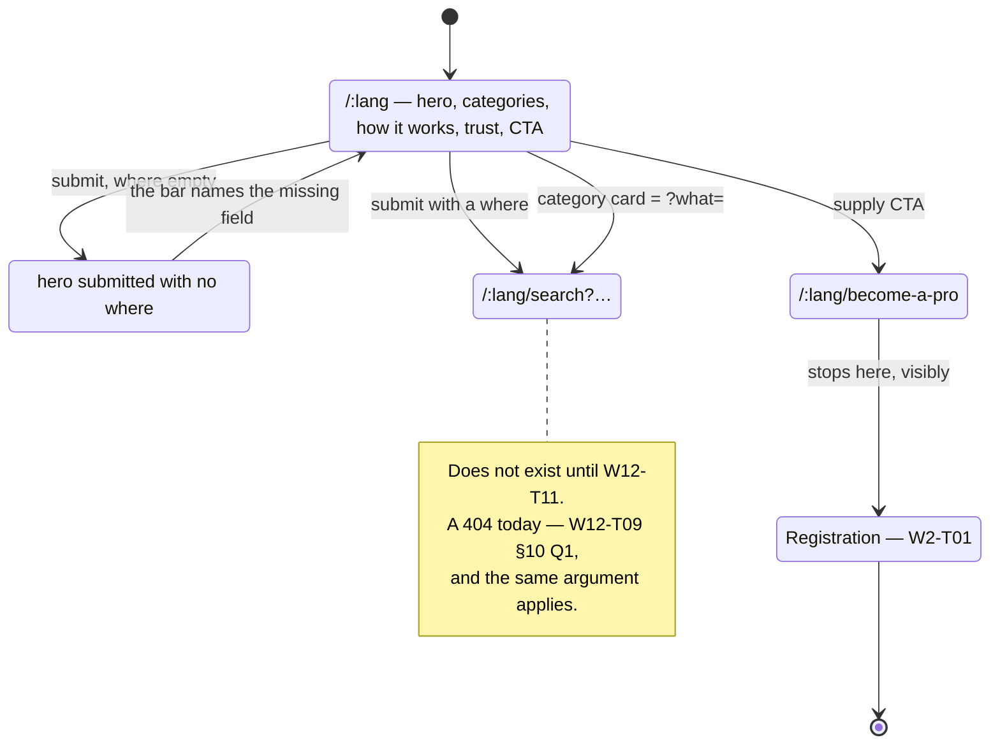

# W12-T10 — The home page

Task: `W12-T10` · Slice: S10 · Owner: `agent-ui` · Issue: #210
Branch: `W12-T10-home-page` · Run record: `W12-T10-home-page.run.md`
Design: [ADR-011](../../adr/ADR-011-web-application-architecture.md) §1, §2, §3 **and Amendment 1** ·
[ADR-012](../../adr/ADR-012-design-system-and-component-workbench.md) §1 ·
Builds on [`W12-T07`](W12-T07-search-schema.md), [`W12-T08`](W12-T08-search-contract.md),
[`W12-T09`](W12-T09-public-shell.md)

---

## 1. Purpose

`W12-T09` built the shell and left `home.tsx` as a heading and a paragraph, with a comment saying
this task replaces it. This is that replacement.

The home page is the only route in M11 a stranger reaches **without a link** — every other public
page is arrived at from a search, a share or a crawler. It is therefore the only place where the
product has to answer three questions before it is allowed to ask for anything: *what is this*,
*what can I ask it for*, and *why would I trust it*. ADR-011 §1 names the shape the reference takes
for a marketplace with no supply and no demand yet: one large search over the schema, category cards
as pre-filled searches, how-it-works, a trust strip, a supply-side call to action.

Who suffers without it: every visitor who has not been sent a link, and the M11 demo itself —
*"home → search *fontanero · Madrid · esta semana* → seeded results → a provider profile → a CTA that
stops cleanly at the auth wall"* (`TODO.md` §8) has no first step until this lands.

The second, quieter half is the supply side. A marketplace with no providers has nothing to sell, and
the cold-start answer (`R3`) is half organic demand and half a reason for a tradesperson to sign up.
ADR-011 §2 puts `/:lang/become-a-pro` in this ticket for that reason: the CTA needs somewhere to go.

## 2. User stories

- **As a visitor who knows what they need**, I want to search from the first screen without scrolling
  or clicking anything first, so that the home page is not a toll booth in front of the product.
- **As a visitor who does not know what to type**, I want to see the trades that exist as things I can
  click, so that I discover the vocabulary instead of guessing it.
- **As a visitor who has never heard of this site**, I want to see how it works and why the people on
  it are worth hiring, so that I know what I am agreeing to before I ask for a quote.
- **As a tradesperson**, I want an obvious route to "work with us", so that the supply side is not
  something I have to already know exists.
- **As a keyboard or screen-reader user**, I want the page to be a short list of named regions with
  one heading each, so that I can skip to the part I want rather than walking the whole page.
- **As a visitor on a phone**, I want the hero search to be usable at 360 px, so that the primary
  control of the product is not a desktop-only feature.
- **As `W12-T11`/`W12-T12`/`W12-T13`**, I want the card surface to already be a reviewable pattern in
  `packages/ui`, so that I compose a page rather than invent a card.

## 3. State machine

The home page holds no domain state — it is a page of links and one form. The lifecycle worth a
table is the visitor's exit from it, because every row is a different piece of the same search
contract:

| From | Event | To | Guard / side effect |
|---|---|---|---|
| home, categories loaded | submits the hero with a `where` | `/:lang/search?…` | `toSearchQuery` → `serializeSearchQuery`; the same pair the header uses |
| home, categories loaded | submits the hero with no `where` | stays | `missingRequiredFields` reports it; `W12-T07` owns the message, no navigation happens |
| home, categories **empty** | submits the hero with a `where` | `/:lang/search?…` | the `what` field is present but has no options; `what` is optional in `SearchQuerySchema` |
| home, categories **empty** | — | home **without the category section** | the endpoint is absent, not the page (`W12-T09` §10 Q4) |
| home | activates a category card | `/:lang/search?what=<slug>` | a pre-filled search with **no `where`** — see §10 Q3 |
| home | activates the supply CTA | `/:lang/become-a-pro` | a real route in this ticket, not a link to nothing |
| become-a-pro | activates its CTA | stays, with the wall stated | registration is `W2-T01`; the boundary is rendered, not hidden |



## 4. API surface

### 4.1 Routing

```
/:lang                → shell (W12-T09)
  index               → home            ← this task replaces the placeholder
  become-a-pro        → supply landing  ← this task adds it
  legal/:doc          → W12-T09
  *                   → 404, inside the shell
```

`become-a-pro` is **not translated** as a segment — ADR-011 Amendment 1, the same rule `/es/search`
follows. It is a child of `/:lang`, so it inherits the shell, the header search and both boundaries
for free; that is what `W12-T09` was for.

### 4.2 Data — no new endpoint, and no new call

The home page needs exactly one thing the shell already has: the category list. It does **not** get
it by reading the shell's loader data, and it does not fetch it a second time either. It calls
`ensureQueryData` on `queryKeys.categories(locale)` — the same key the shell used — so React Query
answers from a warm cache and no second request is made.

That is a deliberate choice between two working options:

| Option | Why not / why |
|---|---|
| `useRouteLoaderData('shell')` | Couples every child page to the shell's loader shape and gives the shell a route id whose only purpose is this. A page that needs different data later has to grow a loader anyway. |
| **Its own loader on the shared key** | ✅ R3 holds by construction, the page is self-contained, the cache makes it free, and `W12-T11`/`T12`/`T13` copy a pattern that still works when their data is *not* the shell's. |

The degrade-to-`[]` logic is now in one place — `src/shared/categories.ts` — and both loaders call it.
Two copies of "a missing endpoint must not take the storefront down" is one copy too many, and
`W12-T09`'s incident is the reason that rule exists at all.

**No counts.** ADR-011 §2's data column for this row says *"categories, counts"*. Nothing serves a
count: `CategorySummary` is `slug`/`name`/`requiresLicence`, and `GET /categories` is `W3-T01`.
See §10 Q2 — the cards ship without them rather than with a number derived from the mock catalogue.

### 4.3 The page — five regions, in this order

Each is a `<section>` named by its own heading, so the page is a short list of landmarks a screen
reader can jump between rather than one undifferentiated `main`.

| # | Region | Content | Degrades how |
|---|---|---|---|
| 1 | Hero | the `h1`, one lead sentence, `SearchBar rendering="hero"` | the `what` field loses its options; everything else works |
| 2 | Categories | one `Card` per active category, each a **pre-filled search** | the whole section is **absent** when the list is empty |
| 3 | How it works | three numbered `Card`s — *busca · compara · contrata* | static |
| 4 | Trust | three `Card`s — verification, reviews, protected payment | static |
| 5 | Supply CTA | one heading, one paragraph, one link to `become-a-pro` | static |

**The hero's search landmark gets its own name.** `SearchBar` renders `role="search"` with the
`label` as its accessible name, and the shell's header already puts one on every page — so the home
page is the first to have two, which is exactly the case `SearchBar.tsx`'s own comment predicted for
`W12-T11`. Two landmarks of the same role sharing one name is an axe failure and, more to the point,
a screen-reader user hearing *"search"* twice with no way to tell which is which. The hero is
`search.hero.label`; the header keeps `search.label`.

A category card's href is built by the **same two pure functions the search bar uses** —
`serializeSearchQuery(toSearchQuery(schema, { what: slug }))` — and not by string concatenation. A
hand-built `?what=${slug}` is a second definition of the query string, which is the drift `W12-T07`
exists to prevent, and it would encode an accent wrongly the first time a category needed one.

### 4.4 One search control, one idea of what "incomplete" means

`where` is required by the schema and by `SearchQuerySchema`, and `SearchBar` deliberately does not
enforce it: `validationBehavior="aria"` reports the state and lets the form submit, because *"the
sentence a user reads is the application's to own"* (`W12-T07`). The application has not owned it
yet — `W12-T09`'s header navigates to `/es/search?` with an empty query string, which is a request
the API would reject.

The hero cannot be the second control to answer that question differently. So the guard lands in
`src/features/search/` as one hook both renderings call: it runs `missingRequiredFields`, and either
navigates or reports the gap. `search.where.required` already exists in both catalogues, unused,
from `W12-T07` — this is the task that renders it.

That the fix reaches the header is not scope creep; it is the point. Two renderings of one
declaration that disagree about validity are precisely the drift `W12-T07` and `W12-T09` exist to
prevent, and the disagreement would have been invented here.

### 4.5 `Card` — ADR-012's patterns layer, second entry

`packages/ui` gains `patterns/Card`. ADR-012 §1 already names it; three of the five regions above are
the same surface with different content, and the alternative is three hand-rolled `<div>`s in
`apps/web` that the results page then makes a fourth copy of.

```ts
export interface CardProps {
  /** Where this card sits in the page outline. A card does not get to decide that. */
  headingLevel?: 2 | 3 | 4;
  title: ReactNode;
  /** Above the title: a step number, a badge. */
  eyebrow?: ReactNode;
  description?: ReactNode;
  /**
   * Wraps the title in a link and stretches it over the whole surface, so the card is clickable
   * while the tab order has exactly one stop. The **application** supplies the element: routing is
   * the app's business, and a design system that imports a router is one nobody can test.
   */
  renderLink?: (props: { className: string; children: ReactNode }) => ReactNode;
  children?: ReactNode;
}
```

The render prop is the whole design decision. A `Card` that took an `href` would render an `<a>`, and
an `<a>` inside a single-page application is a full page reload — so the card would be correct and
the product would be slower. A `Card` that took an `onPress` would be a button pretending to be a
link: no middle-click, no open-in-new-tab, no copyable URL, and category cards *are* URLs. Handing
the app a class name and letting it supply its own `Link` is the only version that is both
domain-free and right.

Card tokens (`--mp-card-*`) are declared in `components.css` and read semantic tokens only — ADR-012
§3, gated by `tokens.test.ts` AC5.

## 5. Permissions matrix

| Role | Home | `become-a-pro` | Hero search | Category cards |
|---|---|---|---|---|
| anonymous | allow | allow | allow | allow |
| CLIENT / PROVIDER / ADMIN | allow | allow | allow | allow |

All of M11 is public (ADR-011 §2) and there is no session in the storefront. There is no deny row,
so there is no deny criterion — the first one arrives with `W2-T03`.

## 6. Error cases

| Case | Behaviour |
|---|---|
| `GET /categories` fails or does not exist | the page renders in full **minus region 2**, and the hero's `what` field has no options. Not a 500, not an empty grid with a heading over it |
| The category list is present but empty | identical to the above — an empty list and a failed request are the same thing to a reader |
| Hero submitted with no `where` | `W12-T07`'s `missingRequiredFields` names it; the form does not navigate and nothing is lost |
| A category card whose slug the API later stops serving | the link still resolves; `parseSearchQuery` drops a `what` the schema does not accept, so the results page opens with an empty service field rather than a phantom category |
| `/:lang/become-a-pro` with an unknown `:lang` | the shell's own 404, unchanged — `W12-T09` |
| The `become-a-pro` CTA | renders the wall as a visible, translated statement. Not a 404, not a disabled button with no explanation |

The second row is worth stating separately because it is the one that is easy to get wrong: a
heading reading *"Servicios"* above nothing is worse than no heading, and it is what a naive
`categories.map()` produces.

## 7. Acceptance criteria

| # | Given / When / Then | Test |
|---|---|---|
| AC1 | Given `/es`, when the page renders, then the hero `h1` and a `SearchBar` are present, and there is still exactly one `h1` | `home.test.tsx` |
| AC2 | Given the hero, when submitted with a `where`, then the app navigates to `/es/search?…` with the query the schema produced | `home.test.tsx` |
| AC3 | Given the hero, when submitted with **no** `where`, then the URL does not change and the missing field is named to the reader | `home.test.tsx` |
| AC3b | Given the **header** search, when submitted with no `where`, then it behaves identically — one guard, not two | `routing.test.tsx` |
| AC4 | Given the seeded categories, when the page renders, then there is one card per active category, in `position` order | `home.test.tsx` |
| AC5 | Given a category card, when read, then its href is `/:lang/search?` + `serializeSearchQuery(toSearchQuery(schema, { what: slug }))` — **built by those functions in the test too**, not by a literal | `home.test.tsx` |
| AC6 | Given `/en`, when the page renders, then the card labels are the English category names | `home.test.tsx` |
| AC7 | Given a failing categories request, when the page renders, then the hero, how-it-works, trust and CTA are all present and the categories region is **absent** | `home.test.tsx` |
| AC8 | Given an empty category list, when the page renders, then the categories region is absent — the same as AC7 | `home.test.tsx` |
| AC9 | Given the page, when the regions are listed, then how-it-works has three steps and the trust strip has three points | `home.test.tsx` |
| AC10 | Given the page, when the landmarks are listed, then every landmark appearing more than once — `region` **and** the two `search` bars — has an accessible name, and no two share one | `home.test.tsx` |
| AC11 | Given the supply CTA, when read, then it links to `/:lang/become-a-pro` in the current language | `home.test.tsx` |
| AC12 | Given `/es/become-a-pro`, when rendered, then it renders **inside the shell** with one `h1` and states that registration is not open yet | `home.test.tsx` |
| AC13 | Given `/en/become-a-pro`, when rendered, then the heading is in English | `home.test.tsx` |
| AC14 | Given a `Card` with a `renderLink`, when rendered, then the link is the only focusable element in the card and it carries the stretch class | `card.test.tsx` |
| AC15 | Given a `Card` with no `renderLink`, when rendered, then it renders a heading at the requested level and contains no link | `card.test.tsx` |
| AC16 | Given `index.ts`, when the boundary rules run, then `Card` has a story file beside it and imports no domain package | `boundaries.test.ts` (existing, extended by construction) |
| AC17 | Given `components.css`, when the token graph resolves, then every `--mp-card-*` token references a semantic token or its own family | `tokens.test.ts` (existing) |
| AC18 | Given `src/**`, when the stylesheets are read, then no home-page style names a colour | `tokens.test.ts` (existing) |
| AC19 | Given every route module, when imported in a DOM-free node environment, then `become-a-pro.tsx` succeeds and exports only the route contract | `route-modules.test.ts` (existing) |

AC5 is the one to read twice. Asserting `href === '/es/search?what=fontaneria'` would pass while the
page and the search bar disagreed about encoding — the test would be a second definition of the
query string. Building the expectation from the same functions the page uses asserts what actually
matters: *the card and the bar produce the same URL for the same search.*

## 8. Data

No migration, no Prisma change, no contract change. `CategorySummary` and `CategoryListSchema` land
in `W12-T09`; this task only reads them.

## 9. Out of scope

- **The results page.** `W12-T11`. Both the hero and every category card navigate to it, and it 404s
  until then — the same deliberate intermediate state as `W12-T09` §10 Q1.
- **Category counts.** No endpoint serves one. §10 Q2.
- **Prerendering.** ADR-011 §1's state diagram flips SPA → prerendered *"when the home page ships"*.
  Deferred — §10 Q1.
- **All SEO.** No `meta`, no canonical, no `hreflang`, no JSON-LD, no Open Graph. ADR-011 Amendment
  1.2, and `W12-T14` owns the machinery that makes any of it possible.
- **Photography.** The reference puts its search over a photograph. There is no asset pipeline until
  `W12-T15` and no licensed imagery at all; a stock photo of a smiling stranger is not a design
  decision this task should be taking on its own.
- **Auth, and the registration flow behind the supply CTA.** `W2-T01`/`W2-T05`.
- **The auth-wall component.** `W12-T12` owns it (*"a CTA that stops cleanly at the auth wall — the
  visible edge of M11"*). This task states the boundary in words on one page; it does not build the
  shared component, which would be inventing the thing `W12-T12` is for.
- **An axe pass over the rendered page.** `W12-T16`, unchanged from `W12-T09` §9 — the new `Card`
  *stories* are covered by `W12-T04`'s gate, the composed page is not.
- **Final marketing copy.** §10 Q4.

## 10. Open questions

### ESCALATION — Q1: ADR-011 says shipping this page flips on prerendering

```
ESCALATION
Task:      W12-T10
Question:  ADR-011 §1's state diagram has `SPA --> Prerendered: W12-T10 — home page ships`. Does this
           ticket flip that switch?
Options:   A) Defer to W12-T14. Prerendering's stated rationale in the ADR is indexing and link
              previews, both deferred by Amendment 1. W12-T14 flips the bigger switch — framework
              mode on Workers — and prerendering fixed routes is a strictly smaller version of the
              same change, done once.
           B) Do it now. Add `vite-plugin-ssr`-style prerendering for /es, /en, the legal slots and
              the 404, ahead of the framework-mode switch that will replace it.
Recommend: A. B buys faster first paint on four routes that nobody is being sent to yet, and it buys
           it by standing up a rendering pipeline that W12-T14 then deletes. The measurable half —
           LCP on the preview URL — is W12-T15's gate, which has not run yet either, so there is not
           even a number saying the current paint is too slow.
Blocked:   Nothing.
Not blocked: Everything. The ADR arrow moves from W12-T10 to W12-T14.
```

### Q2 — category cards have no counts

ADR-011 §2 lists *"categories, counts"* as this page's data. No endpoint serves a count, and the two
ways to produce one now are both worse than omitting it:

- Count the mock catalogue. The number would be real on the preview deploy, real in every test, and
  absent in production — which is the exact shape of the `W12-T09` preview failure, one level up.
- Derive it from `GET /search` facets. That means one search request per category on page load, for
  a number, before the visitor has told us where they are — and `where` is required, so it could not
  even be asked.

So the cards are a name and a link. When `W3-T01` serves a count, it is an additive field on
`CategorySummary` and a line in the card. Recorded against `W3-T01` rather than left implicit.

### Q3 — a category card is a search with no location, and `where` is required

`SearchQuerySchema` requires `where` (`z.string().min(1)`), because a radius search with no centre is
not a search. A category card cannot supply one — the visitor has not said where they are yet.

This is not a defect in the card; it is a state the results page has to have anyway, because a
visitor can also delete the location from the header search. `missingRequiredFields` already exists
to name it, and `W12-T07` wrote it for exactly this. **Hand-off to `W12-T11`:** the results loader
must treat a query with no `where` as *"ask for it"* — the filter rail rendered, the required field
empty and flagged, no request sent — and not as a parse failure. Noted in `TODO.md` against that
ticket so it is not discovered by a 500 on the demo.

### Q4 — the trust strip makes claims the product has not delivered yet

*"Profesionales verificados"*, *"Opiniones reales"*, *"Pago protegido"* are true of the system being
built — `W8` licence verification, `W8` reviews, `W5` Stripe Connect — and not yet true of anything
running. On a pre-launch storefront that is the normal state of a marketing page, and the honest
handling is the one `W10-T07` already uses for the legal slots: ship the structure, and let the
copy be reviewed before anything is public.

Flagged rather than decided: **the final wording of the trust strip and the supply-side pitch is
`[H]` work**, in the same pass as the legal prose, and this task's strings are placeholders that
happen to be grammatical Spanish. No claim here is legally operative and none names a number, a
guarantee or a certification — that was the line, and it is the reason the strip says *"verificados"*
(what the product does) rather than *"todos nuestros profesionales están certificados"* (a fact about
a population that is currently empty).
