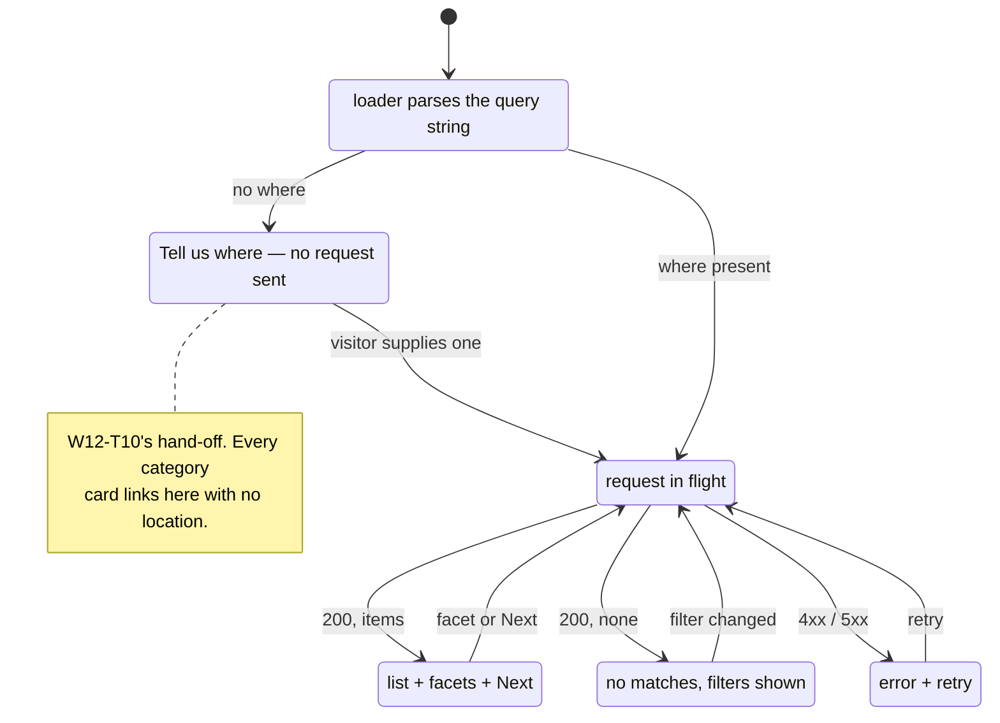

# W12-T11 — The results page

Task: `W12-T11` · Slice: S10 · Owner: `agent-ui` · Issue: #211
Branch: `W12-T11-results-page` · Run record: `W12-T11-results-page.run.md`
Design: [ADR-011](../../adr/ADR-011-web-application-architecture.md) §2, §3, §4, §6 **and Amendment 1** ·
[ADR-012](../../adr/ADR-012-design-system-and-component-workbench.md) §1 ·
Builds on [`W12-T07`](W12-T07-search-schema.md), [`W12-T08`](W12-T08-search-contract.md),
[`W12-T09`](W12-T09-public-shell.md), [`W12-T10`](W12-T10-home-page.md) ·
Contract: `W1-T02` list conventions

---

## 1. Purpose

Everything built so far navigates here. The header's compact search, the home hero, and all eight
category cards resolve to `/:lang/search?…`, and every one of them currently lands on the 404 —
deliberately, and argued twice (`W12-T09` §10 Q1, `W12-T10` §9). This is the ticket that stops that
being a lie.

It is also the ticket where the search schema stops being a claim. ADR-011 §3's whole argument is
that the hero, the header and the filter rail are *three renderings of one declaration*, and two of
them exist. The rail is the third, and until it renders, "they cannot drift" is an assertion with a
50% sample.

And it is where `W1-T02`'s list conventions meet a real list for the first time: keyset paging, no
`total`, facet counts within the matched set.

Who suffers without it: every visitor who uses the product as designed — the search *is* the
navigation (ADR-011 §1) — and the M11 demo, which is *"home → search `fontanero · Madrid · esta
semana` → seeded results on a list + map → a provider profile → a CTA that stops cleanly at the auth
wall"*. Steps two and three are this.

## 2. User stories

- **As a visitor who searched**, I want a list of nearby providers ordered by distance, so that the
  first thing I see is the most plausible thing to click.
- **As a visitor who arrived from a category card**, I want to be asked where I am rather than shown
  an error, because I have not told anyone yet.
- **As a visitor refining**, I want the filters to be the same control I searched with, so that I do
  not have to learn a second form.
- **As a visitor who shares a result set**, I want the URL to reproduce it, so that the link is worth
  sending.
- **As a visitor on a metered connection**, I want the list without waiting for a map, so that the
  page is useful before the expensive part arrives — or if it never does.
- **As a visitor with no matches**, I want to be told what to change, not shown an empty box.
- **As a keyboard or screen-reader user**, I want the result count and the filter rail announced, so
  that refining is not a silent change to a list I cannot see.

## 3. State machine

The page is a function of the query string (`R4`), so its states are the shapes the query can be in:

| From | Event | To | Guard / side effect |
|---|---|---|---|
| any URL | loader parses `?…` | one of the four states below | `parseSearchQuery` drops what the schema does not declare |
| parsed, **no `where`** | — | **"tell us where"** | **no request is sent**; the rail renders, `where` flagged |
| parsed, `where` present | request | loading | `HydrateFallback` / `useNavigation` |
| loading | 200, items non-empty | results + facets + paging | |
| loading | 200, items empty | empty state, with the filters that produced it | not an error |
| loading | 4xx/5xx | error state with a retry | the rail stays usable |
| results | a facet is activated | new URL, loader re-runs | category facet sets `what` |
| results | `Next` | new URL carrying `cursor` | keyset; browser history is the way back |
| any | map chunk fails or never loads | **unchanged** | the list is the page (`R9`) |



**The first transition is the one this ticket exists to get right.** A query with no `where` is not a
parse failure — it is the normal consequence of a category card, and of a visitor deleting the
location from the header search. `SearchQuerySchema` requires `where`, so a loader that parses first
and asks questions later answers the demo with a 500.

## 4. API surface

### 4.1 Routing

```
/:lang/search?what=&where=&when=&mode=&cursor=&limit=&sort=
```

`search`, not `buscar` — ADR-011 Amendment 1. A child of `/:lang`, so it inherits the shell, the
header's compact search and both boundaries.

**`noindex, follow`** is ADR-011 §2's decision for this route and is **not implemented here**: there
is no `meta` machinery until `W12-T14` and no SEO at all under Amendment 1.2. Recorded so the next
reader does not think it was forgotten.

### 4.2 The request

`GET /search`, already mocked from the `packages/testing` factories (`W12-T08`), typed by
`SearchResponseSchema` = `pageEnvelope(SearchResultSchema)` + `facets`. `src/shared/api.ts` gains one
method, parsing the response through the contract schema like `getCategories` does.

The query reaching it is **`SearchQuerySchema.parse(parseSearchQuery(schema, url.search))`** — the
composition `W12-T08` names: `parseSearchQuery` filters the URL to declared fields and drops values a
closed field rejects, then the contract decides meaning. A hand-edited `?what=nosuch` yields an empty
service field, never a phantom category.

### 4.3 Paging — what `W1-T02` makes possible, and what it forbids

`PageInfoSchema` is `{ nextCursor, hasMore }`. **Decision D removed `total` on purpose** — *"a count
over a radius query costs the query"*. Three consequences this page must not fight:

1. **No numbered pager.** There is no total, so there is no last page, so there are no page numbers.
   A component called `Pagination` that renders `1 2 3 … 47` cannot be built against this contract,
   and building one would mean adding a count to the hottest query in the product.
2. **No "N results".** Same reason. The page may say *"showing 20"*, never *"20 of 340"*.
3. **`cursor` goes in the URL** (`R4`), so a paged result set is shareable and the browser's Back
   button is the way back. A cursor stack in component state would make page 2 unshareable and
   unreachable after a refresh.

So the control is **`Next`**, rendered only when `hasMore`. "Previous" is deliberately absent rather
than faked: reversing a keyset page needs a backwards cursor the contract does not issue, and a
`Previous` that re-runs the first page is a button that lies. Browser Back does the real thing.

### 4.4 Facets — which are filters, and which are only counts

`SearchFacetsSchema` gives counts **within the matched set** for `categories` and `kinds`.

| Facet | Interactive? | Why |
|---|---|---|
| `categories` | **yes** — sets `what` | `what` is in `SearchQuerySchema`; changing it is a normal search |
| `kinds` (`MANITAS` / `PRO`) | **no** — count only | there is no `kind` in `SearchQuerySchema`, and `packages/contracts` is the frozen seam (L3) |

Rendering a kind facet as a control that cannot filter would be worse than rendering it as
information, and widening the contract is `agent-contracts`' change, not this ticket's. §10 Q2 files
the request rather than smuggling it.

The rail itself is `SearchBar rendering="filters"` over the **same declaration** the hero and header
use — ADR-011 §3's third rendering, and `renderings.filters.extra` stays `[]` for the same reason the
kind facet is inert.

### 4.5 The map — the seam, not the renderer

ADR-011 §6 is unambiguous: *"the results page renders the **list without the map**; the map is a
separate chunk loaded on viewport or on interaction… If the map fails to load, the page still works."*

There is no Maps API key. `OPS-12` (Google Cloud project, key, billing, quota alerts) is on the
human-blocked list, and `W3-T06` owns it. So this ticket builds **everything except the renderer**:

- the code-split boundary — a `lazy()`/dynamic `import()` that is its own chunk, verified in the
  build output, not asserted in a comment;
- the trigger — on viewport, via `IntersectionObserver`, inside an effect (`R2`: no `window` at
  module scope);
- the fallback — what the region shows when the chunk is absent, failed, or unconfigured;
- **the assertion that the page is complete without it**, which is the part nothing currently proves.

What lands behind that boundary today is a placeholder that states the map is not available yet. That
is not a stub standing in for work this ticket skipped — it is the honest rendering of "no key
exists", and the boundary around it is the deliverable. Adding Leaflet with OpenStreetMap tiles was
considered and rejected in §10 Q3.

### 4.6 New patterns in `packages/ui`

ADR-012 §1 names them; three arrive here.

| Pattern | What it is | Domain-free because |
|---|---|---|
| `ResultRow` | a result's surface: title, meta line, badges, a stretched link | takes strings, numbers and a `renderLink`, like `Card` |
| `Pagination` | `Next` when there is more, nothing when there is not | takes `hasMore` and a `renderLink`; knows nothing of cursors |
| `EmptyState` | an icon-free heading, a sentence, and optional actions | takes nodes |

`ErrorState` is **not** a fourth component: an error is an `EmptyState` with a retry action, and two
components that differ by one prop are two components that drift. Named in ADR-012's list, delivered
as a use of this one — recorded here because a reviewer checking the list will notice.

`ResultRow` and `Pagination` take a `renderLink` render prop for the reason `Card` does (`W12-T10`
§4.5): a real `<a>` in an SPA is a full page reload, an `onPress` is a button pretending to be a
link, and a result *is* a URL.

### 4.7 Money and distance are formatted, not printed

`hourlyRateCents` is integer cents (`W1-T06`) and `distanceMetres` is an integer. Both are rendered
through `Intl` with the route's locale — `es-ES` puts the euro after the number and uses a decimal
comma, and a hard-coded `€${cents/100}` is wrong in the product's first language. A null rate is
"quote only", not "€0.00" — the contract's null is a meaning, not a missing value.

## 5. Permissions matrix

| Role | Results | Facets | Paging | Map |
|---|---|---|---|---|
| anonymous | allow | allow | allow | allow |
| CLIENT / PROVIDER / ADMIN | allow | allow | allow | allow |

All of M11 is public and there is no session in the storefront. No deny row, so no deny criterion.

What the *response* withholds is the security story here, and it is already the contract's:
`SearchResultSchema` is strict and has no `userId`, no `baseAddressId` and no `line1` — and `point`
refuses a coordinate that has not been through `coarsenPoint`. This page must not reconstruct any of
it, which mostly means not inventing a "distance to your exact address" readout.

## 6. Error cases

| Case | Behaviour |
|---|---|
| No `where` in the URL | the "tell us where" state. **No request.** The rail renders with `where` flagged |
| `where` present, zero matches | empty state naming the filters that produced it, and a way to widen them — not an error |
| `GET /search` 400 (the contract rejected the query) | error state; the URL is shown to be the thing at fault, and the rail stays usable so it can be fixed |
| `GET /search` 5xx or network failure | error state with a working retry (`useRevalidator`), inside the shell |
| A `cursor` that no longer decodes | treated as absent — the first page, not a 500. A stale shared link degrades to a valid search |
| `?what=nosuch` | dropped by `parseSearchQuery`; the search runs without a category |
| The map chunk fails to load | **nothing changes.** No error surfaced to the visitor — the list is the page |
| Slow response | the loading state is the route's, so the shell and rail stay on screen |

The `cursor` row is worth stating: a cursor encodes a position in an ordering, so a link shared after
the data moved can decode to nothing sensible. Falling back to the first page keeps a shared link
useful; failing the request makes every shared link a time bomb.

## 7. Acceptance criteria

| # | Given / When / Then | Test |
|---|---|---|
| AC1 | Given `/es/search?what=fontaneria` (no `where`), when rendered, then the "tell us where" state appears **and the API is never called** | `results.test.tsx` |
| AC2 | Given that state, when a location is supplied and submitted, then the URL gains `where` and the search runs | `results.test.tsx` |
| AC3 | Given `?where=28013`, when rendered, then one row per seeded match appears, ordered by `distanceMetres` ascending | `results.test.tsx` |
| AC4 | Given a result, when read, then its link is `/:lang/pro/:id`, its distance and rate are formatted for the locale, and a null rate reads as quote-only — not `€0` | `results.test.tsx` |
| AC5 | Given the response facets, when the rail renders, then each category facet shows its count **within the matched set** | `results.test.tsx` |
| AC6 | Given a category facet, when activated, then the URL's `what` becomes that slug and `cursor` is **dropped** | `results.test.tsx` |
| AC7 | Given `hasMore: true`, when the page renders, then `Next` carries `nextCursor` in its href; given `hasMore: false`, then there is no `Next` | `results.test.tsx` |
| AC8 | Given the page, when it renders, then no total and no "N of M" appears anywhere — the contract has no count | `results.test.tsx` |
| AC9 | Given a query with no matches, when rendered, then the empty state names the active filters and offers a way to widen them | `results.test.tsx` |
| AC10 | Given a failing `GET /search`, when rendered, then the error state appears **inside the shell** with a working retry, and the rail is still usable | `results.test.tsx` |
| AC11 | Given an undecodable `cursor`, when rendered, then the first page is shown rather than an error | `results.test.tsx` |
| AC12 | Given the rail, when compared to the header, then both are `SearchBar` over the **same** `searchSchema` instance shape — asserted by building the expected fields from `fieldsFor` | `results.test.tsx` |
| AC13 | Given the page, when the map chunk is never resolved, then every other region renders and no error is shown | `results.test.tsx` |
| AC14 | Given the production build, when the output is read, then the map lives in **its own chunk**, absent from the initial one | `mocks.test.ts`-style build test (**new**) |
| AC15 | Given the page, when landmarks are listed, then each appears once or is uniquely named, and there is exactly one `h1` | `results.test.tsx` |
| AC16 | Given the result count changes, when a filter is applied, then the change is announced (`role="status"`) | `results.test.tsx` |
| AC17 | Given `ResultRow` with a `renderLink`, when rendered, then the link is the card's only focusable element | `result-row.test.tsx` |
| AC18 | Given `Pagination` with `hasMore: false`, when rendered, then it renders nothing at all | `result-row.test.tsx` |
| AC19 | Given `EmptyState` with a retry action, when rendered, then the action is reachable and labelled | `result-row.test.tsx` |
| AC20 | Given `index.ts`, when the boundary rules run, then each new pattern has a story beside it and imports no domain package | `boundaries.test.ts` (existing) |
| AC21 | Given every route module, when imported DOM-free, then `search.tsx` succeeds and exports only the route contract | `route-modules.test.ts` (existing) |

AC14 is the one that can silently stop being true. A `lazy()` import that some refactor turns into a
static one still *works* — it just quietly moves the map into the initial bundle, which is the exact
cost `R9` exists to avoid, and no behavioural test can see it. It is the same shape as `W12-T08`'s
`stripMocks` gate: assert what the bundler emitted, not what the source says.

## 8. Data

No migration, no Prisma change, no contract change. One additive method on `src/shared/api.ts`.

## 9. Out of scope

- **The map renderer.** §4.5 and §10 Q3. The seam ships; the map waits on `OPS-12`.
- **Kind filtering.** Needs `kind` in `SearchQuerySchema` — a contract request, §10 Q2.
- **Price, rating and availability filters.** `W3-T05`'s geo-search API does not accept them yet, and
  a filter the endpoint ignores is a control that lies. `renderings.filters.extra` stays `[]`.
- **Sorting controls.** `sort` parses (`W1-T02`) and the only sensible order today is distance —
  `W12-T08` Q4 already ruled out rating sort, because keyset paging drops null rows and on a
  cold-start marketplace that is every new provider.
- **The provider profile.** `W12-T12`. Rows link to `/:lang/pro/:id`, which 404s until then — the
  same intermediate state as `W12-T09` §10 Q1, now for the third time and for the last.
- **`noindex, follow`.** No `meta` machinery until `W12-T14`.
- **`GET /places/suggest`.** `where` stays free text; `W3-T06`.
- **An axe pass over the composed page.** `W12-T16`, unchanged since `W12-T09`.

## 10. Open questions

### Q1 — the backlog still has two tickets for this page

`TODO.md` says `W3-T06` is *"Search results UI: list + map (Google Maps), clustering, mobile-first"*
and `W3-T07` is *"Provider public profile page"*. Those are this ticket and `W12-T12`.

ADR-011 has already reassigned `W3-T06` — its data-seam table lists it against `GET /places/suggest`
— but `TODO.md` §6 was never updated to match, and this is precisely the condition ADR-011 §1 was
written to end: *"every other slice's UI work is currently an unstated tail on an API ticket, which
is exactly how thirteen agents each invent their own button."* The tails are still attached.

Fixed in this PR, because leaving it means `agent-discovery` builds this page again: `W3-T06` shrinks
to the places-suggest endpoint plus the Maps key, and `W3-T07` points at `W12-T12`.

**Second, smaller drift found alongside it**: ADR-011 §4 and `apps/web/mocks/handlers.ts` both name
`W3-T04` as the owner of `GET /search`, while `TODO.md` has `W3-T04` as *"Listing CRUD with price
model"* and `W3-T05` as *"Geo search API … PostGIS `ST_DWithin`"*. `W3-T05` is plainly the search
endpoint. The ADR and the mock are wrong about the id; corrected in the mock's comment and noted
against the ADR rather than silently edited, since an ADR is amended, not patched.

### ESCALATION — Q2: the kind facet cannot filter

```
ESCALATION
Task:      W12-T11
Question:  Should `kind` (MANITAS | PRO) become a filter in SearchQuerySchema?
Options:   A) Leave it. The facet shows counts; the visitor cannot filter by it. Zero contract churn.
           B) Request `kind` from agent-contracts as an additive optional filter. It is one line in
              SearchQuerySchema and one predicate in the handler, and the facet then does what a
              facet looks like it does.
Recommend: B, as a separate contract request — not folded into this ticket. The distinction between
           a manitas and a pro is one of the product's two real axes (TODO §3), a visitor wanting
           "only licensed pros" is an obvious need, and a facet that renders a count next to a thing
           you cannot click is a small, permanent confusion. But it is the frozen seam, so it is
           agent-contracts' change and it should not ride along inside a page PR.
Blocked:   Nothing. This page ships correctly under A and gains a control under B.
Not blocked: Everything.
```

### Q3 — why not just add a free map

Leaflet or MapLibre with OpenStreetMap raster tiles would render a real map today, with no key and no
bill. Rejected on two counts, both concrete:

- **Budget.** `W12-T15` sets ≤170 KB initial JS and the app is already at ~231 KB gzipped. Leaflet
  plus a tile layer is roughly another 40 KB, and it would be spent on the exact feature ADR-011 §6
  singles out as *"the budget's main threat"*.
- **Terms.** OSM's tile usage policy does not cover production applications of meaningful traffic, so
  it works until it is switched off, and the failure arrives on the day the product gets busy.

The seam is the durable part and it is what `R9` actually claims. When `OPS-12` lands, the renderer
goes behind a boundary that already exists and is already tested.

### Q4 — "no total" is a product constraint wearing an engineering costume

`W1-T02` decision D is right about cost, and it means this page cannot say *"340 fontaneros near
you"* — which is a line a marketplace usually wants, particularly one arguing it has supply.

Not reopened here: on a cold-start marketplace the honest number is small, and a prominent one is a
liability rather than an asset (`R3`). Flagged because the day someone asks for it, the answer is a
schema change and a query cost, not a UI change — and that conversation should start from
`PageInfoSchema`, not from this page.
