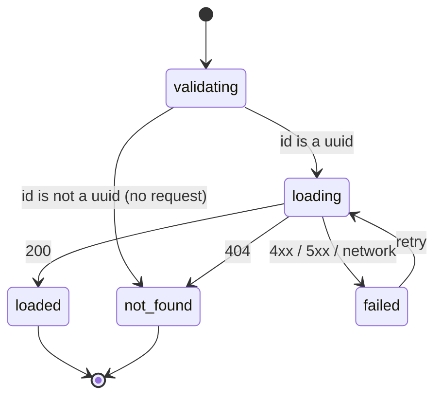

# W12-T12 — The provider profile

Task: `W12-T12` · Slice: S10 · Owner: `agent-ui` · Issue: #212
Branch: `W12-T12-provider-profile` · Run record: `W12-T12-provider-profile.run.md`
Design: [ADR-011](../../adr/ADR-011-web-application-architecture.md) §2, §4, §6 **and Amendment 3
(this spec)** · [ADR-012](../../adr/ADR-012-design-system-and-component-workbench.md) §1 ·
Builds on [`W12-T08`](W12-T08-search-contract.md), [`W12-T09`](W12-T09-public-shell.md),
[`W12-T10`](W12-T10-home-page.md), [`W12-T11`](W12-T11-results-page.md) ·
Contract: `W1-T01` error envelope, `W1-T05` §8 address privacy

---

## 1. Purpose

`W12-T11` shipped a list whose every row links to `/:lang/pro/:id`, and every one of those links
404s today. The run record calls it *"the last deliberate intermediate 404 in the storefront"*. This
is the ticket that closes it, and with it the M11 demo: *"home → search → seeded results on a list +
map → **a provider profile → a CTA that stops cleanly at the auth wall**"*. Both halves of that last
step are here.

It is also where the auth wall stops being a sentence. `become-a-pro.tsx` states its boundary in
prose and its own comment says why: *"The shared auth-wall component is `W12-T12`'s. This page states
the boundary in words; building the component here would be inventing the thing that ticket is for."*
Two pages now need the same boundary, which is the point at which it becomes a component rather than
a guess.

Who suffers without it: the visitor who has just been shown five providers and cannot look at any of
them — the results page is a dead end until this exists. And the demo, which currently ends on a 404.

### The part that is not straightforward

The ticket names five things: **gallery, categories, badges, review summary, and a CTA**. Reading
`apps/api/prisma/schema.prisma`, the models that exist are `User`, `ClientProfile`,
`ProviderProfile`, `Address`, `Category`, `ProviderCategory`, `AuditRecord`. So:

| Named in the ticket | Backing data | Verdict |
|---|---|---|
| Categories | `ProviderCategory` → `Category` | **Real.** Already in `SearchResultSchema`. |
| Review summary | `ratingAvg` + `ratingCount`, denormalised | **Real.** A *summary*; individual reviews are not. |
| Gallery | `PortfolioItem` is in `TODO.md` §3's sketch and in no migration | **Absent.** |
| Badges | `Badge` and `Certification` likewise | **Absent.** |
| "listing detail" | `Listing` likewise — and today a provider *is* the listing | **Absent.** |

`W12-T08` froze `SearchResultSchema` under a stated rule — *"every field is a column that exists
today, which is what makes this contract additive rather than an ADR"*. This ticket keeps that rule.
The three absent things are rendered as **stated pending slots**, the way `W12-T09`'s legal pages and
`become-a-pro` already are, and not as empty grids, placeholder images or hardcoded badge lists.

The operator confirmed all four of these on 2026-09-11: render what exists, `:id` not `:slug`, drop
listing detail, propose the contract here.

## 2. User stories

- **As a visitor who clicked a result**, I want to see who this is and what they do, so that I can
  decide whether to contact them.
- **As a visitor comparing two providers**, I want the same facts in the same places on both, so
  that comparing is reading rather than hunting.
- **As a visitor ready to hire**, I want to be told clearly that accounts are not open yet, so that
  I stop looking for a button instead of concluding the site is broken.
- **As a visitor who shares a profile**, I want the URL to be the profile, so that the link is worth
  sending — this is the WhatsApp share ADR-011 §1 names.
- **As a visitor who followed a stale link**, I want a page that says the provider is gone and offers
  me the search, not a blank screen.
- **As a provider**, I want my public page to show my trade, my area and my rating and **not** my
  home address, because my base address is usually my house.

## 3. State machine

The route has no domain state machine — a public profile is a read. What it does have is a render
state, and every branch below is an acceptance criterion.

| From | Event | To | Guard | Side effect |
|---|---|---|---|---|
| — | navigate to `/:lang/pro/:id` | `validating` | — | — |
| `validating` | `id` is not a uuid | `not-found` | — | **no request sent** |
| `validating` | `id` is a uuid | `loading` | — | `GET /providers/:id` via the loader |
| `loading` | 200 | `loaded` | — | cache warm under `queryKeys.provider` |
| `loading` | 404 | `not-found` | — | — |
| `loading` | 4xx/5xx/network | `failed` | — | — |
| `failed` | retry | `loading` | — | `revalidate()` |
| `loaded` | CTA pressed | `loaded` | — | none — there is nothing to press (§4.5) |



The `validating` branch matters: a uuid check the client can do is a request the client should not
send. It is the same shape as `W12-T11`'s missing-`where` state — a malformed input is rendered, not
round-tripped.

## 4. API surface

### 4.1 Routing — `:id`, and why the ADR is amended

```
/:lang/pro/:id        Component, loader, ErrorBoundary        public
```

ADR-011 §2's page inventory says `/es/pro/:slug`, and `TODO.md`'s `W3-T07` line says
`GET /providers/:slug`. **There is no slug column on `ProviderProfile`** — `Category` has one
(`W1-T05`), a provider does not, and nothing in the backlog adds one. `W12-T11` already ships
`` `/${locale}/pro/${item.id}` `` against a `z.uuid()`.

So the route key is the uuid, and ADR-011 gains **Amendment 3** saying so. A slug is a real future
improvement — it is a nicer share link and it is what an SEO ticket would want — but it needs a
column, a uniqueness rule, a collision policy for two *Fontanería Gómez* and a redirect from the old
form. That is a provider-slice ticket, not a line in a page spec (§10 Q1).

Segment untranslated, per Amendment 1: `/es/pro/…`, never `/es/profesional/…`.

### 4.2 `GET /providers/:id`

Public, unauthenticated — all of M11 is (ADR-011 §2). Response `ProviderProfileSchema`, errors the
`W1-T01` envelope. `W3-T07` (`agent-providers`) implements the real endpoint against this same
schema; the MSW handler is deleted then, not migrated — the same arrangement `W12-T08` made for
`GET /search`.

### 4.3 `ProviderProfileSchema` — derived, not retyped

```ts
export const ProviderProfileSchema = SearchResultSchema
  .omit({ distanceMetres: true })
  .extend({ serviceRadiusMetres: …, memberSince: … });
```

**A profile is a search result minus the search, plus the provider's own reach.** Deriving rather
than declaring a second strict object is what makes the two incapable of drifting: add a public
column to `SearchResultSchema` and it appears here, and the privacy refinements come along
unchanged. `.omit()` on a `strictObject` preserves strictness in zod 4, so the absent fields stay
absent by construction — AC2 and AC9 hold the claim rather than trusting it.

`distanceMetres` is omitted because a profile has **no centre**. Carrying it would mean either a
lie (a distance from nothing) or a second required query parameter on a URL that has to survive
being pasted into WhatsApp.

Added:

| Field | Schema | Why |
|---|---|---|
| `serviceRadiusMetres` | `z.number().int().positive().max(200_000).nullable()` | The column, including its `CHECK (> 0 AND <= 200000)`. Null = not set, and `schema.prisma:127` says such a provider is not searchable — so on a profile it renders as "area not stated", not as 0 km. |
| `memberSince` | `z.iso.datetime()` | `createdAt`. On a marketplace with no reviews yet, "on the platform since March" is one of the few honest trust signals available (`R3`). |

`memberSince` is the **first datetime on the wire** in `packages/contracts`, so it sets a convention:
an ISO-8601 UTC instant as a string, formatted at the display layer. Stated here so that it is a
decision and not a precedent set by accident (§10 Q2).

Unchanged and inherited: `id`, `displayName`, `kind`, `bio`, `categories`, `ratingAvg`,
`ratingCount`, `hourlyRateCents`, `city`, `province`, `point`.

### 4.4 The point stays coarse

`point` inherits `SearchPointSchema`, whose refinement rejects any coordinate not rounded to
`POINT_DECIMALS` (3 ≈ 110 m). `W12-T08` wrote the reason down: *"a provider's base address is usually
their home… returning the stored coordinate would honour the letter of the `line1` rule while
publishing the doorstep."*

That argument is **stronger** here, not weaker. A search result is one pin among many at a zoom level
chosen by the list; a profile page is one provider, and a map centred on one coarse point is a much
better instrument for finding a house. This spec therefore ships **no map on the profile** (§9). The
coarse point is in the contract because the field is inherited and because a "works around here"
affordance is the obvious next thing to build, and it should not be built on a precise coordinate.

### 4.5 The auth wall — a component, and a boundary that is not a control

`AuthWall` joins `packages/ui`'s patterns layer: a labelled region with a heading and a sentence
saying what is not open yet and when it will be.

**It renders no button and no link.** A disabled button tells a visitor only that something is
broken; a live button that 404s is worse. `become-a-pro` already argued this and the same reasoning
applies to *"contact this provider"*: registration and messaging are `W2-T01` / `W4`, neither is in
M11, so there is nothing to navigate to. ADR-011 asks for *"a real boundary the milestone can be
demoed against, not an unfinished edge"*.

`become-a-pro.tsx` **adopts it**, replacing its bare `<p className="mp-pending">`. A shared component
with one call site is a guess about the second; this ticket has both, which is the whole reason the
component belongs here rather than there.

Holds no copy — Spanish-defaulted props, per the slice rule that `packages/ui` is domain-free.

### 4.6 The pending slots

Gallery and badges render as a stated sentence each, not as an empty grid and not as a skeleton that
never resolves. A skeleton is a promise the page cannot keep. The copy names the thing and says it is
not here yet, in the `mp-pending` treatment `W12-T09` and `W12-T10` already use.

### 4.7 Formatting

Money and distance are formatted, never printed — the rule `W12-T11` §4.7 set. `es-ES` EUR at the
display layer over integer cents; `serviceRadiusMetres` renders as km via `Intl.NumberFormat`;
`ratingAvg` as one decimal in the locale's notation (*4,7* in Spanish); `memberSince` as month + year.
A quote-only provider (`hourlyRateCents: null`) renders *"presupuesto"*, never `€NaN/h`.

### 4.8 Files and owners

| File | Holds | Owner |
|---|---|---|
| `packages/contracts/src/provider.ts` | `ProviderProfileSchema` | `agent-contracts` |
| `packages/contracts/src/index.ts` | one added `export *` | `agent-contracts` |
| `packages/contracts/tests/provider.test.ts` | AC1–AC9 | `agent-contracts` |
| `apps/web/mocks/provider.ts` | the projection, shared by handler and tests | `agent-ui` |
| `apps/web/mocks/handlers.ts` | `GET /providers/:id` | `agent-ui` |
| `apps/web/tests/mocks.test.ts` | AC10–AC13 | `agent-ui` |
| `apps/web/src/routes/provider.tsx` | the route contract, nothing else | `agent-ui` |
| `apps/web/src/app/routes.tsx` | one added child route | `agent-ui` |
| `apps/web/src/shared/api.ts` | `getProvider` | `agent-ui` |
| `apps/web/src/shared/query.ts` | `queryKeys.provider` | `agent-ui` |
| `apps/web/tests/provider.test.tsx` | AC14–AC22 | `agent-ui` |
| `packages/ui/src/patterns/auth-wall/**` | `AuthWall` + story | `agent-ui` |
| `packages/ui/tests/auth-wall.test.tsx` | AC23–AC25 | `agent-ui` |

## 5. Permissions matrix

Every row of M11 is public, so the matrix is about **what the response may contain**, which is where
the real denies are.

| Role | View profile | See `userId` / email | See `line1`/`line2` | See exact coordinate | Contact |
|---|---|---|---|---|---|
| Anonymous visitor | allow | **deny** — not in the schema | **deny** — `W1-T05` §8 | **deny** — coarsened | **deny** — no account system (AC19) |
| Authenticated client | allow | **deny** | **deny** | **deny** | n/a in M11 |
| The provider themselves | allow (same public view) | **deny** on this endpoint | **deny** | **deny** | n/a |
| Admin | allow (same public view) | **deny** on this endpoint | **deny** | **deny** | n/a |

There is no role-varying projection: this endpoint has exactly one response shape, and a provider
wanting their own private fields uses the authenticated profile endpoint `W3-T02` will own. One
endpoint with two shapes is how a public route eventually serves a private one.

Each deny is AC22 (rendered DOM) and AC2 (the schema).

## 6. Error cases

| Code | HTTP | When | What the UI shows |
|---|---|---|---|
| — | — | `:id` is not a uuid | 404 page, **no request sent** (AC20) |
| `NOT_FOUND` | 404 | no provider with that id | "this provider is no longer listed" + a link to search, inside the shell (AC20) |
| `VALIDATION_FAILED` | 400 | the endpoint rejects the id | route error boundary with retry (AC21) |
| `INTERNAL_ERROR` | 500 | the endpoint fails | route error boundary with retry (AC21) |
| — | — | the response fails `ProviderProfileSchema` | route error boundary — the client parses on the way in, so drift is loud (AC21) |

No new error codes: `NOT_FOUND` and `VALIDATION_FAILED` are already in the `W1-T01` registry.

**The boundary is the route's, not the shell's** — the slice rule `W12-T09` set and `W12-T11`
followed. A profile that fails should keep the header, because the header holds the search that is
how a visitor recovers. A 404 is *not* the error boundary: it is a rendered state with a way out,
because "gone" is an answer and not a fault.

## 7. Acceptance criteria

**Contract** — `packages/contracts/tests/provider.test.ts`

1. **Given** a complete public provider row, **when** parsed by `ProviderProfileSchema`, **then** it
   succeeds and every field survives.
2. **Given** the same row plus `userId`, `baseAddressId` or `line1`, **when** parsed, **then** it
   fails — strictness survives `.omit().extend()`.
3. **Given** a `point` at stored precision (`40.416775`), **when** parsed, **then** it fails naming
   the decimal limit.
4. **Given** the row plus `distanceMetres`, **when** parsed, **then** it fails — a profile has no
   centre.
5. **Given** `ratingAvg: null` with `ratingCount: 0`, **when** parsed, **then** it succeeds; and
   `ratingAvg: 0` is a *different*, also-valid row.
6. **Given** `hourlyRateCents: null`, **when** parsed, **then** it succeeds (quote-only).
7. **Given** `serviceRadiusMetres` of `null`, **then** it succeeds; of `0` or `200_001`, **then** it
   fails — the column's `CHECK`, restated on the wire.
8. **Given** `memberSince` as `2026-03-01` (date only) or `01/03/2026`, **when** parsed, **then** it
   fails; as an ISO-8601 UTC instant, **then** it succeeds.
9. **Given** `SearchResultSchema`, **when** its key set is compared to the literal list `W12-T08`
   froze, **then** they are equal — the derivation in §4.3 changed nothing upstream.

**Mocks** — `apps/web/tests/mocks.test.ts`

10. **Given** a seeded provider id, **when** `GET /providers/:id` is called, **then** the body parses
    as `ProviderProfileSchema`.
11. **Given** every `id` returned by `GET /search`, **when** each is fetched, **then** all resolve
    200 — the results page cannot link to a 404.
12. **Given** a well-formed uuid nobody seeded, **then** the response is 404 with a `NOT_FOUND`
    envelope carrying a `requestId`.
13. **Given** `id = 'not-a-uuid'`, **then** the response is 400 with a `VALIDATION_FAILED` envelope.

**The page** — `apps/web/tests/provider.test.tsx`

14. **Given** a seeded provider, **when** `/es/pro/:id` renders, **then** the `h1` is the display
    name and the kind is stated in words, not as a raw `PRO`/`MANITAS`.
15. **Given** a provider in two categories, **then** each renders as a link to
    `/es/search?what=<slug>`, built by `serializeSearchQuery` — asserted by intercepting the helper,
    not by matching the string.
16. **Given** `ratingAvg: 4.7, ratingCount: 31`, **then** the summary reads `4,7` with the count;
    **given** `null / 0`, **then** it says there are no reviews yet and renders no `0`.
17. **Given** `hourlyRateCents: null`, **then** the page offers a quote and the string `NaN` appears
    nowhere in the DOM.
18. **Given** `serviceRadiusMetres: 15_000`, **then** the area reads in km in `es-ES`; **given**
    `null`, **then** the area is stated as not set and no `0 km` renders.
19. **Given** the loaded page, **then** the CTA region is the `AuthWall`: it has an accessible name,
    contains no `button` and no `a`, and the page contains no disabled control.
20. **Given** `/es/pro/<unseeded-uuid>` **and** `/es/pro/not-a-uuid`, **then** both render the
    not-found state **inside the shell** — the header and its search survive — with a link to
    `/es/search`; and for the malformed id no request is made (asserted against a spy).
21. **Given** the endpoint returns 500, **then** the route's own error boundary renders with a retry
    that re-issues the request, and the shell survives.
22. **Given** any of the above, **then** the rendered DOM contains no `userId`, no email, no address
    line and no coordinate at stored precision.

**`packages/ui`** — `packages/ui/tests/auth-wall.test.tsx`

23. **Given** `AuthWall` with a title and body, **then** it renders a labelled `region` whose
    accessible name is the title, and contains no interactive element.
24. **Given** `AuthWall` rendered with no copy props, **then** its defaults are Spanish — no English
    leaks from the library.
25. **Given** the `AuthWall` story, **then** the axe pass in the storybook project is clean.
26. **Given** `/es/become-a-pro`, **then** it renders the `AuthWall` rather than its own paragraph,
    and its existing tests still pass.

## 8. Data

**No Prisma change. No migration.** Every field in §4.3 is a column that exists on
`ProviderProfile` or reachable through `ProviderCategory` → `Category`, which is what keeps this
contract additive. The absent models named in §1 stay absent; adding one to make a page look
finished is how a schema acquires a table nothing writes to.

`packages/testing`'s `ProviderProfileInput` has the two gaps `W12-T11` already recorded — no
`ratingAvg`, and `hourlyRateCents` typed non-null — and `mocks/catalogue.ts` carries both beside the
profile rather than hiding them behind a cast. This ticket does **not** widen the factory: that is
`agent-contracts`' change and it is now the second task to work around it (§10 Q3).

## 9. Out of scope

- **Listing detail.** The ticket title names it; there is no `Listing` model and today a provider
  *is* the listing. Confirmed dropped by the operator; it re-opens when the model exists.
- **A gallery, badges, or individual reviews.** No columns. Stated pending slots instead (§4.6).
- **A map on the profile.** §4.4 — and the map seam already exists in `features/search`; a second
  deferred chunk on a page that has not asked for one is bundle cost for no answer.
- **Contact, booking, quote request, favourites.** `W2`/`W4`/`W6`. The auth wall is where this page
  stops, deliberately and visibly.
- **A provider slug and its redirect.** §4.1 and §10 Q1.
- **`GET /providers/:id` for real.** `W3-T07`, `agent-providers`. This ticket ships the contract and
  the mock.
- **The private/own-profile view.** `W3-T02`.
- **`meta`, canonical or JSON-LD.** Deferred with ADR-011 Amendment 1 and collected by `W12-T14`.
  This route is where a share preview would matter most, which is exactly why it is one decision in
  one ticket rather than one page inventing it.

## 10. Open questions

### Q1 — the route key is `:id`, and two documents say `:slug`

ADR-011 §2's inventory and `TODO.md`'s `W3-T07` line both say `slug`. No slug column exists, and
`W12-T11` already ships uuid links. Resolved by the operator on 2026-09-11: **`:id`**. This spec
carries ADR-011 **Amendment 3** and fixes the `W3-T07` line, the same way `W12-T11` fixed the two
stale `W3` lines it found. A slug stays desirable and is filed as a request for `agent-providers`:
it needs a column, a uniqueness rule, a collision policy and a redirect from `/pro/:id` — none of
which a page ticket should decide.

### Q2 — `memberSince` sets the wire convention for datetimes

Nothing in `packages/contracts` has put a datetime on the wire yet (`state-machine.ts` uses
`z.date()`, which is in-process). This field makes the choice: **ISO-8601 UTC string, formatted at
the display layer**, which is the only option that survives a JSON round trip without a reviver and
the only one that does not put a timezone in the database's mouth. Recorded here so the next schema
that needs a timestamp copies a decision rather than a coincidence.

### Q3 — the factory gap is now load-bearing in two tickets

`ProviderProfileInput` has no `ratingAvg` and types `hourlyRateCents` as non-null; the columns are
`Decimal?` and `Int?`. `W12-T11` carried both beside the profile in `catalogue.ts` and flagged it;
this ticket does the same. Two work-arounds is the point at which it should be fixed at the source —
a request for `agent-contracts`, not a change this PR makes, because `packages/testing` is the seam
`W1-T09` gates.

### Q4 — this page is honest, and an honest page looks unfinished

Three of the five things a visitor expects on a provider profile are stated absences. That is the
correct engineering answer and it is a real product risk for a demo: a reviewer may read "gallery
coming soon" as an incomplete build rather than an accurate one. The mitigation is copy — the slots
say *what* is coming and *when*, not "coming soon" — and the alternative is worse, because a
placeholder gallery is a claim about supply that no seeded row supports. Raised so the demo script
can address it rather than be surprised by it.

### ESCALATION — Q5: does the auth wall name a date, or only a state?

```
ESCALATION
Task:      W12-T12
Question:  Should AuthWall (and the pending slots) say when the thing arrives, or only that it has
           not arrived?
Options:   A) State only. "Accounts are not open yet." Never wrong, never informative, and the copy
              survives every schedule change.
           B) State + intent. "Accounts open when we launch in Madrid." One sentence a visitor can
              act on — and a promise the repo will have to keep or edit.
Recommend: A for this ticket. The launch date is a business fact this repo does not hold, and an
           agent inventing one puts a commitment on a public page. B is a copy change over the same
           component the day someone who knows the date says it — which is why the copy is a prop.
Blocked:   Nothing. The component and every AC are identical under both; only the string differs.
Not blocked: Everything.
```
